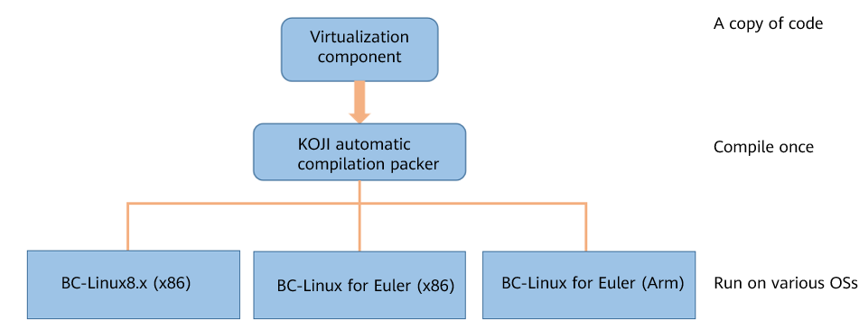

In recent years, the Linux operating system (OS) has developed rapidly in technologies, communities, and commercial solutions. China Mobile Cloud has released the **next-generation Tianyuan OS and Yixing migration tool**, ensuring efficient migration of versatile-scenario mobile cloud services. During CentOS migration, cross-OS VM migration is an important step in rebuild. In the complex live network environment,  there are many underlying virtualization challenges to ensure that customer services are not interrupted during VM migration and that migrated VMs run stably on Linux.

## Key challenges

### Same-source heterogeneous virtualization components

New virtualization components need to run stably on multiple Linux OSs and share the same source code on different OSs and CPU architectures. Therefore, the same-source heterogeneity problem needs to be resolved first.

### OS compatibility and adaptation

Core services such as computing, storage, and SDN must be compatible with each other on the OS. On the new platform, service compatibility and adaptation issues must be resolved at the virtualization layer.

### Live migration across OSs

Cross-OS and cross-virtualization component migration may fail due to differences in VM CPU capabilities, memory layout, and device structures, which affects service continuity.

## Same-source heterogeneous virtualization components

A same-source heterogeneous structure can shield the differences between different systems and architectures, reduce the number of versions on the live network, and reduce the code maintenance pressure. So that a copy of code can be compiled once and then runs on various OSs.

For the same-source heterogeneous structure rebuild, we have solved many problems. For example, the compilation and installation dependency packages vary depending on the system and architecture. Therefore, we specified the dependency depending on the system and architecture in the spec file. The software packages of the old and new virtualization components conflict with each other during the installation. Therefore, we used the Obsoletes mechanism of the RPM to delete the corresponding installation packages to implement a smooth upgrade of components. The old and new virtualization components are very different. As a result, some functions cannot be called after a patch is applied to the old version. Therefore, we re-designed the code to call the functions.

## OS compatibility and adaptation

To ensure that VMs can run stably on the OS, some problems in the adaptation between computing, storage, SDN, and virtualization components on the platform need to be resolved.

### Python 2 compatibility

The lifecycle of Python2 ends. libvirt-python no longer supports Python2 since 6.0.0. However, because the rebuild period of some products is long, the Python2 environment needs to be retained temporarily, and virtualization is used as the underlying component, a Python 2–based libvirt-python component package is required. According to syntax, interface, and module differences between Python 3 and Python 2, the libvirt-python code is modified, including:

-   Data type and class definition

-   Exception capture, input and output, and iterator APIs

-   Modules whose names are changed or abandoned

After more than 50 files and thousands of lines of code are modified, a stable and reliable Python 2–based libvirt-python is obtained.

### Adaptation between OVS-dpdk and QEMU

The stability and reliability of SDN directly affect the network service quality of user VMs. To ensure that SDN can run stably on the new platform, we actively promote vendors to perform the adaptation of SDN on the OSs.

During SDN adaptation, when QEMU is used as the server and OVS is restarted, the VM may crash. The reason is the following code in the **coredump** file of the QEMU.

According to the code, when the QEMU functions as the server and the OVS restarts, the QEMU attempts to reconnect. During the reconnection, the QEMU changes the TCP status word of the network adapter to **TCP_CHARDEV_STATE_DISCONNECTED**. As a result, a processing logic bug occurs, thus, the QEMU crashes. (In fact, when the QEMU serves as the server, the reconnection operation should not be performed. Instead, the OVS at the client end is used to reconnect.) The crash triggering process is as follows:

The solution is that only when QEMU functions as a client and OVS is restarted, QEMU performs reconnection. In addition to the preceding problem, we have resolved some other problems, such as network disconnection of Windows VMs after the OVS hot upgrade and suspension of VMs when the testpmd test program is executed on the Haiguang platform.

### Volume migration efficiency improved

Distributed storage provides basic storage services for the cloud platform. During the use of distributed storage, volume migration and capacity query operations are involved. However, the actual execution efficiency of these operations is low and needs to be optimized.

In the native QEMU version, each bit of the bitmap is set to dirty before the Ceph volume migration. In the first round of migration, all data on the source drive is migrated to the destination drive (and 0 is written to the drive part without data). As a result, the amount of data to be migrated increases and the migration time becomes longer. We have optimized the ceph volume migration by reducing the amount of data to be migrated in the first round, greatly improving the migration efficiency (especially when the source drive space is large but the amount of data is small). The procedure is as follows:

1.  Modify the RBD driver of the QEMU component to add the interface for obtaining the used space of Ceph volumes in the backend cluster.

2.  When the volume migration starts, use the interface to initialize the dirty bitmap.

3.  During the migration, when new I/Os are added to the VM, the bitmap is set to dirty. Then, the dirty bitmap is repeatedly cleared. Only blocks with data are migrated and copied. Blocks without data are ignored.

4.  When all dirty bitmaps are cleared, the volume live migration is complete.

In addition, there are some other optimizations:

1.  The Ceph volume capacity can be queried using a new interface, improving the query efficiency by more than 30%.

2.  The QEMU supports the Ceph volume snapshot migration. After the migration, the snapshot information of the source volume is retained.

## Live migration across OSs

After problems related to the adaptation with other core products are solved, the focus of our work has shifted to the cross-OS migration adaptation. We have carried out in-depth collaboration and innovation with the Virt SIG of the openEuler community to solve problems such as the guest CPU capability and device status.

### Migration failure due to incompatible mainboard type at the destination end

During the migration between a BC-Linux7 series OS and a BC-Linux For Euler series OS, the "unsupported machine type" error occurred. The reason is that the native machine type of the QEMU community is deleted from the virtualization component of BC-Linux7 and proprietary mainboard types are customized.

Given that the machine types cannot be changed during migration, the QEMU of a later version in the BC-Linux For Euler OS must be compatible with the machine types of an earlier version. Therefore, we sort out the devices of machine types supported by the QEMU of an earlier version, and port the corresponding machine types on the QEMU of a later version. In this way, the problem that the mainboard type is not supported will not occur during the migration.

### Migration failure due to device structure differences

The QEMU uses the VMStateDescription (VMSD) data structure to describe and manage device status. During migration, the fields and subsection of VMSD are sent to the destination end. To ensure successful VM migration, if the number of fields in the structure of the source device is greater than that of the destination device, disable the extra fields when **vmstate_load_state** of the destination device loads the device status. Otherwise, skip the missing fields.

During the test, the peer end cannot receive the keyboard status when the VM is migrated from the BC-Linux For Euler series OS to the BC-Linux7 series OS. The migration fails because the later-version QEMU sends the **kbd_extended_state** field, but the destination end does not have the field.

The **kbd_extended_state_needed** function (**true** by default) determines whether to send the **kbd_extended_state** field. To ensure that VMs will not fail to be migrated back due to the **kbd_extended_state** field, do not send the extra **kbd_extended_state** field during the migration.

In addition, we compared the VMSD of other devices, especially the virtio and vhost_user devices, in the earlier and later QEMU versions and modified the differences.

### Migration failure due to incompatible CPU features

The VM CPU has three modes: custom (the minimum number of instruction sets but the best compatibility for live migration), host-passthrough (the maximum number of instruction sets but the poorest compatibility for live migration), and host-model (between the two). However, the VM CPU features are not only related to the virtualization configuration, it is also related to the CPU model of the host machine and the OS kernel. Even in custom or host-model mode, the migration may fail due to the lack of CPU features at the destination end.

#### Case 1：The arch-facilities feature is missing at the destination end.

libvirt of a later version changes the name of the same CPU feature from **arch-facilities** to **arch-capabilities**. As a result, the destination host cannot identify **arch-facilities**, causing the live migration failure. To address this issue, change **arch-facilities** to **arch-capabilities** in the **cpu_map.xml** file of the source end.

#### Case 2：The spec_ctrl feature is missing at the destination end.

The 3.10 kernel in BC-Linux7 series OSs needs to enable **spec_ctrl** to avoid the GHOST vulnerability. However, the 4.19 kernel used in BC-Linux For Euler series OSs prevents the GHOST  vulnerability by disabling **spec_ctrl**. To address this issue, update the microcode to enable the **spec_ctrl** feature on the destination end.

#### Case 3：The hle/rtm feature is missing at the destination end.

The host-model mode is configured for the VM. However, the **hle/rtm** feature is missing on the destination host. As a result, the live migration fails. To address this issue, add "tsx=on" to the kernel startup parameters of the target node to enable the related instruction set.

## Summary

For virtualization components, the same-source heterogeneous structure and OS compatibility adaptation are implemented. An in-depth joint innovation with the openEuler community is carried out to optimize cross-OS live migration. This ensures efficient migration and rebuild of CentOS from the aspects of principles and practices.  However, a large number of nodes on the live network of China Mobile Cloud need to be migrated, which has higher requirements on migration efficiency and success rate. We will share technologies for improving live migration performance in our next article.
