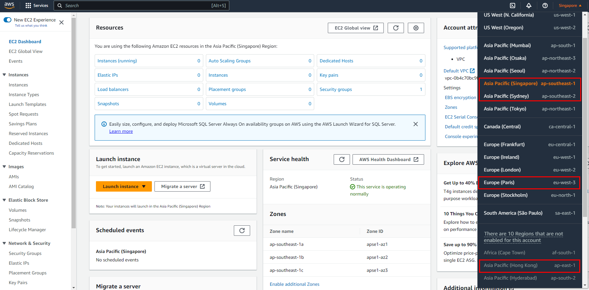
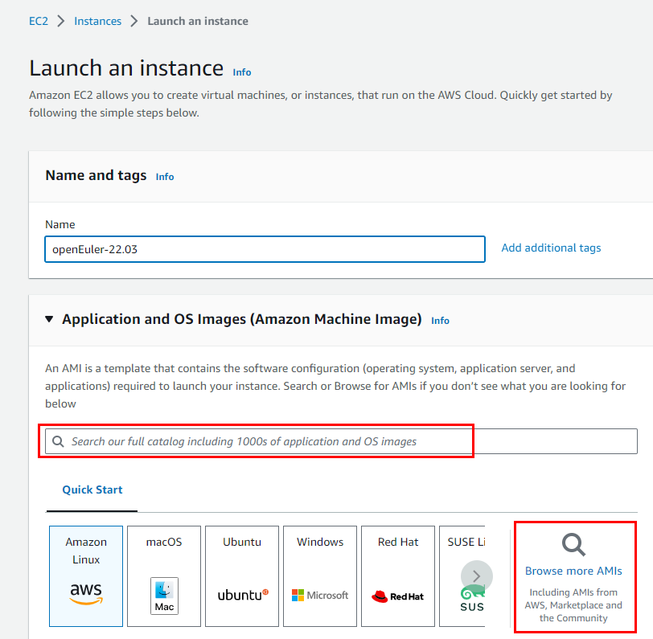
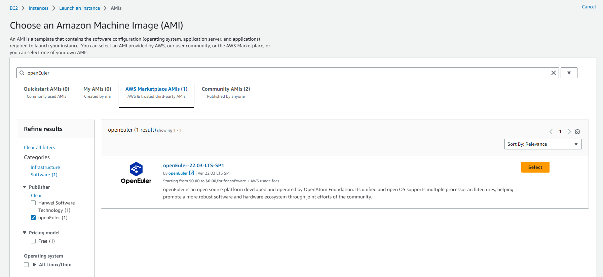
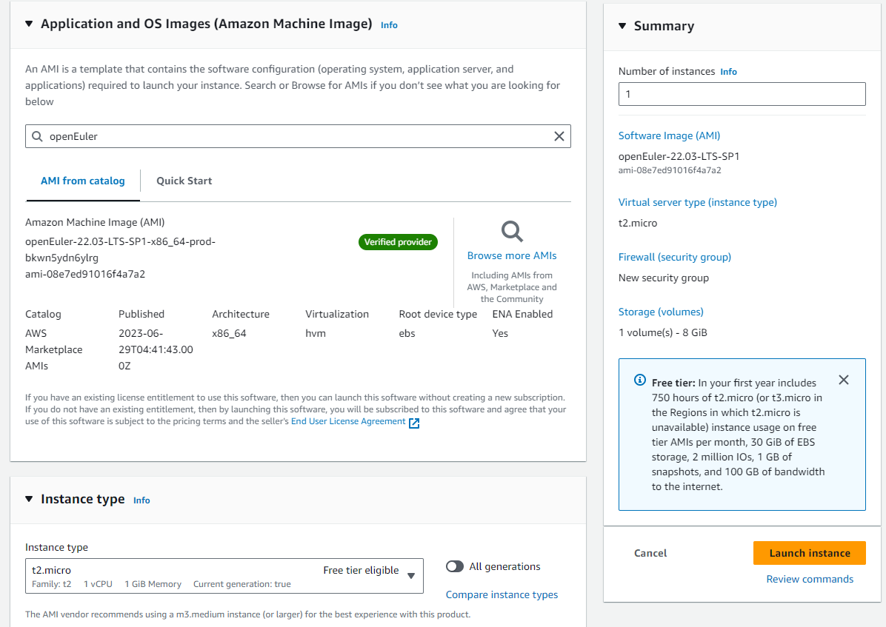
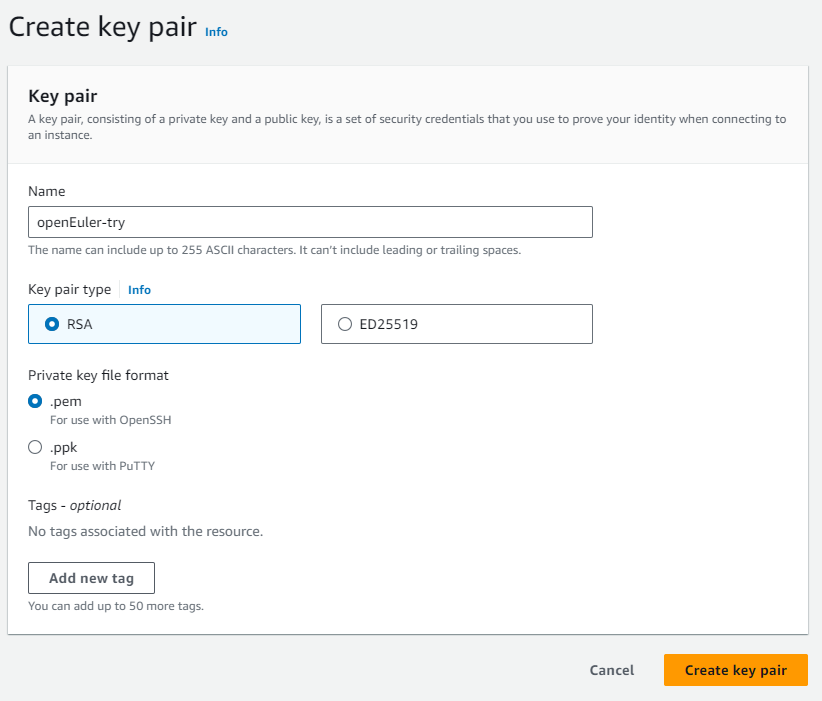
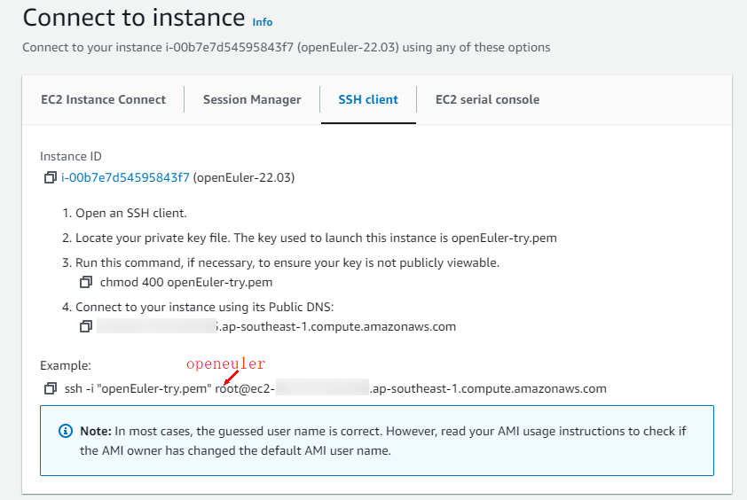
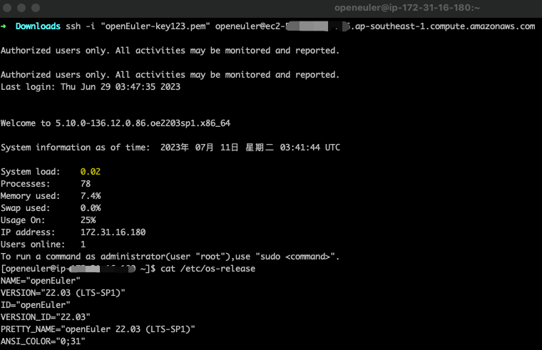

openEuler is now providing multiple versions of Amazon Machine Images (AMIs) in various AWS regions. These AMIs are readily available in AWS Marketplace, which serves as an online software store that helps customers find, buy, and immediately start using the software and services that run on #AWS.

openEuler images will be released by the official openEuler account in AWS Marketplace. We offer a range of image formats, with continuous updates and additions to cater to your needs. Currently, the supported image formats include: 

| Version    | Architecture  |Region      |
| ----------- | ----------- |----------- |
|  openEuler 22.03  LTS SP1  | X86_64          | Middle East (UAE) ，Asia Pacific (HongKong) ，Asia Pacific (Singapore)，Asia Pacific (Sydney)，Asia Pacific (Tokyo)，Asia Pacific (Osaka)，Asia Pacific (Mumbai)，Canada (Central)，Europe (Frankfurt)，Europe (Spain)，Europe (London)，Europe (Paris)，Africa (Cape Town)，US East (N. Virginia) ，US West (N. California)|  
| openEuler 22.03  LTS SP1   |     arm64      |   Middle East (UAE) ，Asia Pacific (HongKong) ，Asia Pacific (Singapore)，Asia Pacific (Sydney)，Asia Pacific (Tokyo)，Asia Pacific (Osaka)，Asia Pacific (Mumbai)，Canada (Central)，Europe (Frankfurt)，Europe (Spain)，Europe (London)，Europe (Paris)，Africa (Cape Town)，US East (N. Virginia) ，US West (N. California)      |
|   openEuler 22.03  LTS SP2  |    X86_64         |  Middle East (UAE) ，Asia Pacific (HongKong) ，Asia Pacific (Singapore)，Asia Pacific (Sydney)，Asia Pacific (Tokyo)，Asia Pacific (Osaka)，Asia Pacific (Mumbai)，Canada (Central)，Europe (Frankfurt)，Europe (Spain)，Europe (London)，Europe (Paris)，Africa (Cape Town)，US East (N. Virginia) ，US West (N. California)      |
|   openEuler 22.03  LTS SP3  |     arm64       | Middle East (UAE) ，Asia Pacific (HongKong) ，Asia Pacific (Singapore)，Asia Pacific (Sydney)，Asia Pacific (Tokyo)，Asia Pacific (Osaka)，Asia Pacific (Mumbai)，Canada (Central)，Europe (Frankfurt)，Europe (Spain)，Europe (London)，Europe (Paris)，Africa (Cape Town)，US East (N. Virginia) ，US West (N. California) |

<https://aws.amazon.com/marketplace/pp/prodview-bxuhwcmulvdmu?sr=0-1&ref_=beagle&applicationId=AWSMPContessa>

## How to use:

Enter AWS Console and select an available region for the image.

Enter the EC2 console and select Launch instance.

Search for an image in the search area or click Browse more AMIs, select an openEuler image, and create an instance.

openEuler #AMIs only allow login through the keypair, so it is necessary to create or specify a keypair during the creation of an instance. Please ensure that the security group rules are correct for #SSH access.

After launching an instance, you can log in as 'openEuler'. For detailed instructions, please refer to the official instruction as follows.

If you encounter any questions, we encourage you to visit our community and submit an issue, or give your feedback via the openEuler Forum.