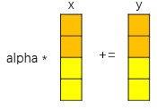
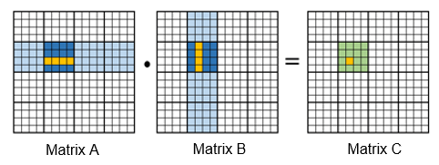
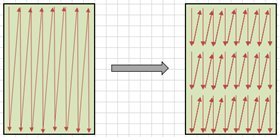
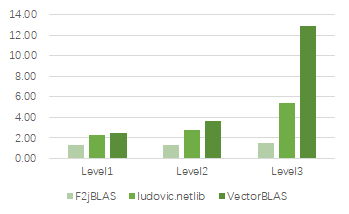

# Introduction to VectorBLAS

VectorBLAS is a high-performance library that implements vectorized BLAS using the Java programming language. Currently, VectorBLAS is available as open-source software within the openEuler community.

VectorBLAS optimizes BLAS functions by optimizing algorithms such as loop unrolling, matrix blocking, and memory layout, and uses multiple vectorized APIs provided by VectorAPI JDK to implement BLAS functions.

To summary, VectorBLAS is a tool that combines the capabilities of VectorAPI and BLAS.

## Introduction to BLAS

Basic Linear Algebra Subprograms (BLAS) is a numerical library for performing basic linear algebra operations such as vector and matrix operations.

As a part of Linear Algebra Package (LAPACK), it is widely used in the high-performance computing (HPC) field, and numerous optimized versions, such as OpenBLAS and Intel MKL, are continuously emerging.

It supports three tiers of operations, including vector-vector, vector-matrix, and matrix-matrix.

## Introduction to VectorAPI

VectorAPI is an abstraction layer provided by Java to implement SIMD vectorization. From JDK16 to JDK21, a total of six versions have been released.

VectorAPI provides the following capabilities:

1\. Definitions of vectorization APIs are clearer and more accurate, to enable users to implement vectorization in a simpler way.

2\. Both AArch64 and x86 platforms are supported, as well as several vectorized instructions such as NEON, SVE, and AVX. A piece of code can be reused in different places.

## Application Scenario

Currently, the BLAS library is widely used in areas such as big data, HPC, and machine learning. For example, many of the BLAS APIs, including gemm, gemv, axpy, dot, and spr, are utilized by multiple machine learning algorithms, such as K-Means, LDA, PCA, Bayes, GMM, and SVM, within the big data component Spark.

# Main Optimization Methods

## 1. VectorAPI Vectorization

The BLAS library commonly executes vector-vector, vector-matrix, and matrix-matrix computations. In the majority of cases, arrays and matrices are the subject of computation. As a result, vectorization can be used to process multiple pieces of data at a time, thereby enhancing efficiency. The following uses the daxpy function (daxpy => y = alpha * x + y) as an example.

In the function, *alpha* is a constant, *x* and *y* are one-dimensional vectors, and the data type is double.

In the native implementation, elements in *x* and *y* are calculated one by one.

However, for the vectorization implementation of a 256-bit register, two pieces of data of the double type can be processed at a time. That is, *alpha*, *x*, and *y* are multiplied and added twice at a time.

In this way, the vectorization operation can multiply the processing efficiency. Currently, a vectorization register supports the bit width of 128, 256, 512, and the SVE instruction set even supports a maximum of 2048 bits.

## 2. Loop Unrolling

Loop unrolling is a loop transformation technique that minimizes computation overheads or reduce the number of loops by reducing or eliminating instructions that control program loops. Such overheads often consist of instructions to increment a pointer or index to the next element in an array. Computation in each loop can also utilize CPU pipelines to improve efficiency.

The Just-In-Time Compiler (JIT) of JDK also automatically optimizes loops, especially by using the **int**, **short**, or **char** variables as counted loops of a counter.

VectorBLAS analyzes function features and improves execution efficiency by changing loops to counted loops or manually expanding key loops.

## 3. Matrix Blocking

Matrix blocking is a method of cache optimization. When the scale of the array and matrix is substantial, and the span in the *N*-layer loop is too extensive, attempts to fit it into the cache will be unsuccessful. This leads to data being cached and results in a high cache miss rate.
Through matrix blocking, small data blocks can be locked in the L1/L2 cache to improve the cache hit ratio and reduce the cache miss rate.

## 4. Packing

Packing optimization, also known as memory layout optimization, involves the storage of matrices by column or row within an array. If the computation does not follow the sequence of the entire row and column, data is read across columns or rows.

Packing entails the creation of a new memory space and the reorganization of data within that space. In this way, data can be read continuously, so as to reduce cache miss rate and speed up data reading. Packing is generally used together with matrix blocking.

# Performance Data

The current version is tested and verified based on a Kunpeng server. Compared with similar libraries F2jBLAS and ludovic.netlib in the industry, the performance is improved, as shown in the following figure.

# Future Plan

This project has been open-sourced in the openEuler community. The current version implements main APIs in the BLAS library. The subsequent plan is as follows:

1\. To support more APIs of Level 1, Level 2, and Level 3

2\. To improve UT and Benchmark

3\. To tune different platforms and instruction sets

To improve performance based on machine learning algorithm libraries such as Spark MLlib

If this project piques your interest, you are cordially invited to participate. For details, you can visit the code address: [https://gitee.com/openeuler/vectorBlas](https://gitee.com/openeuler/vectorBlas)
