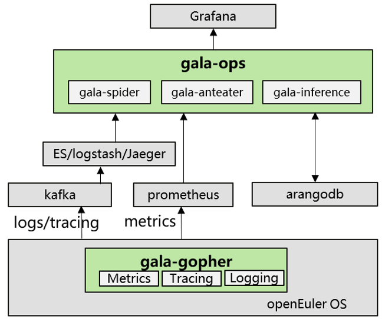
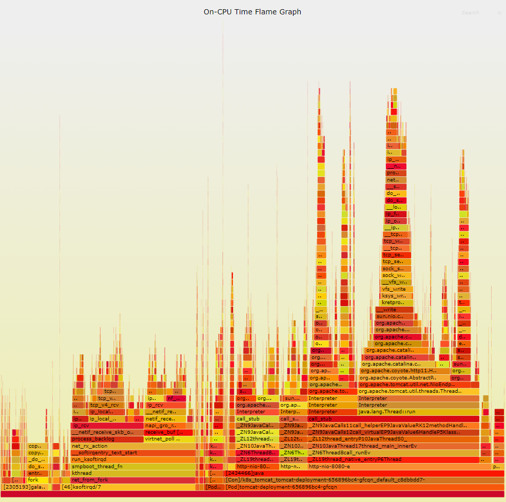

Flame graphs visualize data, allowing developers and O&M personnel to pinpoint performance issues.  

To be specific, flame graphs visualize how system resources (such as CPUs, memory, schedulers, and I/Os) are used to help quickly locate code-level root causes of abnormal resource usages and observe potential performance deterioration trends, thereby optimizing system and application performance.   

The A-Ops project in the openEuler open source community has developed the gala-ops flame graph to monitor cloud native systems and applications across the full stack in real time.

**Features of gala-ops Flame Graph**

1. Easy deployment and integration  

gala-ops is a system/application-level online diagnosis tool for locating gray problems in cloud infrastructure. The flame graph probe "stackprobe" is integrated in gala-ops' gala-gopher component. You can install the gala-gopher component in a click, and enable or disable the flame graph probe by modifying the configuration file.

  
 
After the probe is enabled, flame graphs in .svg format will be generated to your computer. What's more, the gala-ops flame graph can be connected to third-party O&M platforms such as Pyroscope and Grafana. You only need to enter the address of a third-party plugin in the configuration file, and the flame graph probe program will periodically upload flame graph data to the third-party platform for subsequent analysis and real-time monitoring.

2. Container support

In cloud native systems, applications can be deployed as containers. During system-level performance analysis, conventional flame graphs generally display only the thread names. If the internal thread names in different containers are the same, the call stacks will be combined, making them hard to distinguish, which subsequently affects fault locating and demarcation. The gala-ops flame graph probe can automatically identify different pods and containers and add workload, container, and process ID information to the graph. If the process is a workload or container process, the pod and container are prefixed with [Pod] and [Con], respectively, and the process is prefixed with [<pid>].

>

3. Full-stack support

The gala-ops flame graph can parse mixed code call stacks in compiled and interpreted languages, including C, C++, GO, Rust, and Java. In this case, application, functions, and methods of different languages within the same call stack, in user or kernel mode, can all be displayed in a single flame graph. Before using the gala-ops flame graph, you do not need to make any further configurations or adapt applications to different languages.

4. Low overhead

With the eBPF technology as the base, the gala-ops flame graph simplifies the stack sampling logic, and maintains the sampling precision (CPU sampling frequency: 10 ms) while only slightly deteriorating the performance of the application being observed (which is generally around 1%). Therefore, in large-scale production environments, the gala-ops flame graph can continuously monitor application performance in real time. When an application or system failure occurs, you can use the flame graph to trace the system status at any time, rather than reproducing the failure.

**Continuous Function Improvement**

gala-ops currently supports two types of flame graphs: CPU usage and memory leakage. In the future, flame graphs of other system resources, such as network I/Os and disk I/Os, will be gradually added, while multi-lingual support is also under development.

For more information about the gala-ops flame graph, visit:

-	[openEuler official website](https://www.openeuler.org/en/)

-	[openEuler@GitHub](https://github.com/openeuler-mirror)

