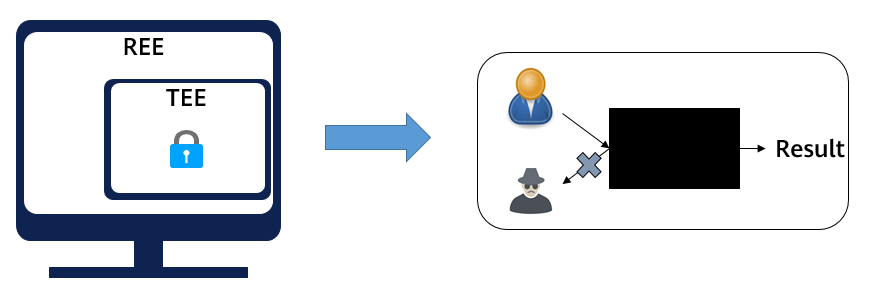
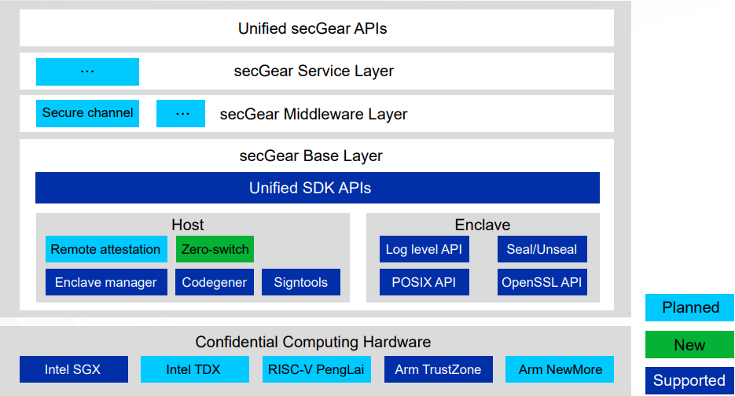

As an important branch of privacy computing, confidential computing is a technology that uses a trusted execution environment (TEE) to protect data in use. To an insecure rich execution environment (REE), the TEE isolated based on hardware is like a black box, which prevents unauthorized access to or tampering with applications and data in the TEE by the external world (including the operating system, privileged users, and malicious programs). Data in the TEE is available but invisible to third-party platforms, eliminating security concerns about data migration to the cloud and promoting secure data flow.  

>  
 
**Pain Points in Confidential Computing**  
There are various confidential computing technologies and software development kit (SDKs) in the industry and the application ecosystems of different TEEs are isolated from each other, which brings high development and maintenance costs to confidential computing application developers and slows down the development of the confidential computing ecosystem. The security applications developed are strongly bound to the system architecture. For example, applications developed using the Intel SGX SDK are difficult to port to the Arm TrustZone because the SDK APIs are greatly different.

**secGear Confidential Computing Framework**  
secGear is a unified development framework that delivers confidential computing for the openEuler system. Compatible with popular TEEs in the industry, secGear masks the differences between the TEE and SDK and simplifies development APIs by sharing the same set of source code over different architectures. secGear streamlines the TEE applications while contributing to the confidential computing ecosystem.  

>

secGear is logically divided into three layers that form the foundation of openEuler confidential computing software.  
-	**Base layer**: The unified layer of the confidential computing SDK provides unified APIs for different TEEs, enabling different architectures to share the same set of source code.  
-	**Middleware layer**: The general component layer provides confidential computing software to quickly build confidential computing solutions.  
-	**Service layer**: The confidential computing service layer runs dedicated solutions for typical situations.  

secGear is licensed under Mulan PSL v2, allowing developers to contribute open source middleware or solutions or build commercial solutions based on secGear.

**Typical Application Scenarios**  

-	TEE-based cryptographic module
In conventional cryptographic modules, algorithm protocols and processed data are privacy data and can be protected based on the TEE. secGear can divide the cryptographic module into two parts: management service and algorithm protocol.  
--Management service: runs on the REE to provide cryptographic services for the external world and forward requests to the TEE for processing.  
--Algorithm protocol: runs on the TEE to encrypt and decrypt user data.  
Cryptographic services may have highly concurrent requests with large data volumes. The zero-switch feature of secGear reduces the context switches and data copies typically required for processing a large number of requests between the REE and TEE.

-	Encrypted databases  
An encrypted database provides SQL query and computing capabilities in the TEE. When a database client requests a query, the ciphertext is transferred to the TEE, sometimes in multiple times if the data volume is large. With a large number of query requests, the calls and data copies between the REE and TEE are frequently triggered, which significantly deteriorates performance. The zero-switch feature of secGear implements zero-switch calls and zero-copy data exchange, greatly improving the end-to-end performance of data queries.

For more information about how openEuler helps tackle modern workloads, visit:

-	[openEuler official website](https://www.openeuler.org/en/)

-	[openEuler@GitHub](https://github.com/openeuler-mirror)

