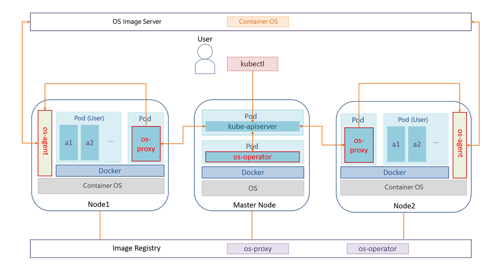
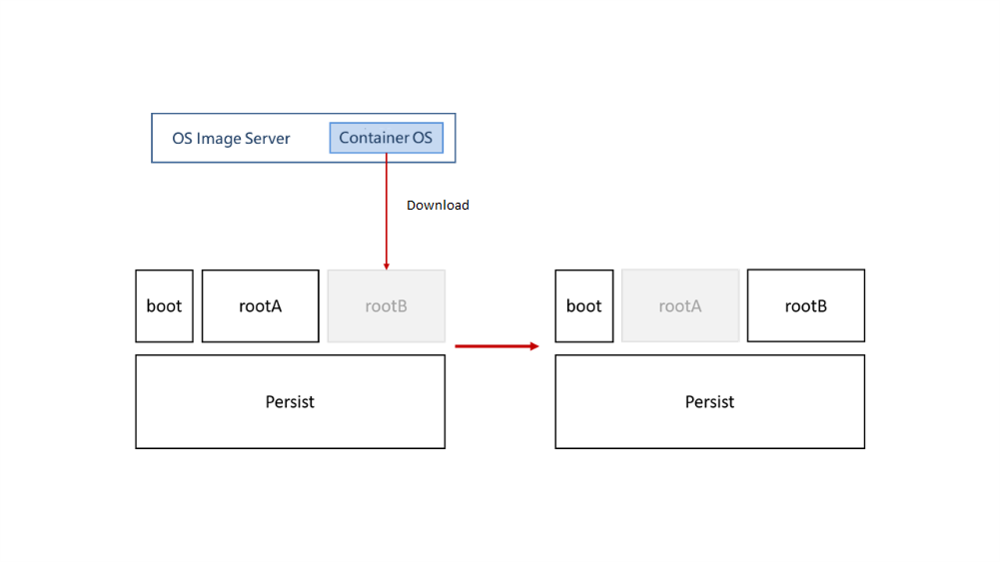

Containers and Kubernetes are two technologies that see extensive use in cloud environments. Yet, the present method of managing the containers and their OSs separately typically encounters challenges of function redundancy and difficult coordination across scheduling systems. In addition to this, it is challenging to maintain several OS versions. With OSs of the same version, individual software packages are installed, updated, and uninstalled separately. After a certain period of time, the OS versions start to become inconsistent, causing version fragmentation. Besides, the OSs could be tightly coupled with the services, which would make major version upgrades more challenging. openEuler offers KubeOS, a container OS upgrade tool, as a solution to the challenges described above.

KubeOS works as a Kubernetes operator to schedule the process of upgrading container OSs and upgrade all container OSs collectively to facilitate collaboration between the OS managers and services. When the container OSs are upgraded, the services are relocated to other nodes to lessen the impact that the OS upgrade and configuration will have on the services.

>  
 
KubeOS implements its functions using the os-operator, os-proxy, and os-agent components. os-operator on the master node monitors container OS information received from os-proxy on each worker node and controls OS upgrades on all nodes. If os-operator decides to upgrade a node, os-proxy evicts pods from the node and informs os-agent to download a container OS image and perform the upgrade.

>  

With KubeOS, the root partition of the container OS is divided into two read-only partitions, rootA and rootB, with one of them acting as the active root partition. During the upgrade, os-agent downloads a container OS image to the standby root partition and reboots the container into the partition. User data in the Persist partition is not affected.

The container OSs are upgraded atomically in this upgrade strategy so that the OSs can keep their state synchronized with what is required of them. This guarantees that the OS versions used throughout the cluster are consistent and prevents version fragmentation.

In addition to KubeOS, openEuler also offers iSula and other components to facilitate container usage and management. For more, visit:

-	[openEuler official website](https://www.openeuler.org/en/)
-	[openEuler@GitHub](https://github.com/openeuler-mirror)

