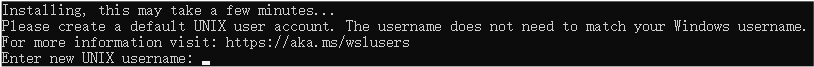
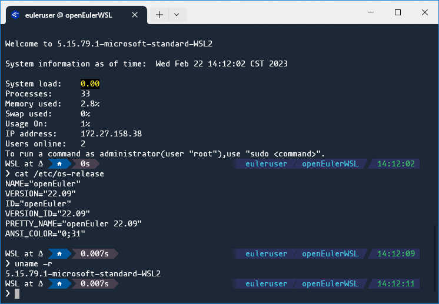

  
 
Windows Subsystem for Linux (WSL) is a feature on Windows 10 and 11 that allows you to directly run a complete Linux distribution on Windows. With WSL, dual booting or a traditional virtual machine is no longer needed to access both Windows and Linux applications and utilities at the same time.

openEuler has been ported to WSL and launched on Microsoft Store. Installing openEuler WSL is fast and painless as you don't have to manually configure drive partitions for each installation, and running openEuler WSL is clean and easy because it doesn't consume as many system resources as virtual machines. Developers working on Windows can utilize openEuler WSL to verify their code in a Linux environment; Linux beginners can also use openEuler WSL to quickly get started with Linux usage. Now, let's install and configure your first openEuler WSL installation.

## Installing openEuler WSL

The WSL version of openEuler can be easily installed by performing three simple steps on Windows 11 or Windows 10 version 2004 and higher. For older Windows 10 versions, please refer to [manual installation steps](https://learn.microsoft.com/en-us/windows/wsl/install-manual).

1. Enable the WSL feature. 

In **Control Panel**, choose **Programs > Programs and Features > Turn Windows features on or off**. In the displayed **Windows Features** window, check **Windows Subsystem for Linux** and click **OK**. You will be prompted to restart your PC.

  

After restarting the PC, set the default version of WSL to WSL 2 by running **wsl --set-default-version 2**.
 
2. Install openEuler from Microsoft Store.

You can now install openEuler with few clicks: Open Microsoft Store from the start menu, search for openEuler, and install a version of your choice. Currently, openEuler 20.03 LTS SP3, 22.03 LTS, and 22.09 are available as WSL distros on Microsoft Store.

>

Click **Get** on the store page of openEuler, the system will download and install the openEuler application. When the installation completes, openEuler is ready to be launched from the start menu. It's as easy as installing a simple desktop program!

3. Configure the default user.

>

Upon first running of the openEuler application, openEuler will perform some further configurations automatically, then prompt you to add a default user. Don't forget to set a password that meets the [complexity requirements](https://docs.openeuler.org/en/docs/22.03_LTS_SP1/docs/Quickstart/quick-start.html#:~:text=will%20be%20disabled.-,Password%20Complexity,-The%20password%20of).

## Using openEuler WSL

The most straightforward way to launch openEuler WSL is through the start menu application, but it can be troublesome if you log in as multiple users at the same time. Other methods to run openEuler WSL include Windows CMD, PowerShell, and Windows Terminal (WT).  

In CMD and PowerShell, openEuler (22.09 for example) can be launched by running **wsl -d openEuler-22.09**. Or, you can run **wsl -s openEuler-22.09** to set openEuler as the default WSL distro and directly run **wsl** to start openEuler. To use openEuler through WT, a WT profile is required (which is installed with openEuler if WT is already in the system). You can also manually create a profile as follows:  

>

Now, you're all set to begin your new openEuler journey on Windows.

>

The capabilities of openEuler WSL are being continuously expanded. If you want openEuler WSL to support more launchers, or want to learn more about openEuler WSL and the software packages of different versions, you are welcome to visit the openEuler community and submit issues:

-	[openEuler official website](https://www.openeuler.org/en/)

