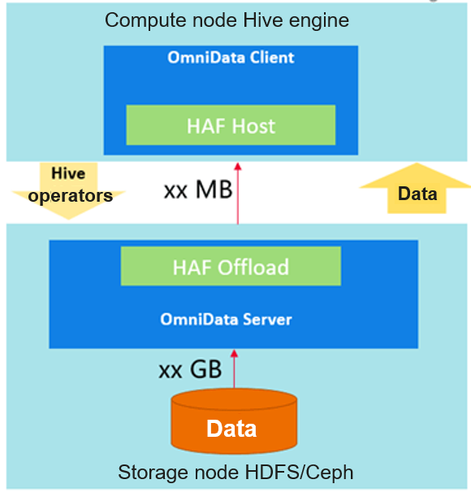
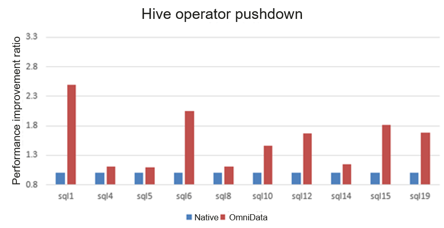
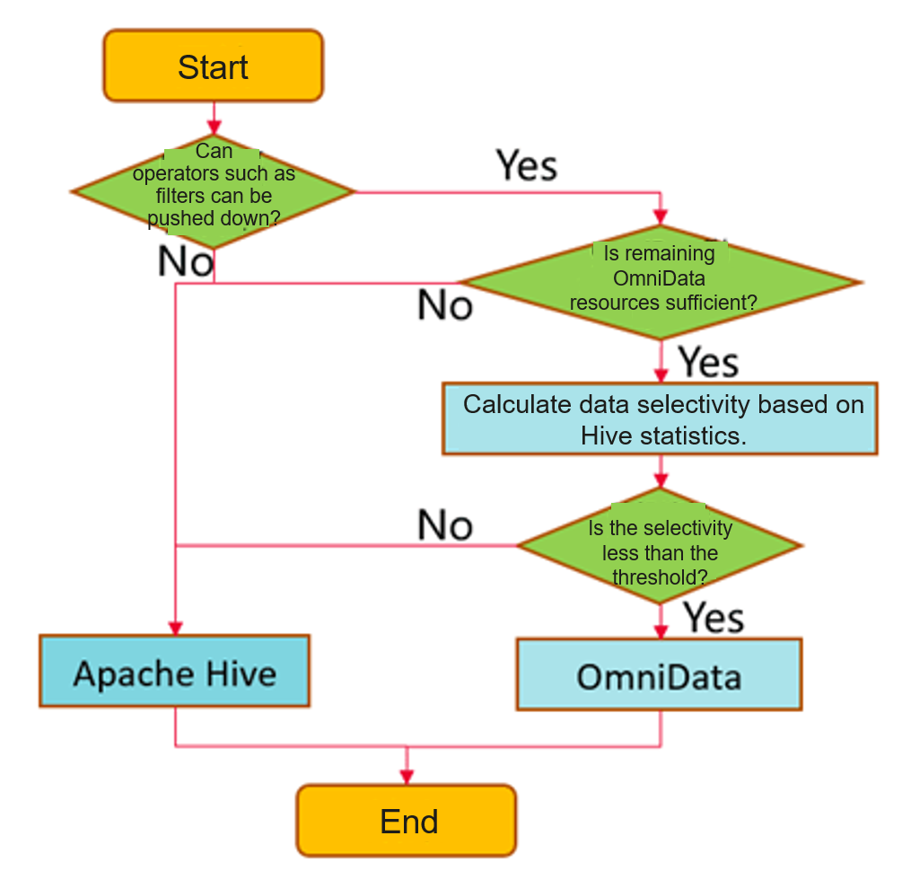
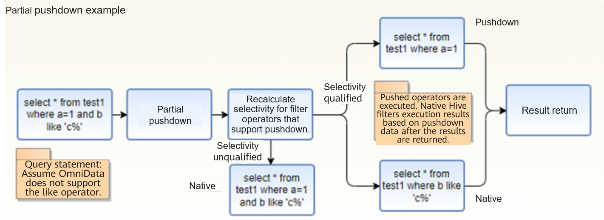
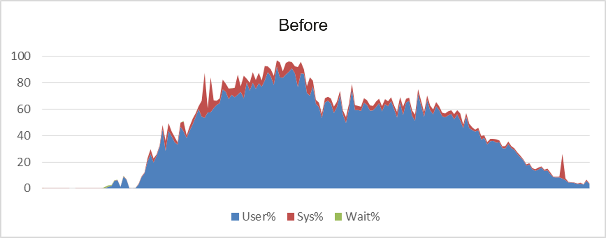
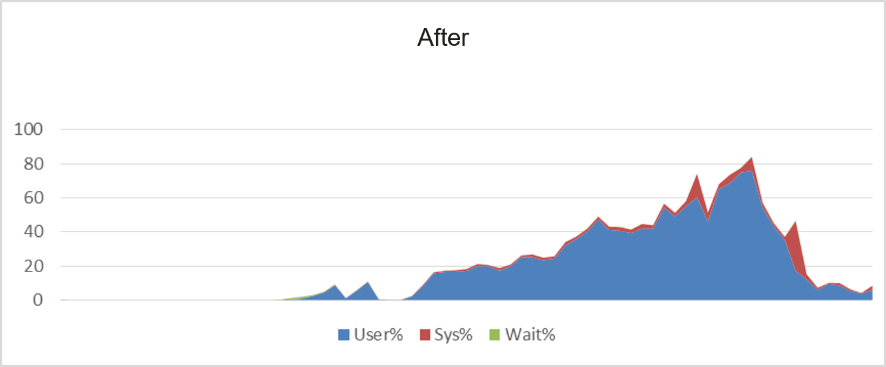
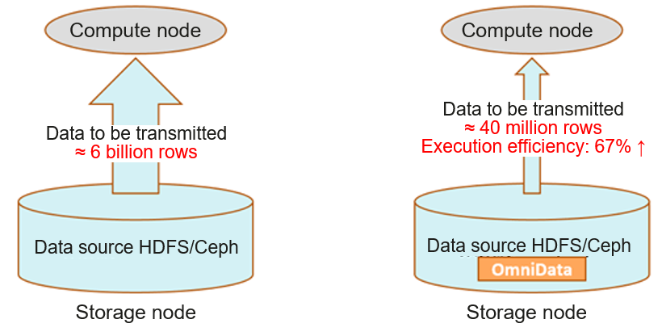

## Introduction to omnidata-hive-connector

omnidata-hive-connector is a service that pushes operators of the big data component Hive to storage nodes for near-data computing, thus reducing network bandwidth consumption and improving Hive query performance. Currently, Hive on Tez is supported. **omnidata-hive-connector has been open-sourced in the openEuler community**.

## OmniData Architecture

OmniData is an operator pushdown feature. It consists of the following components:  
1.  The OmniData Client is an open source component that provides a plugin for different engines. For the Hive engine, omnidata-hive-connector functions as the OmniData Client and uses the annotation and compilation plugins provided by HAF to automatically push tasks to the OmniData Server on storage nodes.  
2.  HAF Host is a library deployed on compute nodes to provide task offload capabilities and push tasks to HAF Offload.  
3.  HAF Offload is a library deployed on storage nodes to provide task execution capabilities and execute OmniData Server jobs.  
4. OmniData Server handles tasks pushed down by HAF Host.  

## Functions of omnidata-hive-connector

1.  Pushes the filter, aggregation, and limit operators of Hive to storage nodes for computing. It filters data in advance to reduce the amount of data transmitted over the network and improve overall performance.  

2.  Registers with Hive as a plugin and pushes operators down in loose coupling mode. The plugin can be activated or enabled through a feature switch.  

3.  Pushes down the HDFS/Ceph file system.  

4.  Pushes down the ORC/Parquet file format.  

5.  Pushes down built-in user-defined functions (UDFs) of Hive, including cast, instr, length, lower, replace, substr, and upper.  

## Application Scenarios of omnidata-hive-connector

In the decoupled storage and compute scenario under typical hardware configuration of Hive, run the TPC-H benchmark and omnidata-hive-connector one by one.  

After omnidata-hive-connector is run, the performance of ten SQL statements is **improved by more than 40% on average**.  

## Major Optimization Methods of omnidata-hive-connector

1.  Dynamic pushdown based on data selectivity  

omnidata-hive-connector calculates data selectivity based on Hive statistics. A lower value indicates that more data is to be filtered. By setting the selectivity threshold through parameters, omnidata-hive-connector dynamically pushes operators that have a selectivity value lower than the threshold to storage nodes. In this way, storage nodes read data locally for computing, and then return the filtered datasets to compute nodes over the network, which improves network transmission efficiency. In addition to data selectivity, omnidata-hive-connector also determines whether an operator is supported and whether the remaining resources are sufficient.  

2.  Partial pushdown of a filter  

If a filter contains both operators that support pushdown and operators that do not, omnidata-hive-connector constructs a new filter for the operators that do not support pushdown and adopts native Hive computing. For the operators that support pushdown, it recalculates data selectivity, based on which it determines whether to push down the operators.

3.  Storage and compute collaboration leveraging computing resources

omnidata-hive-connector pushes operators to storage nodes for computing, effectively reducing CPU usage of computing nodes and improving overall computing efficiency. Take the SQL statements of TPC-H as an example. Before the optimization, the average CPU usage of compute nodes is greater than 60%. After the optimization, the average CPU usage of compute nodes is about 40%.

4.  Data filtering in advance 

Data filtering in advance is the main source of omnidata-hive-connector performance gains. Data is filtered on storage nodes to reduce the amount of data transmitted over the network and processed by computing nodes.  

Take the TPC-H SQL statements as an example. The SQL statements contain multiple filters. Before the optimization, the operators need to read nearly 6 billion rows of data from remote storage nodes over the network. After the optimization, only 40 million rows of valid data after filtering need to be transmitted. The execution efficiency is improved by more than 60%.  

##  Follow-up Planning

This project has been open-sourced in the openEuler community. omnidata-hive-connector will accommodate more functions such as the following:

1. Support for timestamp and decimal data formats

2. Pushdown of BloomFilter operators

3. Pushdown of UDFs

Code repository: [https://gitee.com/openeuler/omnidata-hive-connector](https://gitee.com/openeuler/omnidata-hive-connector)

Welcome to join the openEuler big data SIG and discuss big data technologies with us.
