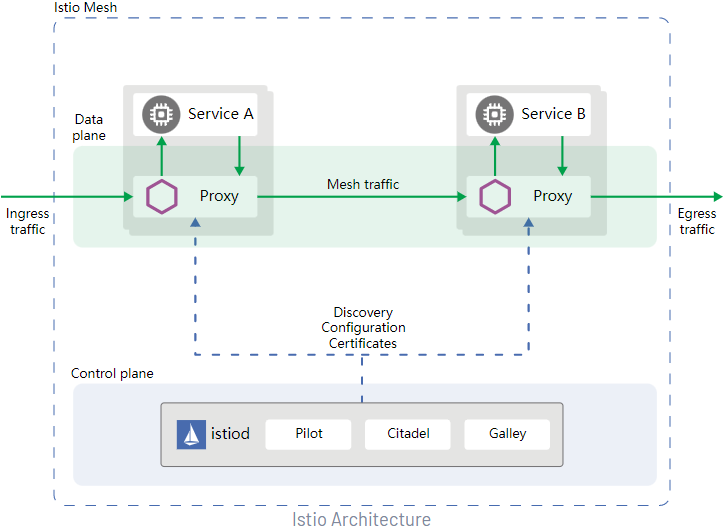
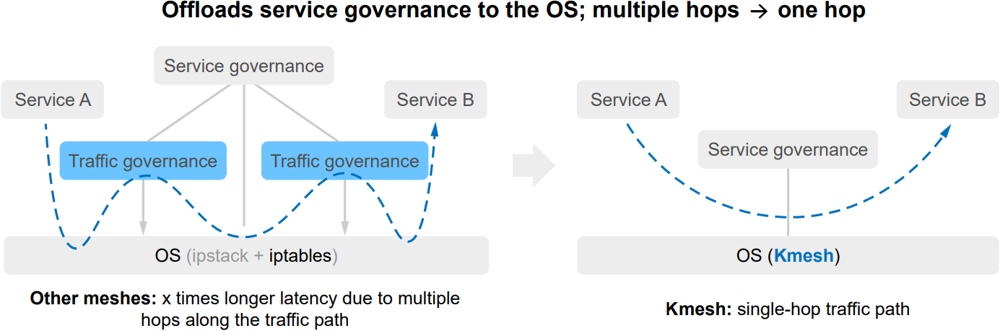

As cloud-connected microservices have become a common choice for enterprise data centers, it is a big challenge to boost the communication between microservices while meeting SLA requirements.

Service meshes arise as a practical solution to the previous challenge. A service mesh is a dedicated infrastructure layer that you can add to your applications in a microservice-based system. It controls the way how different parts of an application communicate with each other.

Take Istio as an example. Istio is one of the most popular service meshes for distributed or microservice-based architectures. It connects, monitors, and secures the containers in a Kubernetes cluster. Kubernetes enables agile application deployment and management on the cloud, though they cannot effectively orchestrate application traffic. Istio extends Kubernetes to establish a programmable, application-aware network using service proxies.

Istio has two components: the data plane and the control plane. 

-	The data plane has intelligent service proxies (functioning as sidecars) deployed to control the network communication between microservices.  
-	The control plane configures and manages the service proxies to route traffic.

>  
Source: Istio official website
 
These service proxies in Istio orchestrate the network traffic and allow a broad set of application-aware features based on the configuration the user sets. However, they generally incur extra latencies and overheads in the data plane.  
-	Latency  
With the meshing, the single-hop access latency increases by 2.65 ms, which is nearly unacceptable for core applications.

-	Resource overhead  
By default, each Istio sidecar occupies more than 50 MB of memory and two CPU cores. For large clusters, such overhead is too high to deploy service containers.

**To resolve such issues in the data plane, openEuler offers an alternative solution – Kmesh**. Kmesh is a cloud-native service mesh data plane. It can connect to a mesh control plane, such as Istio, that complies with the Dynamic Resource Discovery (xDS) protocol. Kmesh orchestrates application traffic more efficiently in the following ways:

-	Load balancing: Various load balancing policies such as polling.  
-	Routing: L7 routing support.  
-	Gray: Backend service policies available in percentage mode.  

**Kmesh runs on a programmable kernel to offload service governance to the OS, which shortens the communication latency between services to one-fifth the industry average.**

>  

Kmesh can optimize communication for cloud-native services to meet latency-sensitive needs of e-commerce, billing, finance, logistics, short video, online conference, and cloud gaming deployments.

For more information about how openEuler helps tackle modern workloads, please visit the [openEuler official website](https://www.openeuler.org/en/).

