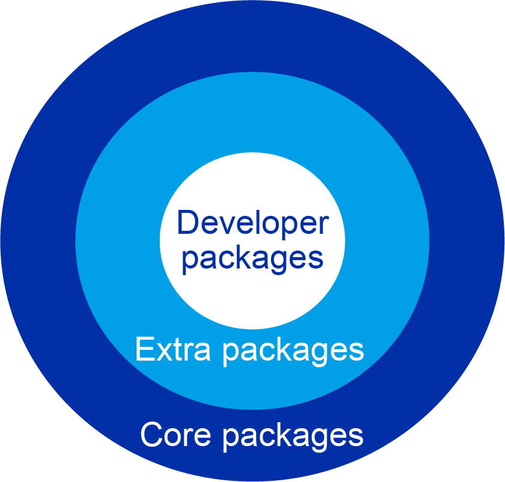

## What Is EUR?
openEuler User Repo (EUR) is a hosting platform provided by the openEuler community for personal software packages. It aims to provide an easy-to-use software package distribution platform for developers.

## Why EUR?

In the world of operating systems, the richness of software packages and whether they are easy to distribute determine the experience of operating system users and developers. However, in the following scenarios where:

-	Developers expect to continuously integrate software under development with the openEuler community as soon as possible and release the software to their own users for testing.  
-	A new package is introduced, but multiple software dependencies do not exist in the community, which greatly increases developers' workload.  
-	Users expect to use or integrate the nightly or unstable build of a software package on openEuler 20.03 LTS.  

There is no ideal out-of-the-box solution in the infrastructure of the openEuler community.  
After discussion with the Technical Committee (TC) members of the community, software packages are further classified as follows:

>  
 
-	Core packages: Software packages maintained by SIGs and developers of the openEuler community.  
-	Extra packages: Software packages that do not meet the quality requirements of the community, such as EPOL or oepkgs, but are still available.  
-	Developer packages (hosted on EUR): Software packages that are completely maintained by developers or individuals. Those packages hosted on EUR do not need to comply with most constraints and quality requirements for software packages in the openEuler community.  

## What Are Characteristics of EUR?
Based on the preceding software package classification model, developer packages require a simple and lightweight software package distribution platform that is:

-	Friendly to developers and upstream ecosystems;  
-	Able to build software packages for different openEuler versions;  
-	Open to users to release software packages independently;  
-	Independent from the community releases.  

Since the objectives and requirements for EUR are similar to those for Copr, according to communication with the Copr development team, the openEuler community decided to use Copr to build the first version of EUR.

## What Can EUR Do?
EUR hosts personal repositories of developers, similar to Personal Package Archive (PPA) of Ubuntu and Copr of Fedora. EUR supports automatic packaging of software from PyPI and RubyGems (more methods will be explored in the future). Continuous builds can be automatically triggered through webhooks. In the future, software packages in personal repositories can be introduced to the community by one click.

## Who Is EUR Intended For?

If you want to:
-	Quickly package software from PyPI and RubyGems;  
-	Add the latest software package or variant version to a released openEuler version (for example, i3wm for openEuler recently provided on EUR);  
-	Build a repository for continuous integration with openEuler for software still under development;  
-	Package a piece of software into an RPM package for your own use;  
-	Test whether the spec file is correct before contributing a software package to the community.
You are advised to use EUR to quickly build an individual repository and distribute your software packages.  

For more information about EUR, visit:

-	[openEuler official website](https://www.openeuler.org/en/)
-	[EUR](https://eur.openeuler.openatom.cn/)

