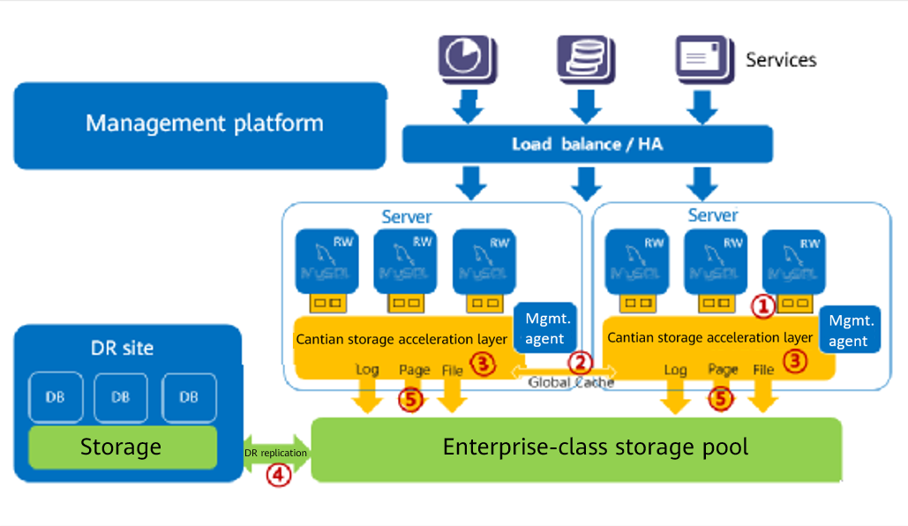
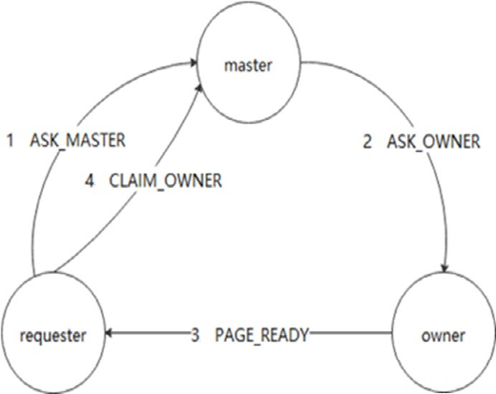
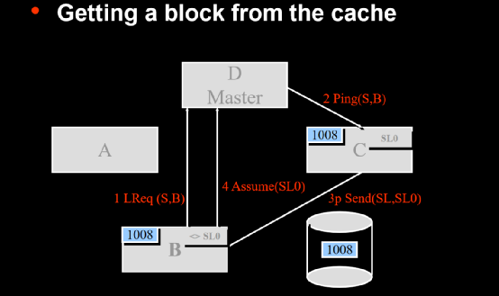
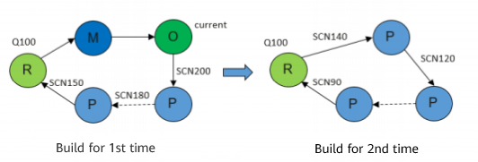
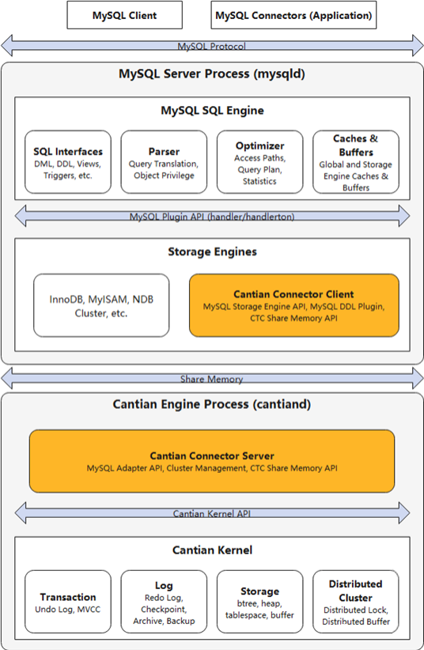
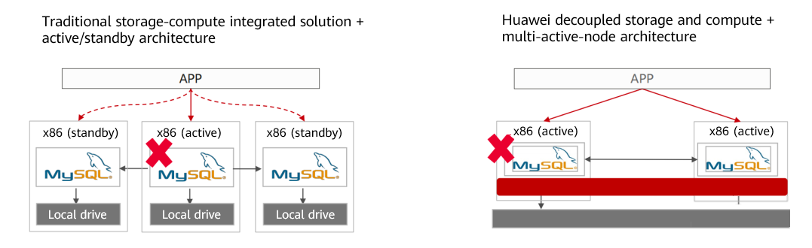
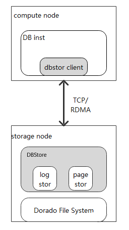
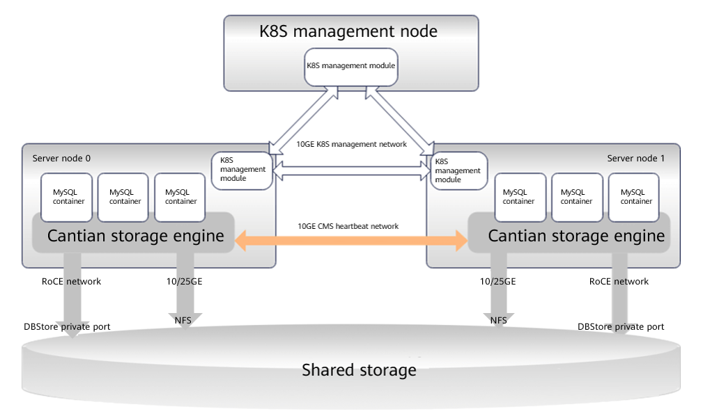

At DTCC2023, Huawei and GreatDB jointly released a MySQL shared storage concurrent read/write solution, with the Cantian engine as its core. **Cantian is a middleware that enables a regular single-node database to have a database similar capability to Oracle RAC. It is open sourced in the openEuler community and supports InnoDB, with plans to support more database storage engines in the future.**

Repo URL: [https://gitee.com/openeuler/cantian](https://gitee.com/openeuler/cantian)

The logical architecture of Cantian is illustrated in the preceding figure. Based on enterprise-class centralized storage, the Cantian engine creates an intermediate layer between the SQL engine and the InnoDB storage engine in MySQL. This intermediate layer can simulate InnoDB behaviors, allowing for easy interconnection with the SQL engine. The InnoDB is closely related to transaction control. Therefore, Cantian contains the MySQL transaction management layer in addition to the MySQL storage layer.

Upon adding the Cantian engine, MySQL gains the capability of concurrent read and write on multiple nodes, effectively transforming it into MySQL RAC.
In Cantian, although undo, temp, and log are stored in shared storage, they are exclusively accessed by specific instances and not shared across the cluster. Other instances in the cluster can only read data when a fault is rectified. In contrast, tablespaces such as control files and system/users can be read and written concurrently in the cluster. 

The figure above illustrates that Cantian utilizes Global Cache, a cache fusion technology, to enable concurrent read and write operations on multiple instances.

The algorithm for implementing global cache in Cantian is similar to that in Oracle 9i RAC. The algorithm determines the master instance of a buffer block. Other instances can be accessed directly when it has the current block. Otherwise, the master instance needs to be used to check whether the block is in the buffer of an instance. The master notifies the owner of the block to send the block to the required database instance.

Although the cache fusion schematic diagrams of Oracle 9i RAC and Cantian may appear similar, there are significant differences in the implementation of the buffer fusion algorithm between the two. Furthermore, due to the UNDO access feature's limitations, when the MVCC requires a PRE-IMAGE that has been changed multiple times across multiple instances, the assembly process in the Cantian engine becomes complex, and the MVCC can only be obtained after level-by-level forward transmission.

If data access occurs in a multi-instance environment in this mode, the Cantian engine may experience performance issues. While performing multiple builds on an instance can significantly improve efficiency, it may also make distributed lock management more complex. Currently, Cantian's Cache Fusion algorithm is in its first generation and will be further optimized.

Cantian is currently integrated with MySQL. The MySQL SQL layer interacts with CTC via the predefined MySQL handler/handlerton interface. The CTC plugin receives the request that the MySQL SQL engine invokes the storage engine plugin. The CTC plugin uses a shared memory communication module and interconnection layer logic to forward the request to the Cantian engine kernel. The CTC plugin and communication module of the Cantian engine are designed as a unified interface and can be dynamically replaced. Two deployment modes are supported: single-process interface direct binding and dual-process shared memory communication. A Cantian engine process can connect to one or more MySQL instances. Different instances communicate with the Cantian engine through distinct shared memory channels. The CTC plugin manages the allocation and release of cluster resources when instances are started or stopped. Although MySQL metadata is still stored and maintained using the InnoDB engine, metadata modification operations performed by MySQL are broadcasted to other active MySQL instances in the cluster through the CTC and Cantian engines to ensure metadata consistency across the cluster. When broadcasting, the remote MySQL instance uses a proxy user with the corresponding permission to perform the modification operation, ensuring consistency of user permissions when the cluster executes statements.

The Cantian engine-based MySQL database does not require the failover of the active/standby architecture in terms of high availability. Applications can be switched over in seconds with zero data loss, which is critical for critical services.

DBStore is another crucial component of the Cantian engine. It provides direct interfaces for database log and page storage, and separates the storage logic of database services from computing. DBStore uses a C/S architecture. The client is deployed on the compute node to provide log and page storage interfaces, while the server is deployed on the storage node to store logs and pages. The client and server communicate with each other based on TCP/RDMA.

The project team will endeavor to adapt DBStore to more storage systems inside and outside China. This is a process of ecosystem construction, which requires the cooperation of the community ecosystem. Currently, Cantian has adapted to InnoDB, and the adaptation to PostgreSQL storage engine is being developed. More and more databases will adapt to Cantian with the help of the open source community.

When it comes to the application scenarios of Cantian, it can be used to develop database appliances. Cantian enables a single-node centralized database to quickly become a high-performance, multi-read-multi-write, or strongly consistent read/write separation database system. An all-software solution is possible if high-performance distributed storage replaces centralized storage at the back end. However, to achieve high performance, the Cantian engine must rely on a high-speed CMS network and a high-performance, low-latency centralized storage system. Therefore, an all-software solution is not currently feasible. But as an open source project, the iterative development of the Cantian engine makes anything possible.
