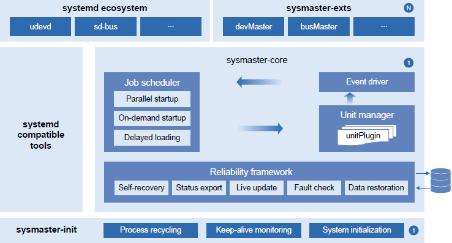

Recently, sysMaster 0.5.0 was released and has been integrated into openEuler 23.09. Compared with earlier versions, this version adds the devmaster module for device management and the support for VM scenarios.

## **About devmaster**

The device manager processes such operations as device hot swap, node creation, and update, and is an integral part of system initialization. **Devmaster, a crucial component of sysMaster, serves as the device management module. It plays a vital role in facilitating quick system startup and ensuring the normal operation of system functions.**

The software architecture of devmaster follows the design principles of high cohesion and low coupling to ensure independent responsibilities of each component, thus improving the software's reusability, replaceability, and scalability, and reducing development and maintenance costs. Devmaster consists of four components: resident process devmaster, client tool devctl, external library, and compatibility tool. Devmaster is compiled using the Rust language, which can eliminate memory security issues.

## **Core Principles**

**Event-triggered:**

Monitor device hot swap events in real time and use the queue grading technology to better handle high-concurrency scenarios and alleviate device competition issues; utilize a worker pool mechanism to support concurrent event processing, improve the event processing throughput, and enable faster startup (within seconds).

**Separation of mechanisms and policies:**

Define event processing behavior in external rule files to avoid hard coding of the device processing logic; allow device rules to be combined, customized, and tailored as required, providing flexible and powerful scalability.

**Maintainability and testability:**

Provide control interfaces for users through the client tool devctl, improving devmaster maintainability and testability; support compatibility with the udevadm option to enable smooth migration of user habits.

**Ecosystem compatibility:**

Provide comprehensive southbound and northbound compatibility tools, including the rule translation tool udev, Rust2C interfaces of the external library, and specialized device components, to support seamless migration from the udev ecosystem to the devmaster ecosystem. Streamline all scenarios of embedded, physical machine (PM), and virtual machine (VM) OSs based on the openEuler and OpenHarmony ecosystems.

In general, devmaster is designed to simplify the system architecture and ensure the device manager's scalability, reliability, maintainability, testability, software performance, and ecosystem compatibility through multiple key technologies. It is a valuable device management tool.

## **New Scenarios**

**sysMaster currently uses PID 1 to manage system services in the BusyBox, container, and VM scenarios.**

**Compatible with BusyBox:**

[http://sysmaster.online/use/01-run%20sysmaster%20with%20busybox/](http://sysmaster.online/use/01-run%20sysmaster%20with%20busybox/)

**Managing services such as sshd in containers:**

[http://sysmaster.online/use/01-run%20sysmaster%20with%20container/#sshd](http://sysmaster.online/use/01-run%20sysmaster%20with%20container/#sshd)

**Running as PID 1 on VMs:**

[http://sysmaster.online/use/01-run%20sysmaster%20with%20vm/#pid1](http://sysmaster.online/use/01-run%20sysmaster%20with%20vm/#pid1)

## **About sysMaster**

sysMaster is an open-source software project initiated and created by the openEuler community. It manages processes, containers, and VMs centrally and provides fault monitoring and self-healing mechanisms to help deal with Linux initialization and service management challenges. All these features make sysMaster an excellent choice for server, cloud computing, and embedded scenarios. It divides the functions of traditional PID 1 into a 1+1+*N* architecture based on application scenarios.

As shown in the figure, sysMaster consists of three parts:

**sysmaster-init**: new PID 1, featuring simplified functions, KLOC, and ultimate reliability.

**sysmaster-core**: undertakes original core functions of systemd and incorporates the high-reliability framework and plugin mechanism to enable quick self-healing upon crashes, live upgrades, and flexible assembly capabilities.

**sysmaster-exts**: offers a set of components that deliver independent system functions, which are coupled in traditional PID 1; supports drawer-style replacement of systemd components and scenario-based and regular replacement.

 
Featuring a simple architecture, sysMaster uses a high-reliability framework to improve system reliability and employs a 1+1+*N* design to improve the scalability and adaptability of the overall system architecture while reducing development and maintenance costs. Now, we prioritize minimal functionality and utilize scenario-based and regular approaches to meet our expectations. Based on the server, embedded, and cloud application scenarios, we enhance the reliability, performance, maintainability, and testability of sysMaster to build it into a self-controlled and competitive root component that can replace systemd.

**Short-term competitiveness**: ultimate reliability and system startup speed

1\.
Zero downtime: Technologies such as status export and savepoint are used to implement second-level fault self-healing, which ensures that PID 1 remains online at all times and services remain unaffected.

2\. Quick startup: Decoupling, deduplication, and simplified mirroring shorten the server restart time from 3 to 5 minutes to 1 minute.

**Long-term competitiveness**: All-scenario application and higher cloud platform O&M efficiency

1\. All-scenario application: support for cloud, edge, and device scenarios, unified init, as well as bare metal servers, VMs, and containers

2\.
Container OS: Kernel + sysMaster = Container OS base. Interconnection with Kubernetes and OpenStack improves O&M efficiency by X times in cloud scenarios.

In the future, sysMaster will extend to more scenarios and have its architecture and performance further optimized for higher scalability and adaptability. In addition,
new features and components will be developed to meet the requirements of containerization, virtualization, and edge computing scenarios. These features make sysMaster a powerful, efficient, and user-friendly system management framework.

## **Related Links**

[1] [https://live.huawei.com/huaweiconnect/meeting/cn/12050.html](https://live.huawei.com/huaweiconnect/meeting/cn/12050.html)

[2] [https://www.openeuler.org/zh/interaction/summit-list/summit2022/](https://www.openeuler.org/zh/interaction/summit-list/summit2022/)

[3] [https://eventyay.com/e/7cfe0771/schedule?search=sysMaster](https://eventyay.com/e/7cfe0771/schedule?search=sysMaster)

[4] [https://gongyi.cctv.com/special/opensource/index.shtml](https://gongyi.cctv.com/special/opensource/index.shtml)

[5] [https://mp.weixin.qq.com/s/DaKM7f6tEAGNkBGeZwfzIA](https://mp.weixin.qq.com/s/DaKM7f6tEAGNkBGeZwfzIA)
