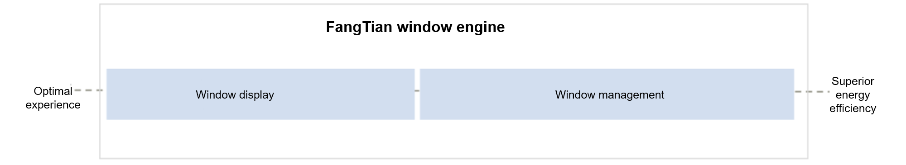
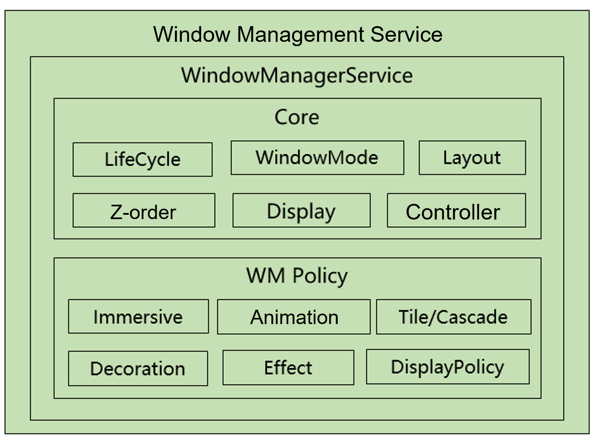
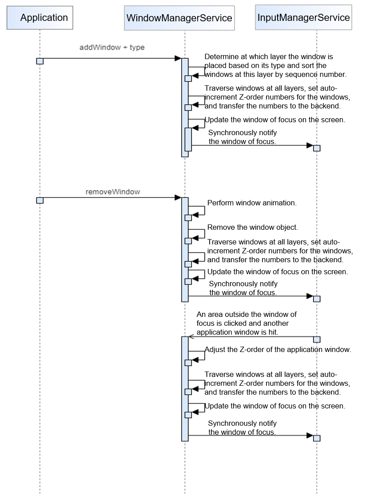
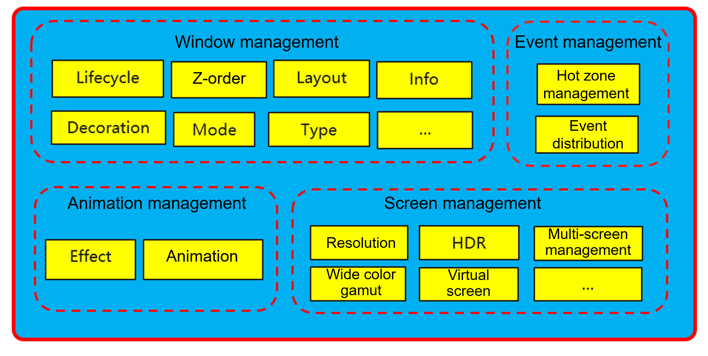

As one of the two core modules of the FangTian window engine, window management provides a mechanism for multiple application interfaces to share the same physical screen for display and interaction. An application program only needs to implement its user interface, and the window management system organizes the user interfaces of multiple application programs. **The following content describes the window display capabilities of the FangTian window engine for multiple device types.**

The window management module consists of the interface layer and server. The interface layer provides window capabilities for applications, and the server implements window capabilities. As shown in the preceding figure, the window management service consists of the Core component and WM Policy component. The Core component provides basic window management capabilities, including window information, life cycle, layout, and so on. The WM Policy component provides animation, styling, decoration, and other capabilities.

Take the core basic functions as an example to describe how a window is added or removed. The following figure shows the detailed process.

## Functions of the Window Management Module

**The window management module is capable of the following:**

- 1. Window management: As the core capability of the window management module, it:

   - Provides window abstraction of application and system display interfaces. A window object represents a rectangular area on the screen and has the position, width, height, and overlay layer (Z-axis) attributes.

  - Maintains the window relationship. The window management system maintains the overlay and position attributes of windows, and dynamically adjusts the attributes according to user operations.

  - Provides a window decoration bar. In the freeform mode, the window management system adds a decoration bar to the top of an application window to provide GUI elements such as maximize, minimize, and close buttons.

  - Composes the windows for display based on the position, size, and layer attributes of the windows.

- 2. Animation management: Provides transition animation, blur, and shadow effects when a window is displayed, hidden, or switched, to make the interaction process more smooth.

- 3. Event management: Manages window operation hot zones based on window information, distributes pointing device events (such as mouse events and touch events) based on event coordinates, and distributes non-pointing device events (such as keyboard events) based on the window of focus.

- 4. Screen management: This capability belongs to the window management module and is provided by the independent DisplayManagerService (DMS). The DMS adds, deletes, and rotates screens, and sets and maintains screen parameters (such as resolution and HDR).

##  Normalization of Window Capabilities for Multiple Device Types

Multi-device support is an important feature of the FangTian window engine. This engine is oriented to both enterprise and consumer business. To adapt to multiple device types, the window management module of the FangTian engine implements normalization at the following aspects:

1\. Form normalization: Four basic window modes are provided: full-screen, split-screen, freeform, and picture-in-picture (PiP). Users can combine the modes based on device requirements.

2\. Policy normalization: The FangTian engine abstracts the window policy layer, provides the adaptive layout capability, and opens custom interfaces. The default window form and layer can be configured, and in-depth customization is supported.

3\. Interface normalization: Interfaces are the only channel for the interaction between applications and the window management service. The FangTian engine enables applications to be quickly ported between different platforms and devices through the same set of interfaces.

**The FangTian SIG is in fast development and will provide more window capabilities in the future.**

**Related Links**

1\. FangTian window engine homepage:

[https://www.openeuler.org/en/sig/sig-detail/?name=sig-FangTian](https://www.openeuler.org/en/sig/sig-detail/?name=sig-FangTian)

2\. Quick understanding of the FangTian engine:

[https://www.openeuler.org/en/blog/20230728-FangTian/20230728-FangTian.html](https://www.openeuler.org/en/blog/20230728-FangTian/20230728-FangTian.html)

Welcome to add the WeChat account **hhd_kkx2023** to join the FangTian SIG communication group.

