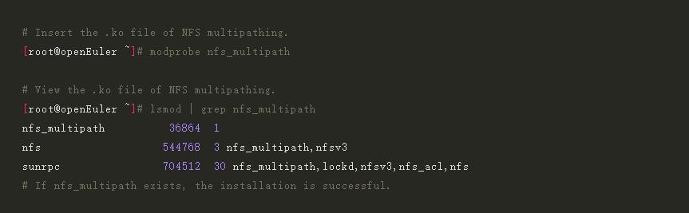
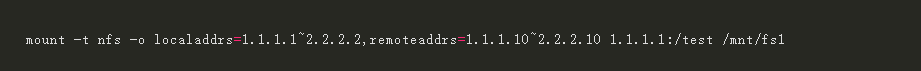
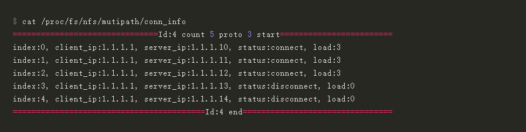

Network File System (NFS) is a distributed file system protocol originally developed by Sun Microsystems (Sun) in 1984. It allows users on NFS clients to access files on NFS servers over computer networks. Due to the widespread use of the NFS service in industries such as finance, AI, and container, there are increasingly high demands for NFS performance and reliability. However, conventional NFS has several disadvantages, including:

-	A mount point on a client is accessible only through a client and a server IP address. Even when multiple physical links exist between the client and the server, only one of them is usable.

-	Conventional NFS is prone to single points of failure, such as a single link of a single mount point, meaning link failover cannot be performed and host services will be interrupted.

NFS multipathing solves the defects of conventional NFS. It ensures multiple links between the client and the server are connected for each single mount point to support I/O transmission over those links, improving the mount point performance. In addition, the link status is periodically checked to ensure fast I/O failover upon a link fault.  

NFS multipathing offers several functions, including:

-	Provides the Round Robin link selection algorithm that balances the performance of multiple links. (NFSv3)

-	Enables fast link failover, which improves NFS reliability. (NFSv3 and NFSv4)

-	Provides an interface for registering link path selection algorithms, allowing developers to customize path selection algorithms.

-	Detects link availability periodically.

-	Displays the link status in real time.

In the upcoming section, we will provide a detailed guide on how to install and utilize NFS multipathing. Our operating system of choice will be openEuler 23.03, while the hardware will be x86_64/Arm.

**Step 1**	Install the openEuler OS. For details, see the *[openEuler 23.03 Installation Guide](https://docs.openeuler.org/en/docs/23.03/docs/Installation/Installation.html)*.

**Step 2**	Install NFS multipathing.

  

**Step 3**	Mount multipath links.

>

Both of the parameters **localaddrs** and **remoteaddrs** are optional. If neither of them is specified, the multipathing feature is disabled.

**localaddrs** indicates the client IP address.

**remoteaddrs** indicates the server IP address.

You can set an IP address range or multiple IP addresses. Use a hyphen (-) to indicate an IP address range and tilde (~) to indicate multiple IP addresses.

For example, **remoteaddrs=1.1.1.1-1.1.1.3** specifies three server addresses: 1.1.1.1, 1.1.1.2, and 1.1.1.3. **localaddrs=1.1.1.1~1.1.1.3** specifies two client addresses: 1.1.1.1 and 1.1.1.3.

Step 4	Query multipathing information.

>

**status** indicates the link status. **connect** indicates that the link is up, and **disconnect** indicates that the link is down.

**load** indicates the number of NFS requests sent over the link.

Note

-	There can be up to eight client addresses and eight server IP addresses. If more IP addresses are specified, the links cannot be mounted.

-	A maximum of eight multipath links are allowed.

For more information about NFS multipathing and other openEuler functions, please visit the [openEuler official website](https://www.openeuler.org/en/).
