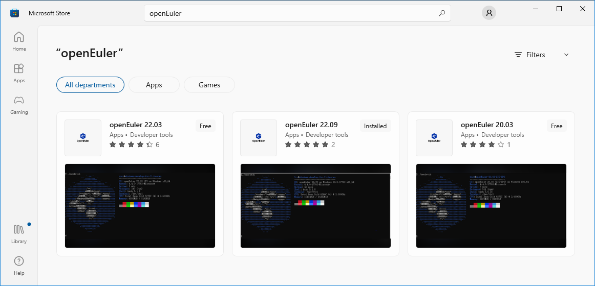

As an open source infrastructure OS derived from Linux, openEuler has witnessed quick adoption by Linux enthusiasts worldwide in a wealth of application scenarios like server, cloud computing, edge computing, and embedded.

Since openEuler is a Linux distribution, is it possible to use openEuler on Windows? The answer is YES, for we now have the openEuler Windows Subsystem for Linux (WSL) package, which lets you install openEuler and get started with its features and capabilities directly on Windows, unmodified, without the overhead of a traditional virtual machine or dualboot setup.

You can download openEuler from Microsoft Store, to enjoy a native experience on Windows devices that support WSL:

>  
 
All openEuler long term support (LTS) versions within the support period are available on Microsoft Store, and are updated at the same time with official versions released in the openEuler open source community.

As an alternate to downloading packaged openEuler applications from Microsoft Store, it's convenient to build your own WSL applications using the open source code in the [openEuler WSL repository](https://gitee.com/openeuler/wsl?_from=gitee_search).

Along with continuous feature updates, Linux's native GUI applications, systemd, and other features will be supported in future openEuler WSL versions, to stay in line with Microsoft WSL iterations.

With the openEuler WSL package, you can leverage Visual Studio Code to create a smooth cross-OS development experience, build a Kubernetes cluster in openEuler WSL, use openEuler command-line programs or scripts to process files in Windows or WSL, and more.

To learn details about how to install a Linux distribution on Windows with WSL, visit the [WSL official website](https://learn.microsoft.com/en-us/windows/wsl/install).

For more information about how openEuler helps tackle modern workloads, please visit the [openEuler official website](https://www.openeuler.org/en/).

