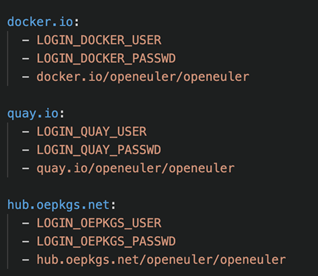

KubeCon + CloudNativeCon + Open Source Summit China 2023 was held in Shanghai from September 26 to 28, 2023. In the OpenSpeech topic of this summit, **developers of the openEuler community shared an innovative project – EulerPublisher.**

In the cloud native era, cloud images and container images are the mainstream forms of OSs, which are greatly different from typical ISO images released in OS communities. In addition, public cloud platforms have different requirements on OS images, which poses new challenges to open source OS communities. **EulerPublisher is developed to solve the problem that it is difficult for users to customize and obtain openEuler images in cloud native scenarios.**

## What Is EulerPublisher?

EulerPublisher is a toolchain for automatically building, testing, and releasing openEuler images. It can connect to mainstream public cloud platforms such as AWS, Huawei Cloud, Tencent Cloud, and Alibaba Cloud, as well as mainstream container repositories such as Docker Hub. This greatly improves the openEuler image release efficiency and lowers the threshold for users to obtain and experience openEuler.

## How to Use EulerPublisher?

EulerPublisher source code is hosted on [Gitee](https://gitee.com/openEuler/eulerpublisher). Currently, EulerPublisher v0.0.2 has been released to PyPI. 

### Install Environment Dependencies

1. EulerPublisher depends on Docker and QEMU to build container images on multiple platforms. Run the following commands to install the dependencies:

```c
yum install qemu-imgyum install docker
```

The Docker buildx function is used to build images on multiple platforms. This requires that the Docker version be 19.03 or later. Alternatively, you can install the buildx plugin separately as follows:

(1) Find the binary file suitable for your platform on the release page of the Docker buildx project.

(2) Download the target binary file to the local host, rename it **docker-buildx**, and move it to the Docker plugin directory **\~/.docker/cli-plugins**.

(3) Run the **chmod +x ~/.docker/cli-plugins/docker-buildx** to grant the execute permission to the binary file.

2. EulerPublisher is implemented using Python. It depends on the **requirement.txt** file in the source code directory. The installation command is as follows:

```c
pip install -r ./requirement.txt
```

### Installing EulerPublisher

```c
pip install eulerpublisher
```


### Releasing an openEuler Container Image

**Environment Configuration**

To ensure that images can be successfully pushed to a target repository, run the following command to configure the environment variables of the user name and password of the target repository for login:

```c  

export LOGIN_USERNAME=usernameexport LOGIN_PASSWORD=password
```

**One-Click Release**

```c  

eulerpublisher container publish -v {VERSION} -p {REPO} -g {REGISTRY} -f
{DOCKERFILE}
```

The preceding command is used to release an openEuler container image that is customized based on {DOCKERFILE} and whose tag is {VERSION} to the {REPO} repository of {REGISTRY}. This image supports ARM64 and AMD64 platforms.

**Manual Operations**

In addition to one-click image release, you can manually build, push, and test images in sequence as required.

i\. Perform preprocessing.

```c  

eulerpublisher container prepare -v {VERSION}
```

This command is used to download the base container image of the {VERSION} version from the openEuler repository, prepare the Dockerfile, and complete related operations before the build.

ii. Build and push the image to the repository.

```c

eulerpublisher container push -v {VERSION} -p {REPO} -g {REGISTRY} -f
{DOCKERFILE}
```

The preceding command is used to release an openEuler container image that is customized based on {DOCKERFILE} and whose tag is {VERSION} to the {REPO} repository of {REGISTRY}. This image supports ARM64 and AMD64 platforms.

iii\. (Optional) Perform tests.

```c

eulerpublisher container check -v {VERSION} -p {REPO} -g {REGISTRY}
```

This command is used to test the image generated in step ii. Currently, it applies only to images built using the default Dockerfile.

**Multi-repository Release**

EulerPublisher provides the capability of pushing a container image to multiple repositories. The command is as follows:

```c

eulerpublisher container publish -v {VERSION} -f {DOCKERFILE} -m
```

This command uses **-m** (or **--mpublish**) to enable publishing one image to multiple repositories. You do not need to set **-p** {REPO} and **-g** {REGISTRY} when running the command. Target repositories are specified in **etc/container/registry.yaml**. The following is an example:



Before running the multi-repository release command, you need to configure the user name and password environment variables of each registry, such as **LOGIN_DOCKER_USER** and **LOGIN_DOCKER_PASSWD**.

### Building an openEuler Cloud Image

The following describes how to use EulerPublisher to build a general-purpose cloud image.

**Environment Preparation**

If you use EulerPublisher to build a cloud image locally, you need to prepare an execution machine whose OS version is the same as or compatible with that of the target image.

**Building a General-Purpose Cloud Image**

i\. Perform preprocessing.

```c

eulerpublisher cloudimg gen prepare -v {VERSION} -arch {ARCH}
```

In this command, {VERSION} indicates the openEuler version of the target image, and {ARCH} specifies the architecture of the target image, which can be **aarch64** or **x86_86**. Download the image released in the openEuler community and decompress it to obtain the base image.

ii. Build the cloud image.

```c

eulerpublisher cloudimg gen build -v {VERSION} -a {ARCH} -o {NAME} -p
{RPMLIST}
```

In this command, {NAME} specifies the name of the target image, and {RPMLIST} specifies the list of software packages to be preinstalled. Once used, {RPMLIST} cannot be empty. The functions of other parameters are the same as those in the **eulerpublisher cloudimg gen prepare** command.

After this command is executed, a target image named {NAME} is generated in the **/etc/eulerpublisher/cloudimg/gen/output/** directory on the execution machine. This image meets the technical requirements for publishing images in the marketplace of most mainstream public cloud vendors. You can manually publish the image.

**AMI Building**

Specially, the AWS marketplace supports only Amazon Machine Images (AMIs) which can be created using AWS cloud instances.

EulerPublisher supports AMI image building, and the building result meets the requirements for releasing cloud images in the AWS marketplace. For details, see [1].

## Follow-up Planning

EulerPublisher has been used to build images and release general-purpose cloud images to Tencent Cloud and Huawei Cloud image markets, and AMIs to the AWS marketplace (see [2]). The container image release capabilities of EulerPublisher are also used to periodically release openEuler container images to mainstream repositories such as Docker Hub [3].

EulerPublisher's functions are being continuously improved. Currently, we plan to:

1\. Supplement openEuler WSL container image building and release capabilities.

2\. Supplement openEuler cloud image building capabilities that meet image release requirements of more cloud vendors.

3\. Explore the capabilities of building and releasing openEuler bare metal images.

Join us to explore more application scenarios of EulerPublisher!

Related links:

\[1\] EulerPublisher project address: [https://gitee.com/openeuler/eulerpublisher](https://gitee.com/openeuler/eulerpublisher)

\[2\] Releasing openEuler images in the AWS marketplace: [https://aws.amazon.com/marketplace/pp/prodview-cgu5xymg7qnqg?sr=0-4&ref\_=beagle&applicationId=AWSMPContessa](https://aws.amazon.com/marketplace/pp/prodview-cgu5xymg7qnqg?sr=0-4&ref\_=beagle&applicationId=AWSMPContessa)

\[3\] openEuler image repository on Docker Hub: [https://hub.docker.com/r/openeuler/openeuler/tags](https://hub.docker.com/r/openeuler/openeuler/tags)
