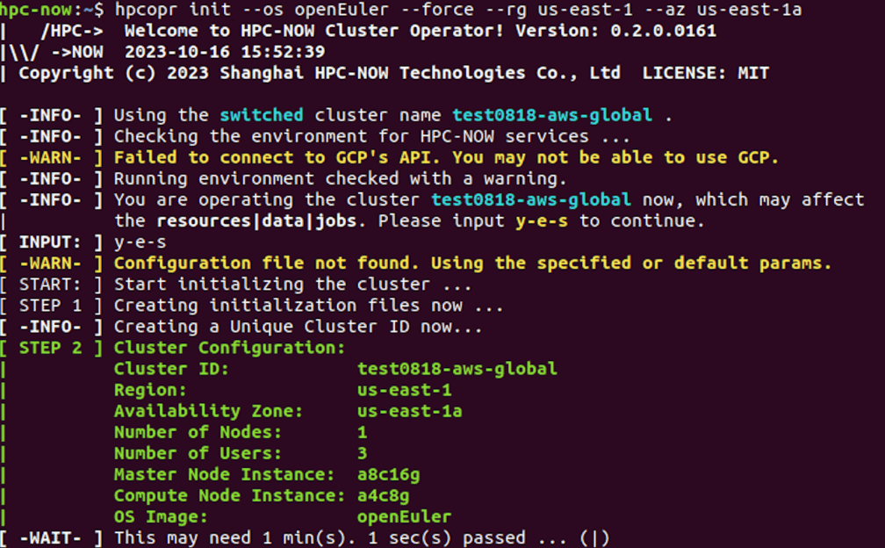
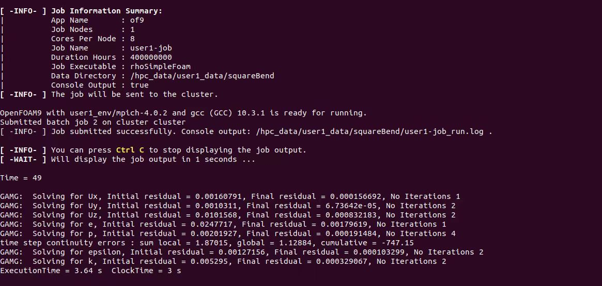
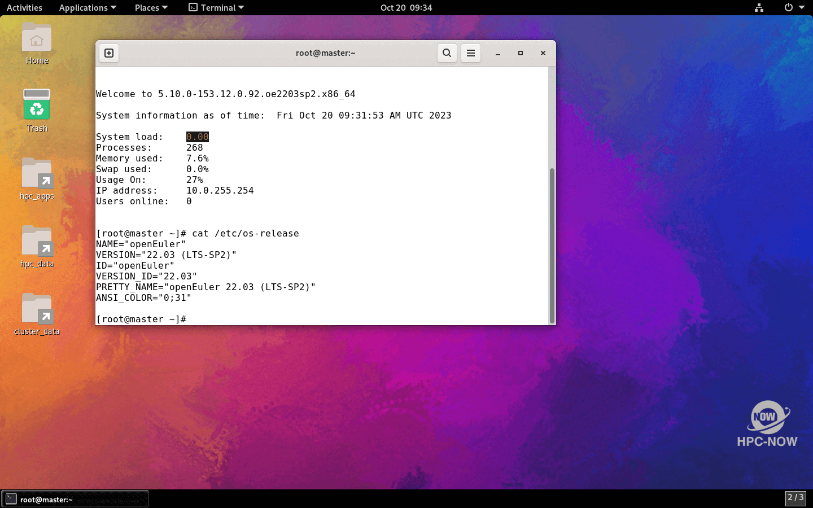
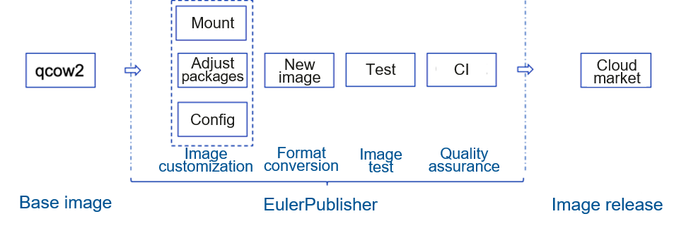

Cloud HPC[1] is a project under incubation preparation of the OpenAtom Foundation. This project is contributed by the Shanghai HPC-NOW Technologies Co., Ltd. who built a commercial cloud HPC solution HPC-NOW based on the Cloud HPC project. Over the past few months, the openEuler community has worked with the Cloud HPC team to promote a complete Cloud HPC solution based on the openEuler operating system.

**Original Requirements**

The Cloud HPC team hopes that the following requirements can be met after the default OS is switched from CentOS to openEuler:

1.  Stable running: supports stable running at full load for a long period of time (24 x 7).

2.  Package manager: provides various software packages to meet HPC software compilation and running requirements.

3.  Desktop UI: supports smooth and extensible graphical user interfaces (GUIs).

4.  Cloud image support: supports one-click VM startup based on openEuler in each region of mainstream cloud vendors.

Based on these basic requirements, Cloud HPC and openEuler developers join hands to perform multiple rounds of debugging and verification.

**Obtaining an openEuler Image**

You can obtain the openEuler image in either of the following ways to deploy and run HPC-NOW on a public cloud platform:

1.  Obtain it from the public image list or image marketplace on the public cloud platform.

2.  Upload the openEuler cloud image to the public cloud platform by importing a private image.

Method 1 is more convenient for users to use openEuler on the cloud. openEuler cloud images have been released in the public image list of Huawei Cloud and e-Cloud, as well as in the marketplaces of Tencent Cloud, Huawei Cloud, and AWS.

If you use method 2 to import a private image to the cloud platform, you are advised to use the openEuler toolchain EulerPublisher[2] to customize openEuler cloud images. EulerPublisher can flexibly preset software based on user requirements to adapt to various scenarios. In addition, diskimage-builder[3] of the OpenStack community has supported openEuler image building since 2022. It can be used to create private openEuler images.

**openEuler Cluster Creation**

The openEuler cluster of HPC-NOW[4] can be easily deployed on the cloud. Major operations are as follows:

1.  Create a cluster.

***hpcopr new-cluster***

***hpcopr init \--os requiredOS \--rg clusterRegion \--az clusterAZ***

2.  After a cluster is created, you can directly connect to the graphical desktop environment of the cluster by running **hpcopr rdp -u USER_NAME --copypass**. The openEuler desktop environment has been automatically deployed and installed during cluster creation. You do not need to manually install it.

Figure 1 Starting an openEuler cluster in one-click mode on AWS

**Running the openEuler Cluster**

**Basic functions:**

After starting an openEuler cluster according to the preceding steps, you can run jobs. Cloud HPC jobs are properly running on the openEuler cluster.

Figure 2 Successful running of OpenFOAM

**Desktop effect:**

Most HPC-NOW users are personnel in research institutes and universities who have strong requirements for OS desktops. openEuler supports mainstream basic and extension desktop UI components that are easy to install and deploy [5]. With the help of the openEuler community, HPC-NOW has integrated the installation and deployment of the desktop environment into an automation script for out-of-box use.

Figure 3 Desktop effect using the GNOME component

**openEuler Cloud Image Release Process**

By reviewing the practice of deploying HPC-NOW on the cloud, we can see that public cloud platforms where openEuler images have been released can facilitate openEuler image services for users. So, it is important to cover more mainstream cloud vendors. The openEuler community proposes a complete process of publishing openEuler cloud images to mainstream cloud platforms.

Figure 4 openEuler cloud image release process

The preceding figure shows how to release an openEuler cloud image.

1.  Obtain the qcow2 image officially released by the openEuler community.

2.  Based on the image, use EulerPublisher for secondary customization to meet user requirements.

3.  Work with oESP to release the custom image to cloud platforms.

This cooperation is not only a valuable practice for openEuler to connect upstream projects, but also an important step to move towards mainstream public cloud platforms. Currently, openEuler cloud images built using EulerPublisher have been released to the Tencent Cloud and AWS image marketplaces. In the future, we will continue to promote openEuler to cover more mainstream cloud vendors and improve cloud experience with openEuler.

\[1\] Cloud HPC project address:

[https://www.openatom.org/project/projectPjVzJsmXW3kG](https://www.openatom.org/project/projectPjVzJsmXW3kG)

\[2\] EulerPublisher project repository:

[https://gitee.com/openeuler/eulerpublisher](https://gitee.com/openeuler/eulerpublisher)

\[3\] Diskimage-builder official website:

[https://docs.openstack.org/diskimage-builder/latest/](https://docs.openstack.org/diskimage-builder/latest/)

\[4\] HPC-NOW deployment guide:

[https://gitee.com/zhenrong-wang/hpc-now/tree/master/Docs](https://gitee.com/zhenrong-wang/hpc-now/tree/master/Docs)

\[5\] openEuler desktop installation guide:

[https://docs.openeuler.org/en/](https://docs.openeuler.org/en/)

 

 

 

 
