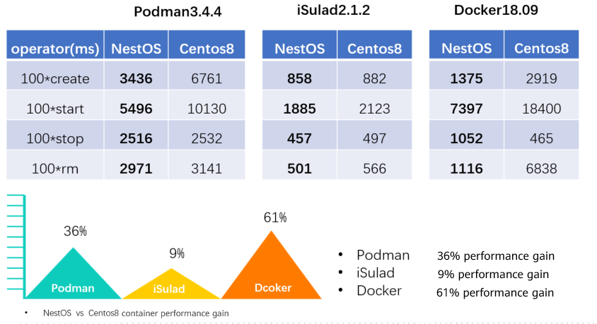

The openEuler community has recently released the dual-mode, cloud-based NestOS, which is designed for containerization and virtualization use cases and incorporates six basic functions. This development allows users to comprehend and adopt the base OS in the form of an immutable infrastructure. Moreover, it provides an alternative for users to leverage the innovative features of openEuler.

## Dual-Mode

In the rapidly evolving landscape of cloud-native computing, containerization and virtualization technologies have emerged as the bedrock for modern application delivery and management. Our latest offering, NestOS, introduces two distinct flavors: NestOS For Container (NFC) and NestOS For Virt (NFV), both built upon the NestOS-22.03-LTS-SP2 version. 

### NFC

This version provides an optimal container environment that facilitates seamless deployment and execution of contemporary applications. Leveraging the power of containers, NFC ensures agility, scalability, and efficient resource utilization. In a nutshell, NestOS combines rpm-ostree, Ignition configuration, a dual-root file system, and an atomic update design. Additionally, the nestos-assembler tool streamlines integration and construction. NFC adheres to the concept of immutable infrastructure. It excels in OS management, supporting both container image mode and self-built application system images. NFC seamlessly integrates with platforms like Kubernetes and OpenStack. Furthermore, it optimizes container performance, enabling effortless cluster building and secure handling of large-scale containerized workloads. 

### NFV

Designed for high performance and stability, NFV caters specifically to virtual machines (VMs). It empowers mission-critical workloads with robustness and reliability, making it an ideal choice for demanding scenarios. It combines RPM package management, system tailoring, performance optimization, and virtualization enhancements. It empowers users to effortlessly create and manage VMs, delivering excellent performance across development, test, and production environments. NFV ensures secure resource isolation, making it a robust virtualization solution. 

Whether you’re running cloud-native applications, virtualized environments, or both, the NFC and NFV versions of the operating system are well-suited. They offer robust stability and security, addressing the diverse requirements of modern data centers and cloud environments.

## Six Key Features

### NKD: Cloud-native Integrated O&M Tool

NestOS Kubernetes Deployer (NKD) is a unique container cloud deployment and O&M tool designed based on NestOS for NFC. It provides a consistent O&M solution for container cloud services and cloud-based OSs. NKD is designed to provide services such as deployment, update, and configuration management outside the cluster, covering the cluster infrastructure, including the operating system and Kubernetes core components. This comprehensive solution greatly simplifies the cluster deployment and upgrade process.

**Project Addresses**

**https://gitee.com/openeuler/nestos-kubernetes-deployer\
\
**

### PilotGo: O&M Plug-in

PilotGo, an O&M plug-in incubated by Kylinsoft in the openEuler community, customizes O&M functions and introduces new architecture awareness features for the NestOS platform. By default, the NestOS integrates the PilotGo agent and topology awareness plug-in agent for out-of-the-box O&M and visualization capabilities.

**Project Addresses**

https://gitee.com/openeuler/PilotGo

### x2NestOS: Immutable Conversion Tool

x2NestOS is a rapid deployment tool that transforms general-purpose OSs into NFC. It is integrated by default in NFV and can also be used with other general-purpose Linux OSs managed by mainstream package managers like yum and apt. Leveraging the dynamic kernel loading feature of kexec, this tool bypasses the boot process, streamlining OS deployment and reducing the complexity and cost of converting existing clusters to NFC.

**Project Addresses**

https://gitee.com/openeuler/x2nestos

### Easy System Image Customization

NFC, which enhances O&M and security by distributing and updating file systems as a whole, integrates the ostree native container feature. This feature allows users in container cloud scenarios to effortlessly create customized images by compiling a ContainerFile (Dockerfile) based on their technology stack. These customized images can be used for integration components customization, as well as upgrades and maintenance.

### Rubik: Hybrid Deployment Engine

Rubik, a hybrid deployment engine, optimizes single-node computing power and ensures service quality.  The NFC version has enabled the kernel features related to Rubik's hybrid deployment and supports the overall solution based on the Rubik hybrid deployment engine. Resources are properly scheduled and isolated, this greatly improves resource utilization in container cloud scenarios while ensuring the quality of mission-critical services.

### Kernel Feature Enhancements

nestos-kernel is independently maintained and developed based on the openEuler-22.03-sp2 kernel version. The repository address is https://gitee.com/src-openeuler/nestos-kernel. In this process, we improved the kernel features of the mm, CPU, and cgroup to make the kernel different from the Euler kernel but with better performance.

1.  Compact Numa Aware (CNA) spinlock

2.  Optimized VM startup, accelerating concurrent VM startup in high-density scenarios

3.  memcg THP control

4.  UKFEF, facilitating fault locating for R&D and O&M personnel.

5.  Performance optimizations

6.  Thread NAPI, improving network resource management efficiency

7.  Page cache limit

## Container Performance Test

## Version Declaration

-   The released version number is 22.03-LTS-SP2.20230928. The released NestOS 22.03-LTS-SP2 version can be smoothly upgraded to NestOS For Container 22.03-LTS-SP2.20230928.
    
-   Due to great changes in the work process of the release team, the first dual-mode version is still built based on the long term support (LTS) version of openEuler 22.03 LTS SP2.
    
-   In the future, we will continue to launch versions based on the pace of LTS and innovation versions in the openEuler community.
    
-   NestOS will follow the release flow based on LTS and innovation versions. When significant updates or patches are available, the versions are rolled out incrementally.

## Welcome to Join in the Project

-   NestOS official website: [https://nestos.openeuler.org/](https://nestos.openeuler.org/)

-   NestOS image download: [https://nestos.openeuler.org/](https://nestos.openeuler.org/)

-   NestOS project repository: [https://gitee.com/openeuler/NestOS](https://gitee.com/openeuler/NestOS)

-   Suggestions and feedback: [https://gitee.com/openeuler/NestOS/issues](https://gitee.com/openeuler/NestOS/issues)

## Downstream Partners

