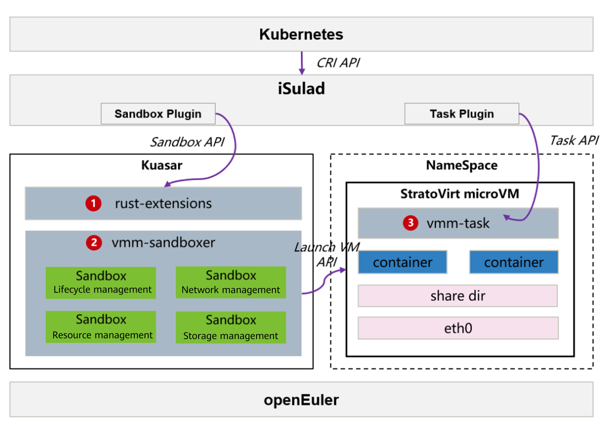

## Overview

    Kuasar is a container runtime that supports multi-sandbox isolation [1] released by Huawei this year with CNCF, which can run multiple types of sandbox containers on a single node. Thanks to its 1:N container process management model, Kuasar improves the multi-container startup speed by more than two times compared with the 1:1 shim process management, saving up to 99% memory increase of the container management process. Kuasar is developed based on the sandbox API [2]. Compared with the shim v2 API, it features lower memory consumption and shorter call chain for sandbox lifecycle management.

​With iSulad, the openEuler community takes the lead in supporting the sandbox API. Kuasar has been built into openEuler 23.09, where users can deploy an ultra-fast, lightweight secure container solution of iSulad+Kuasar+StratoVirt [3] with just a few clicks. For details about the architecture and advantages brought by the unified container runtime solution of iSulad+Kuasar, see the previous blog [4].

​    This blog describes how to install and use the solution as a quick start guide.



**Figure 1** Architecture of the secure container solution of iSulad+Kuasar+StratoVirt

 

 

## Installation and Configuration

**Note:** The root permission is required for installing and using Kuasar.

### Prerequisite

- For better performance, run this solution on bare metal servers. Currently, VMs are not supported.

- Install the openEuler 23.09 OS.

- Install the CRI command line tool crictl required for starting sandboxes and containers.

  ```bash
  # Arm environment
  $ wget https://github.com/kubernetes-sigs/cri-tools/releases/download/v1.25.0/crictl-v1.25.0-linux-arm64.tar.gz
  $ tar -zxvf crictl-v1.25.0-linux-arm64.tar.gz -C /usr/local/bin
  # x86 environment
  $ wget https://github.com/kubernetes-sigs/cri-tools/releases/download/v1.25.0/crictl-v1.25.0-linux-amd64.tar.gz
  $ tar -zxvf crictl-v1.25.0-linux-amd64.tar.gz -C /usr/local/bin
  ```

- Install the CNI plugins required for CRI to configure the network.

  ```bash
  # Create the cni directory.
  $ mkdir -p /opt/cni/bin && mkdir -p /etc/cni/net.d
  # Arm environment
  $ wget https://github.com/containernetworking/plugins/releases/download/v1.3.0/cni-plugins-linux-arm64-v1.3.0.tgz
  $ tar -zxvf cni-plugins-linux-arm64-v1.3.0.tgz -C /opt/cni/bin/
  # x86 environment
  $ wget https://github.com/containernetworking/plugins/releases/download/v1.3.0/cni-plugins-linux-amd64-v1.3.0.tgz
  $ tar -zxvf cni-plugins-linux-amd64-v1.3.0.tgz -C /opt/cni/bin/
  ```

 

### One-Click Installation

Run the following command to install iSulad, Kuasar, and StratoVirt on openEuler 23.09:

```bash
$ yum install iSulad kuasar stratovirt
```

### Component Configurations

#### Configuring crictl

Modify the crictl configuration file **/etc/crictl.yaml** to connect to iSulad.

```bash
$ cat /etc/crictl.yaml
runtime-endpoint: unix:///var/run/isulad.sock
image-endpoint: unix:///var/run/isulad.sock
```

#### Configuring iSulad

Modify the configuration file **/etc/isulad/daemon.json configuration** of the iSulad container engine. Add the following fields to the configuration file:

```bash
$ cat /etc/isulad/daemon.json
...
    "cri-sandboxers": {
        "vmm": {
            "name": "vmm",
            "address": "/run/vmm-sandboxer.sock"
        }
    },
    "cri-runtimes": {
        "vmm": "io.containerd.vmm.v1"
    },
...
```

Save the settings and restart the iSulad service.

```bash
$ systemctl restart isulad
```

In this way, iSulad can invoke Kuasar to start VMM sandboxes. Run the `systemctl status iSulad` command to check whether the iSulad service is running.

#### Configuring Kuasar

Modify the Kuasar configuration file used to connect to StratoVirt. (You can use the default configuration of the installed Kuasar RPM package. The path is **/var/lib/kuasar/config_stratovirt.toml**.)

```bash
$ cat /var/lib/kuasar/config_stratovirt.toml
[sandbox]
log_level = "info" # Kuasar log level. The default value is info.

[hypervisor]
path = "/usr/bin/stratovirt" # StratoVirt binary file path
machine_type = "virt,mem-share=on" # Simulated chip type. The value is virt for the Arm architecture or q35 for the x86 architecture.
kernel_path = "/var/lib/kuasar/vmlinux.bin" # Guest OS kernel execution path
image_path = "" # Guest OS image execution path
initrd_path = "/var/lib/kuasar/kuasar.initrd" # Guest OS initrd execution path. The guest OS initrd and guest OS image are mutually exclusive. Use only one of them.
kernel_params = "task.log_level=debug task.sharefs_type=virtiofs" # Guest OS kernel running parameters
vcpus = 1 # Default number of vCPUs for each sandbox (default: 1)
memory_in_mb = 1024 # Default memory size of each sandbox (default: 1024 MiB)
block_device_driver = "virtio-blk" # Block device driver
debug = true # Whether to enable debug mode
enable_mem_prealloc = false # Whether to enable memory pre-allocation

[hypervisor.virtiofsd_conf]
path = "/usr/bin/vhost_user_fs" # vhost_user_fs path
```

Save the settings and restart the **kuasar-vmm** service.

```bash
$ systemctl restart kuasar-vmm
```

Run the `systemctl status kuasar-vmm` command to check whether the **kuasar-vmm** service is running.

 

## Sandbox and Container Deployment

### Starting the Sandbox and Container

Run the crictl command to deploy the pod sandbox and container. The procedure is as follows:

1. Prepare the YAML configuration files of the pod and container. The following is an example:

   ```bash
   $ cat podsandbox.yaml 
   metadata:
     name: busybox-sandbox
     namespace: default
     uid: hdishd83djaidwnduwk28bcsc
   log_directory: /tmp
   linux:
     namespaces:
       options: {}
   
   $ cat pod-container.yaml
   metadata:
     name: busybox
   image:
     image: docker.io/library/busybox:latest
   command:
   - top
   log_path: busybox.log
   ```

2. Run the `crictl run` command to start a pod and the corresponding service container. Set the runtime to VMM.

   ```bash
   $ crictl run -r vmm container-config.yaml podsandbox-config.yaml
   ```

3. Check the pod list. The pod is in the **Ready** state.

   ```bash
   $ crictl pods
   POD ID              CREATED              STATE               NAME                NAMESPACE           ATTEMPT
   5cbcf744949d8       About a minute ago   Ready               busybox-sandbox     default             1
   ```

   Check the container list. The container is in the **Running** state.

   ```bash
   $ crictl ps
   CONTAINER           IMAGE                              CREATED             STATE               NAME                ATTEMPT             POD ID
   c11df540f913e       docker.io/library/busybox:latest   2 minutes ago       Running             busybox             0                   5cbcf744949d8
   ```

The pod and container are started and running properly.

 

### Checking the Sandbox and Container

Enter the shell environment of the pod sandbox for debugging.

```bash
# Obtain vsock guest-cid of the StratoVirt process corresponding to the pod:
$ ps -ef | grep stratovirt | grep 5cbcf744949d8 
/usr/bin/stratovirt -name sandbox-5cbcf744949d8500e7159d6bd1e3894211f475549c0be15d9c60d3c502c7ede3 ...
-device vhost-vsock-pci,id=vsock-395568061,guest-cid=395568061,bus=pcie.0,addr=0x3,vhostfd=3 
...
# Run the ncat command to enter the sandbox shell.
$ yum install -y nmap && ncat --vsock 395568061 1025
bash-6.4#
```

Test the pod network connection.

```bash
# Run the commands in the shell environment of the pod.
bash-6.4# ip addr show
1: lo: <LOOPBACK,UP,LOWER_UP> mtu 65536 qdisc noqueue qlen 1000
    link/loopback 00:00:00:00:00:00 brd 00:00:00:00:00:00
    inet 127.0.0.1/8 scope host lo
       valid_lft forever preferred_lft forever
    inet6 ::1/128 scope host 
       valid_lft forever preferred_lft forever
2: eth0: <BROADCAST,MULTICAST,UP,LOWER_UP> mtu 1500 qdisc pfifo_fast qlen 1000
    link/ether 42:e2:92:d4:39:9f brd ff:ff:ff:ff:ff:ff
    inet 172.19.0.240/24 brd 172.19.0.255 scope global eth0
       valid_lft forever preferred_lft forever
    inet6 fe80::40e2:92ff:fed4:399f/64 scope link 
       valid_lft forever preferred_lft forever
# Test the network connectivity between the pod and the host. (**172.19.0.1** is the gateway of the host.)
bash-5.1# ping 172.19.0.1
PING 172.19.0.1 (172.19.0.1): 56 data bytes
64 bytes from 172.19.0.1: seq=0 ttl=64 time=0.618 ms
64 bytes from 172.19.0.1: seq=1 ttl=64 time=0.116 ms
64 bytes from 172.19.0.1: seq=2 ttl=64 time=0.152 ms
```

The pod is working properly and has been connected to the external host.

During the pod sandbox creation, no shim process is created. Instead, new sandbox instances are added to the **vmm-sandboxer** process provided by Kuasar. You can also use the following method to view the relationship between Kuasar and the virtualization engine StratoVirt. Check the StratoVirt process corresponding to the container pod. The kernel and initrd paths are the same as those specified in the Kuasar configuration file.

```bash
$ ps -ef | grep stratovirt | grep 5cbcf744949d8 
/usr/bin/stratovirt -name sandbox-5cbcf744949d8500e7159d6bd1e3894211f475549c0be15d9c60d3c502c7ede3...-kernel /var/lib/kuasar/vmlinux.bin -initrd /var/lib/kuasar/kuasar.initrd...
```

The socket used for the communication between the pod sandbox and the host and the log file are stored in the **kuasar-vmm** directory:

```bash
$ ls -al /run/kuasar-vmm/5cbcf744949d8500e7159d6bd1e3894211f475549c0be15d9c60d3c502c7ede3/
console.sock
sandbox-5cbcf744949d8500e7159d6bd1e3894211f475549c0be15d9c60d3c502c7ede3.log
sandbox-5cbcf744949d8500e7159d6bd1e3894211f475549c0be15d9c60d3c502c7ede3.pid
...
```

 That's all about how to use the secure container solution of iSulad+Kuasar+StratoVirt. For details about Kuasar, visit the openEuler official website [5].

The CloudNative SIG will keep introducing features such as the iSulad implementation of the sandbox API and WASM support of Kuasar. Stay tuned!

 

## Reference

[1] Kuasar Technology for Multi-Sandbox Container Runtime– 100% Startup Speed Improved and 99% Memory Saved: https://mp.weixin.qq.com/s/4L7f8pAlt9KCoyDhkW0mUQ

[2] Sandbox API : [https://github.com/containerd/containerd/issues/4131 ](https://github.com/containerd/containerd/issues/4131)

[3] openEuler 23.09: <https://www.openeuler.org/en/download/?version=openEuler%2023.09>

[4] iSulad+Kuasar: Next-Generation Unified Container Runtime Solution Reduces Management Plane Resource Consumption by 99%: https://mp.weixin.qq.com/s/uxpsV2yLVobiuYeaAhA_Lg

[5] openEuler 23.09 Kuasar Multi-Sandbox Runtime User Guide: <https://docs.openeuler.org/zh/docs/23.09/docs/Container/kuasar.html>

 

## Join Us

The iSulad, Kuasar, and StratoVirt components described in this blog are jointly developed by the CloudNative SIG and Virt SIG. Related source code has been open-sourced in the openEuler community. If you are interested in related technologies, you are welcome to join us. 

 
