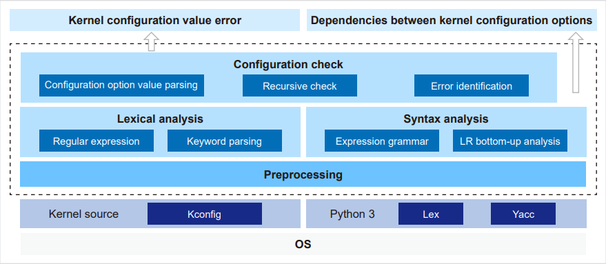

Kconfig is a language in the kernel source that defines configuration options and interactions. It defines strict dependencies between upstream and downstream configuration options and limits mutual impact of kernel configuration options, which greatly complicates Linux kernel setup. If the kernel configuration file does not meet the value restrictions of configuration options defined by Kconfig, the kernel build may be incorrect, or an error or a security issue may arise during system running.

KconfigDetector is a tool that automatically detects value errors in kernel configuration options. It uses formal semantics and a Kconfig file parsing framework to detect value errors in the kernel configuration file. In addition, it can query parent and child entries to help configure the kernel. Common option errors may exist in the type, value, dependency, and matching, which can be pinpointed to simplify verification and fault locating.

  

### Feature Description

The KconfigDetector feature consists of two parts:

1. Checking for the following value errors in the kernel **.config** file
-	**Type error**: The value of a configuration option does not match its type.  
-	**Dependency error**: A configuration option is not started using select and dependencies are not met.  
-	**Dependency risk**: A configuration option is forcibly started using select, but dependencies are not met.  
-	**Configuration option not found**: The specified configuration option is not found in the kernel Kconfig file.  
-	**Invalid value range**: The value is not within the value range specified by range.  
-	**Value alarm**: The value of a configuration option does not meet the requirements of default or imply.  

2. Querying dependencies between kernel configuration options

The kernel configuration space is modeled to generate dependencies of kernel configuration options in a JSON file. All parent and child entries that are directly and indirectly dependent can be quickly queried, which is useful to secondary development.

### Application Scenarios

This feature is perfectly suited to streamline kernel testing, tailoring, and porting tasks, by directly modifying the **.config** file instead of using other kernel configuration tools. It can also check the updated **.config** file to ensure that the kernel configuration file meets dependencies.

### Installation

1.	Install dependencies.

>yum install -y python3
>pip3 install ply

2.	Get code.

>git clone https://gitee.com/openeuler/kconfigDetector.git

3.	Run the **check_kconfig_dep.py** script.

### Option Description
| Option | Description   |
| :---------------- | :----------- |
| --checkfile, -c         | (Mandatory) Configuration file to be checked.  |
| --kernelversion, -v         | (Mandatory) Kernel version.  |
| --kernelpath, -s        | (Optional) Kernel source code path. This option is mandatory for the first check of a version.  |
|--output, -o        | (Optional) Output path of the check result. The default value is the current directory.|
| --arch, -a       | (Optional) Target architecture. By default, the local architecture of the environment is checked. |

### Output

After the execution is complete, the check result file *Version_Architecture*_**error.json** is output and the error message is printed by category in the terminal.

For more information about KconfigDetector and other openEuler features, please visit the [openEuler official website](https://www.openeuler.org/en/).
