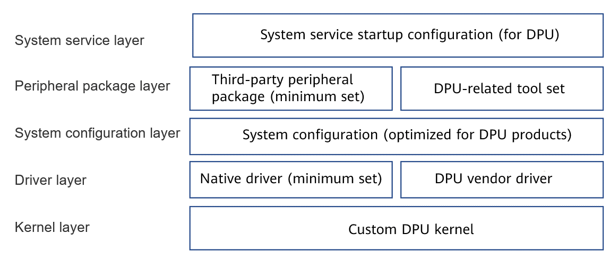

In data center and cloud scenarios, Moore's Law fails. The CPU computing power growth rate slows down, while the network I/O rate and performance keep increasing. The growth rate difference between the two forms a scissors difference, that is, the processing capability of the general-purpose processors cannot keep up with the I/O processing requirements of the network and drives. In traditional data centers, more and more general-purpose CPU computing power is occupied by I/O and management plane processing. Such resource losses are called datacenter taxes. According to AWS and Google Cloud, data center taxes can comprise more than 30% of the computing power of data centers and even more in some scenarios[1][2].

To free such computing resources from the host CPU, the data processing unit (DPU) emerges, which offloaded the management plane, network, storage, and security capabilities to dedicated processors for acceleration processing, reducing costs and improving efficiency. Currently, mainstream cloud vendors, such as AWS, Alibaba Cloud, and Huawei Cloud, use self-developed chips to offload the management plane and related data plane, so that all data center computing resources can be used by customers.

DPU development is a hot topic. Cloud and big data vendors have strong requirements for DPU in related scenarios. Many DPU startups in China have launched diverse DPU products. Against this backdrop, cloud and big data vendors need to consider how to integrate and use different DPU products. DPU vendors also need to adapt device drivers to OSs specified by customers.

openEuler is a leading open-source operating system in China. The DPU-OS built based on openEuler solves the adaptation problems between DPU vendors and customers. In addition, as the OS on the DPU is used to accelerate services, the performance of the DPU-OS needs to be optimized and accelerated. DPU-related acceleration capabilities can be built based on openEuler and embedded in the DPU-OS to build a DPU-related software ecosystem.

## DPU Status Quo

The DPU has the following features and problems:

* Limited DPU general processing capability resources
  
  Currently, the DPU is still in the early stage of development, and the hardware is still evolving. In addition, the current hardware specifications are low due to the limitation of the DPU power supply. Mainstream DPUs contain only 8 to 24 CPU cores and deliver poor single-core processing capability. The memory size only ranges from 16 GB to 32 GB. The local storage space of the DPU ranges from dozens to hundreds of GB. These restrictions also need to be considered for the operating system running on the DPU.
* Various DPU-OS installation modes
  
  Currently, there are various DPU vendors and products, and the installation and deployment modes of the corresponding operating systems are different. The installation modes include PXE network installation, USB flash drive installation, and other customized installation modes (the installation image is delivered by the host).
* DPU performance requirements
  
  The application of the DPU requires high DPU performance. Compared with common server OSs, DPU-OS may have special requirements on kernel features or functional components, for example, the vDPA for device live migration, vendor-specific driver adaptation, insensible uninstallation of DPU process, customized and optimized user-mode data plane acceleration tools (such as DPDK/SPDK/OVS), and tool components related to DPU management and monitoring.

## DPU-OS Requirements

Based on the DPU status quo, the DPU-OS requirements are as follows:

* **Lightweight DPU-OS installation package**
  
  Tailor the openEuler system image to reduce the space occupied by unnecessary installation packages. Optimize system services to reduce the overhead.
* **Tailoring configuration and tool support**
  
  Offer tailoring configuration and tool support to enable customers or DPU vendors to customize according to their needs. openEuler provides ISO reference implementation.
* **Customized kernel and system, providing ultimate performance**
  
  Customize the kernel and related drivers to provide competitive kernel features for the DPU. Customize acceleration components to enable the DPU hardware acceleration capability. Optimize the system configuration to provide better performance. Use DPU management and control tools to facilitate unified management.

## DPU-OS Design

Figure 1 Overall DPU-OS design

As shown in the preceding figure, the DPU-OS is divided into five layers:

* **Kernel layer**: Customize the kernel config to tailor unnecessary kernel features and modules to deliver a lightweight kernel. Enable specific kernel features to provide high-performance DPU kernel capabilities.
* **Driver layer**: Tailor and customize native openEuler drivers and select the minimum set. Integrate related low-level drivers of DPU vendors to provide native support for some DPU hardware products.
* **System configuration layer**: Provide optimal performance for DPU-related services by configuring the system sysctl and proc.
* **Peripheral package layer**: Tailor and customize the openEuler peripheral packages and select the minimum set. Provide the DPU-related customization tool set.
* **System service layer**: Optimize the native service startup items of the system to reduce unnecessary system services and minimize the overhead during system running.

With the preceding five-layer design, a lightweight DPU-OS with ultimate performance can be provided. This is a long-term solution that depends on the DPU-related software and hardware ecosystem.

Currently, the DPU-OS is in its initial phase, focusing on input customization with the openEuler imageTailor tool for minimum implementation. In the future, the kernel and DPU-related components will be customized and configured to provide dedicated and high-performance DPU-OS capabilities.

> **NOTE**
> 
> 1. In the current phase, the DPU-OS is tailored using the imageTailor tool on the existing openEuler kernel and peripheral packages to provide a lightweight OS installation image. In the future, kernel and peripheral packages can be developed and integrated based on actual requirements.
> 2. For details about **how to tailor** the DPU-OS, see DPU-OS tailoring guide[3]. For details about how to **verify and deploy** the DPU-OS, see DPU-OS deployment and verification[4].

## Voice of Customers

### e-Cloud

As an important partner of openEuler, CTyunOS of e-Cloud is born out of openEuler. CTyunOS has been built and tested in DPU-OS, including:

* Build DPU-OS images of the x86\_64 and AArch64 architectures based on the CTyunOS3 system and the DPU-OS component released by sig-DPU.
* Customize the kernel package based on the DPU requirements (removing the built-in virtio-pci and virtio-ring modules).
* Add customized peripheral packages, such as bash command completions, custom tool, and DPU driver package, to the image.
* Upgrade the components and services related to the DPU-OS configuration in Yum mode when the network is connected.

In the DPU 2.0 planning, the e-Cloud DPU team will use the CTyunOS system and promote the DPU-OS built based on CTyunOS3. The team will send related requirements and features to the community and work with openEuler to build a DPU software ecosystem.

### YUSUR

Thanks to the favorable environment created by openEuler for development and implementation, DPUs are rapidly evolving though newly emerged. A DPU usually contains chips of the general-purpose CPU architecture to process complex control-plane logic. For example, in a virtualized network system, a CPU is required to run complex network control plane programs. In the network security field, many different security frameworks also depend on the CPU to provide basic computing power.

In terms of CPU selection, DPU products need to be selected in different application scenarios and computing power requirements. For example, x86 can provide powerful performance, but cannot be well integrated with DPU chips. Arm can solve the preceding problems, but has performance limits in application uninstallation scenarios. RISC-V can provide the optimal solution in terms of cost and flexibility, but at the cost of poor adaptability to application scenarios. In a word, there is no optimal solution for CPU selection. In this context, the OS selection is critical. DPU vendors preferentially consider the following issues when selecting the OS:

* Stability and security
* Adaptability to different low-level architectures
* Tailorability and flexibility

After thorough research, demonstration, and testing, YUSUR chose openEuler as the low-level basic OS for DPU products. First, the openEuler OS has been fully implemented and verified and has obvious advantages in system stability. Second, openEuler provides a complete tool chain support for quick and efficient service development and system tailoring. Last, the support for various devices is considered in the initial openEuler system design. The openEuler system can be closely integrated with the existing hardware ecosystem, greatly reducing the R&D costs of DPU vendors.

Thanks to the excellent tool chain support of the openEuler system, the first-generation DPU-OS has been tailored and customized and applied in many customer services. In the future, YUSUR will continue to explore the openEuler system to deepen customization and build an OS that best meets DPU application scenarios, and contribute to the openEuler community and help the community flourish.

## Join Us

sig-DPU is dedicated to building a lightweight and ultimate-performance DPU-OS based on the openEuler ecosystem, helping customers and DPU vendors resolve compatibility issues between different boards and services. Based on the openEuler ecosystem, sig-DPU unifies the DPU and host OS bases, provides customized features and components for DPU scenarios, builds a DPU software ecosystem, better utilizes hardware offloading for acceleration, and further generates the business value of DPU. openEuler DPU-OS has been verified by multiple enterprises, including e-Cloud and YUSUR.

Currently, the implementation of DPU-OS by sig-DPU in the openEuler community has been open-source. You can access it through the Gitee source code repository address[5], or add WeChat assistants to join the WeChat group for sig-DPU technical communication. Welcome to join us!

## **References**

1. Analysis on technical value and investment prospect of DPU: https://www.icspec.com/news/article-details/1392086?type=prefecture
2. Profiling a warehouse-scale computer: https://ieeexplore.ieee.org/document/7284063
3. DPU-OS tailoring guide: https://gitee.com/openeuler/dpu-utilities/blob/master/dpuos/doc/DPU-OS%E8%A3%81%E5%89%AA%E6%8C%87%E5%AF%BC.md
4. DPU-OS deployment and verification: https://gitee.com/openeuler/dpu-utilities/blob/master/dpuos/doc/%E9%AA%8C%E8%AF%81%E4%B8%8E%E9%83%A8%E7%BD%B2.md
5. DPU-OS Gitee source code repository: https://gitee.com/openeuler/dpu-utilities/tree/master/dpuos
