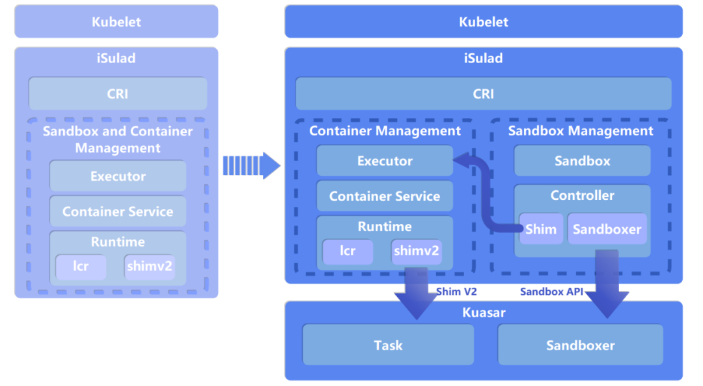
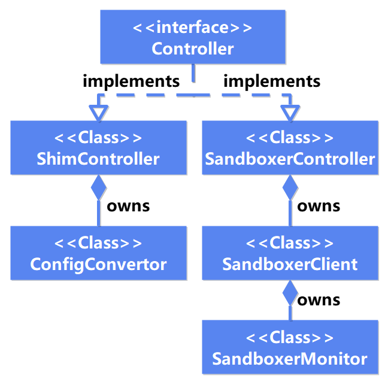
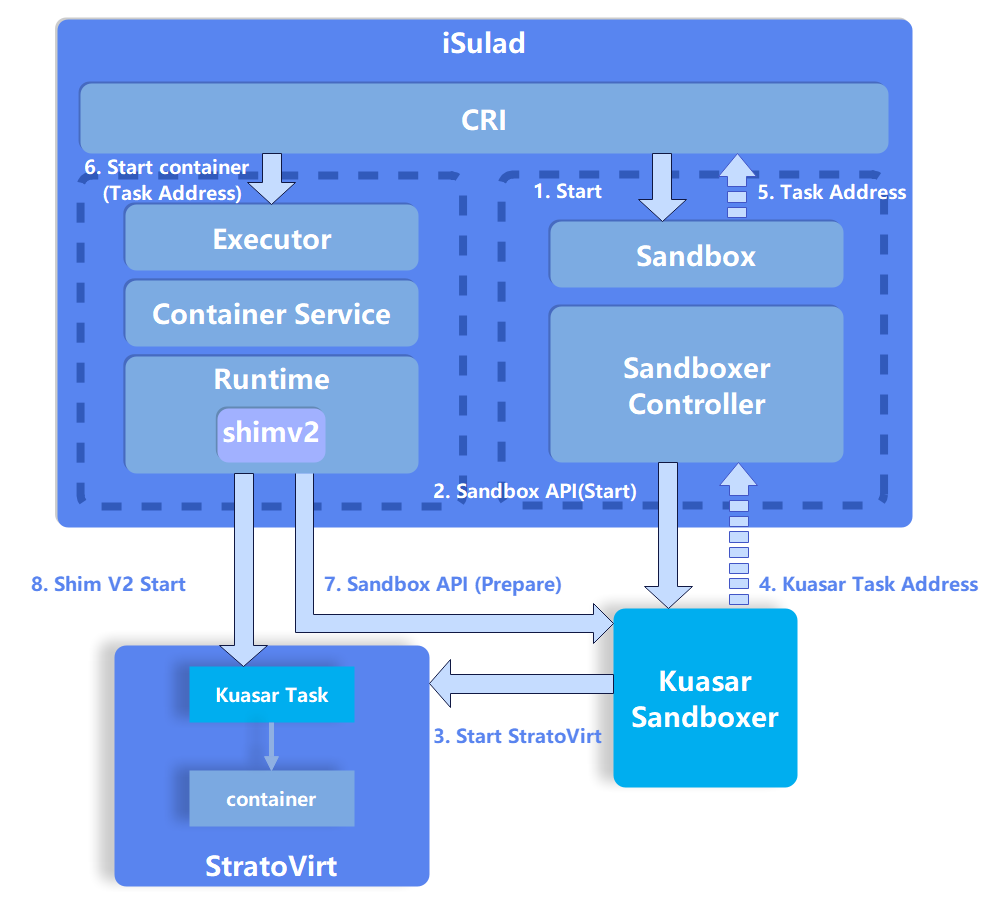

## Background

The sandbox technology isolates each process into an independent environment to improve system security. With the advent of container technologies, sandbox isolation is widely used in the cloud native field. For example, a Pod, the minimum unit for container orchestration and scheduling in Kubernetes, is a secure, isolated, and resource-sharing sandbox for containers.

However, the concept of sandbox is not sufficiently supported in container engines and runtimes. Sandbox management is not defined in the OCI Runtime Spec[1]. As a result, a container engine or container runtime can only manage sandboxes as containers, deteriorating performance and stability.

Developers in the container field have been exploring the introduction of sandbox management interfaces. For example, the containerd community merged Sandbox API functions into the main branch[2] in April 2022, which optimizes the sandbox management logic inside containerd. However, it still uses the OCI standard interfaces to invoke the container runtime to manage sandboxes.

On April 21, 2023, Huawei released a multi-sandbox runtime Kuasar at KubeCon + CloudNativeCon Europe 2023, introducing sandbox management logic to the container runtime. Kuasar became the first container runtime that supports Sandbox API. It enables a container engine to directly manage sandboxes through Sandbox API.

iSulad[3] is the first to support Kuasar through Sandbox API, providing efficient and stable sandbox management capabilities. openEuler 23.09 integrates iSulad+Kuasar+StratoVirt to provide users with a fast, lightweight, and secure container solution.

## Introduction to Sandbox API

```
service Controller {
	rpc Create(ControllerCreateRequest) returns (ControllerCreateResponse);
	rpc Start(ControllerStartRequest) returns (ControllerStartResponse);
	rpc Platform(ControllerPlatformRequest) returns (ControllerPlatformResponse);
	rpc Prepare(PrepareRequest) returns (PrepareResponse);
	rpc Purge(PurgeRequest) returns (PurgeResponse);
	rpc UpdateResources(UpdateResourcesRequest) returns (UpdateResourcesResponse);
	rpc Stop(ControllerStopRequest) returns (ControllerStopResponse);
	rpc Wait(ControllerWaitRequest) returns (ControllerWaitResponse);
	rpc Status(ControllerStatusRequest) returns (ControllerStatusResponse);
	rpc Shutdown(ControllerShutdownRequest) returns (ControllerShutdownResponse);
}
```

The introduction of Sandbox API solves the long-standing pain points between the container engine and container runtime:

- **The cohesion of the cloud native architecture is enhanced with Sandbox semantics.**
- **The shim process is eliminated to cut resource consumption and accelerate the startup.**
- **The call chain is shortened, which boosts the reliability.**
- **The Pause container is not mandatory anymore.**
- **The container runtime can support multiple sandboxes through unified sandbox interfaces.**

#### Lifecycle Management

Sandbox API[4] defines how a container engine interacts with a container runtime. Among them, the Controller service defines sandbox lifecycle management interfaces, including **Create**, **Start**, **Stop**, **Wait**, **Status**, **Shutdown**, and **Platform**.

With Sandbox API, the container engine can directly manage sandboxes without using OCI standard interfaces, improving the performance and stability of the container engine.

#### Resource Management

Sandbox API also defines sandbox resource management interfaces, including resource preparation (**Prepare**), resource clearing (**Purge**), and resource update (**UpdateResources**). The container engine can use these interfaces to manage container resources. For example, the container engine prepares resources before creating a container, updates resources during container running, and clears resources after the container exits.

## New Architecture of iSulad



**Figure 1 iSulad architecture improvements**

After Kuasar was released, iSulad immediately adopted a new architecture to support Sandbox API, realizing direct sandbox management through Kuasar.

To ensure the stability and compatibility with existing versions, iSulad reconstructs and upgrades only CRI V1 to use Sandbox API for sandbox management. CRI V1alpha continues using the OCI standard to process sandbox management requests.

#### Decoupling of Sandboxes and Containers

In the new architecture, iSulad introduces Sandbox semantics and adds a core module Sandbox, decoupling sandbox management from container management. **In the overall cloud native architecture, sandbox management between the container orchestration component, container engine, and container runtime becomes smoother and more efficient, forming a complete sandbox management chain.**

Take the iSulad+Kuasar+StratoVirt solution as an example. iSulad receives northbound CRI requests from Kubernetes, creates a sandbox object to process PodSandbox-related calls, and uses the Executor module to process the CRI container requests. In the southbound direction, the Controller module uses Sandbox API to invoke the Sandboxer process of Kuasar to manage the sandbox, and uses the Shim V2 module in the Runtime module to invoke the Task process of Kuasar, so as to manage StratoVirt containers.

#### Sandbox Controller



**Figure 2 Sandbox Controller class diagram**

The Sandbox API implementation enables iSulad to directly manage sandboxes through the Controller module. Therefore, the Kuasar container runtime does not need to create a Pause container for OCI standard compatibility, **eliminating Pause container redundancy**.

In the new architecture, Controller module design fully considers the compatibility with the original sandbox management functions. That is, users can use the Sandbox and Controller modules to create a common container (Pause container) as a sandbox.

As shown in the preceding figure, the Controller module provides a unified Controller interface for the Sandbox module, as well as two implementations: SandboxerController and ShimController.

- SandboxerController encapsulates Sandbox API and forwards users' sandbox management requests to the Sandboxer process of Kuasar through the gRPC interface. In this way, Sandboxer executes the underlying sandbox management logic.
- ShimController is compatible with the original container-based management interfaces and forwards sandbox management requests to the Executor module to create and manage Pause container-based sandboxes. The ShimController implementation enables users to continue using the OCI standard interfaces to manage sandboxes in the new architecture, so as to be compatible with deployed services and ensure function continuity.

For details about the Sandbox and Controller design, see the design document[5] in the iSulad community.

#### Simplified Container Call Chain



**Figure 3 Container startup flowchart**

After Sandbox API is introduced, the iSulad container management process changes. The preceding figure uses the iSulad+Kuasar+StratoVirt solution as an example to show the simplified process from starting a sandbox to starting a container.

In the figure, Kuasar Task acts as the init process in the VM and the management process of the container in the VM sandbox. It provides the container management interface Task API for iSulad. The Task API implementation in the current solution is similar to that in Shim V2. According to the shim V2 specifications, the container engine invokes a shim V2 binary to create a shim process and return the shim address for managing sandboxes, containers, and resources. However, with Sandbox API, iSulad no longer needs to manage sandboxes through the shim process. On the contrary, the Start interface in Sandbox API returns a Task address after the sandbox is started so that iSulad can directly communicate with the Kuasar Task process on the VM to manage the container lifecycle. **This design eliminates the shim process to reduce the memory overhead on the management plane and shorten the call chain, thereby improving the performance and stability of the entire solution.**

## Summary

Sandbox API connects iSulad, Kuasar, and StratoVirt to form the fast, lightweight, and secure container solution. With Sandbox API, the container engine can directly manage sandboxes without using OCI standard interfaces, improving the performance and stability of the container engine. The introduction of Sandbox API also provides a standardized interface for sandbox management between the container engine and container runtime, providing new possibilities for the development of the container field. Currently, the Sandbox API implementation has been merged into the main branch of the iSulad community. Users can explore the full-stack, fast, lightweight, and secure container solution in openEuler 23.09.

The openEuler community has always been committed to the principles of openness, cooperation, and sharing in the open source world. We welcome developers from all backgrounds to join us in contributing to container projects such as iSulad, Kuasar, and StratoVirt.

## References

[1] OCI Runtime Spec: [https://github.com/opencontainers/runtime-spec/tree/main](https://github.com/opencontainers/runtime-spec/tree/main)

[2] Sandbox API: [https://github.com/containerd/containerd/issues/4131](https://github.com/containerd/containerd/issues/4131)

[3] iSulad: [https://gitee.com/openeuler/iSulad](https://gitee.com/openeuler/iSulad)

[4] sandbox.proto: [https://github.com/kuasar-io/rust-extensions/blob/main/crates/sandbox/src/protos/sandbox.proto](https://github.com/kuasar-io/rust-extensions/blob/main/crates/sandbox/src/protos/sandbox.proto)

[5] iSulad Sandbox design: [https://gitee.com/openeuler/iSulad/tree/master/docs/design/detailed/Sandbox](https://gitee.com/openeuler/iSulad/tree/master/docs/design/detailed/Sandbox)

## Join Us

The iSulad, Kuasar, and StratoVirt components described in this blog are jointly developed by the CloudNative SIG and Virt SIG. Related source code has been open-sourced in the openEuler community. If you are interested in related technologies, you are welcome to join us by scanning the following QR code to join the SIG WeChat group that you are interested in.


