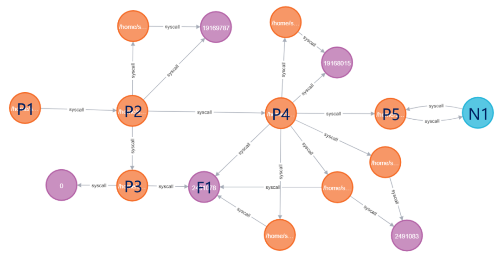
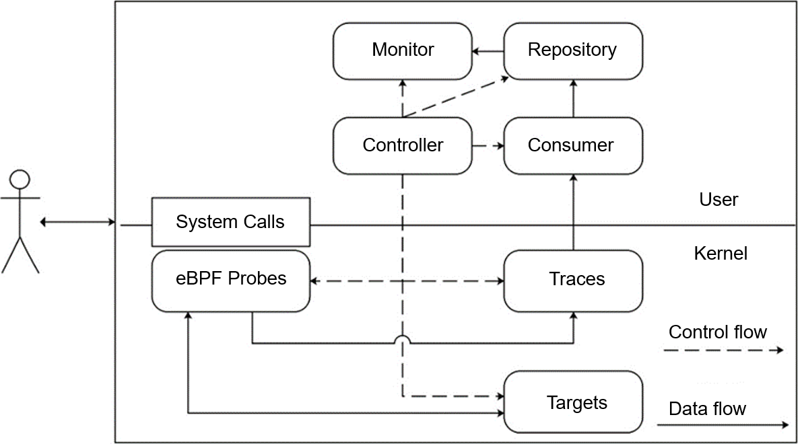
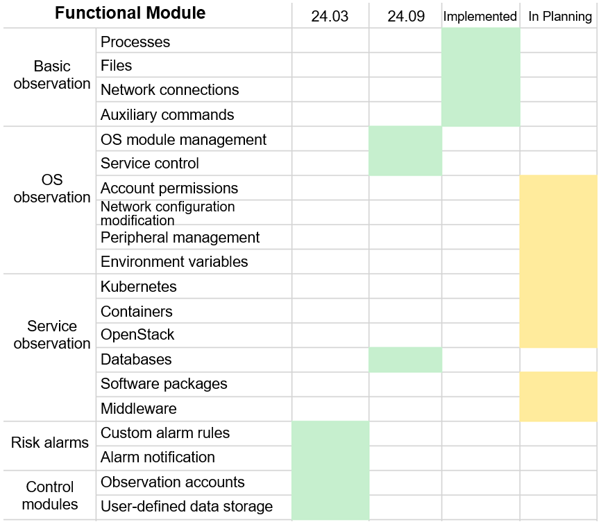
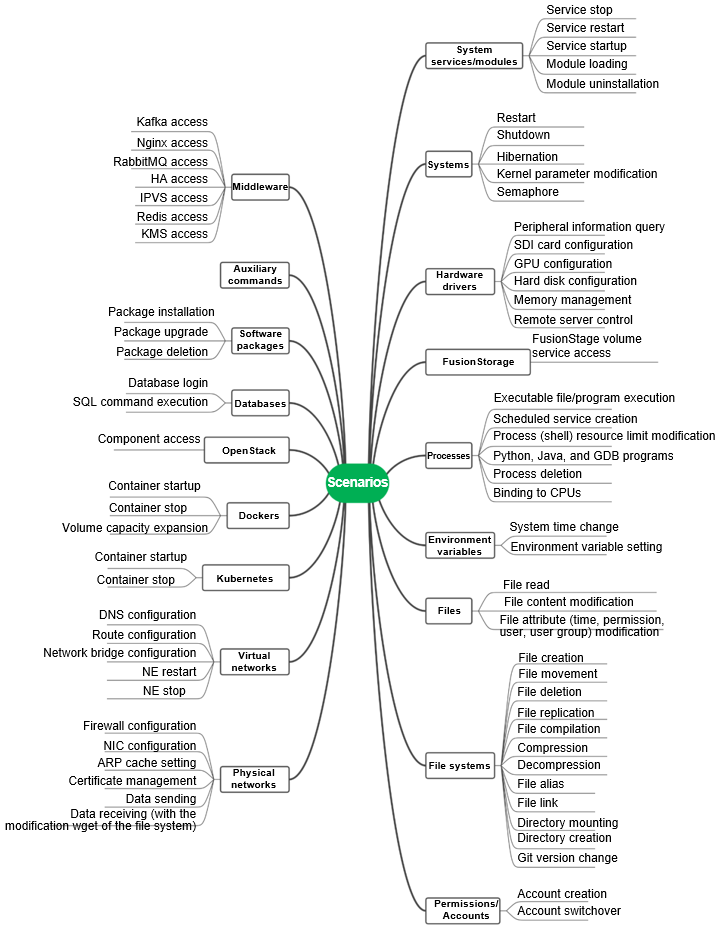

To address the difficulty in observing the change process in openEuler O&M, the OSMind team at Huawei 2012 Laboratories has developed an eBPF-based change observation tool called Agith. Agith can identify change-related behaviors and represent the change process as a topology, namely, change impact scope. Based on the change impact scope, functions such as change alarm reporting, audit, root cause analysis, and dependency analysis can be implemented.

## Background

Cloud computing has become the computing backbone of the information age, serving thousands of households. As the crucial infrastructure, stability is essential. However, cloud computing's focus on scalability and adaptability to upper-layer services often results in frequent changes that can lead to inevitable failures.

Change tasks can be roughly divided into two types. The first type of changes, known as white screen changes, are typically carried out through O&M tools and are best suited for tasks with fixed processes, such as version updates, resource scaling, and disaster recovery switchover. However, their flexibility is poor, and can execute only standard processes. The other type of changes, known as black screen changes, require O&M personnel to log in to systems and run corresponding commands to complete the change processes. The black screen changes are simpler and more flexible. They are ideal for IT O&M and complex O&M tasks of small and medium-sized enterprises, such as root cause analysis and fault rectification. Black screen changes are the main source of change uncertainty and are more likely to cause failures. Therefore, their observability needs to be improved.

Currently, the main method of observing a change process is to record all commands input by O&M personnel during the process. After the change process is complete, detect potential risks through audit and supervision. This method requires a significant level of expert experience due to the challenge of representing the change process through command logs. For example, the log piece ` 2022-09-12 00:00:00.0 Jam obs\_cmd.sh 1818 CN East 10.164.179.21` contains such information as the time, personnel, host IP address, host cluster (CN East), and the most important command (`obs\_cmd.sh 1818`). But it cannot be interpreted without expert experience.

## Agith and Change Impact Scope

Agith is short for Agent Smith. This is a tribute to the character of Agent Smith in the movie *The Matrix*. Although Agent Smith is an antagonist character in the movie, from the perspective of O&M engineers, Agent Smith is the best O&M engineer in the Matrix system. The Matrix system has billions of traffic accessing it every moment, but Agent Smith can detect minor change exceptions and log in to the nearest node to handle them (Kill Neo). This observation capability aligns perfectly with Agith's design objective. A system processes a large number of requests every moment, including normal upper-layer services and change tasks. Agith needs to distinguish those change tasks, record change behaviors, and organize them into a topology of change impacts.

Agith is an observation tool designed for the change process. Unlike simply recording command names, Agith focuses more on the behaviors of commands. The difference is reflected in the final output. The traditional method outputs all inputs of the O&M personnel, and organizes them as log data. Agith outputs the change impact scope, as shown in the following figure.

**Figure 1 Example of a change impact scope**

Orange nodes indicate processes, purple nodes indicate files, and the blue node indicates a remote node. Attributes of each type of nodes are displayed in the list on the right. For example, the attribute information of a process node includes the process working path, command name, and PID. The attribute information of a file node includes the inode and file path. And that of a remote node includes the IP-Port address and interaction information. The edges between nodes store the system call types. For example, the call types of process nodes and file nodes include read, write, and unlink (delete).

In the change process shown in Figure 1, the O&M personnel log in to the host, run the `obs_cmd.sh 1818` command, and then exit. The operation reflected in the figure is that process node P1 (**bash**) creates process node P2 (**obs_cmd.sh 1818**). Process node P2 then creates a Python script (process node P3) and a shell script (process node P4) during execution. Process node P3 creates a file node F1. Then, process node P4 modifies file F1 and accesses port 1818 of remote node N1 by running the **curl** command (process node P5). You can click the blue node to view the URL of the access.

Compared with command logs, **Agith focuses more on the behaviors of commands**. This method maps unlimited commands to limited behaviors, making them convenient for O&M personnel to understand. With this change impact scope topology, any O&M personnel can understand the operation of a change, without requiring complex expert experience.

## Agith Architecture

Agith adopts a policy of separating data flows from control flows in the design. The eBPF, Consumer, Repository, and Monitor modules can form data flows (solid lines in Figure 2) of data filtering, collection, sorting, and output. The control flows (dashed lines in Figure 2) are centered around the Controller module, with other modules being managed under the unified control of the Controller module. Upon startup, the Controller module checks the environment, analyzes the configuration file, and verifies the startup parameters. It then sequentially starts and deploys each module. When the program ends, the Controller module manages each module to complete its cleanup task before exiting in sequence.

**Figure 2 Agith architecture**

### eBPF Module

The eBPF module consists of three parts: eBPF Probes, Traces, and Targets. This module is responsible for data filtering using a dynamic target-based change monitoring technique. This technique first establishes two types of maps. The first type is the Target map, which stores identifiers of monitoring targets, such as PIDs, file inodes, and network IP addresses. The second type is the Trace map, which stores data obtained by probes.

eBPF Probes are probe programs designed for specific system calls. Once triggered, these programs first determine whether certain system calls are relevant to monitoring targets based on the Target map. If they are irrelevant, returns are directly sent. If they are relevant, corresponding data will be collected and written to the Trace map. Additionally, the eBPF Probes will modify the Target map. For example, if you mount a probe program at the clone system call of a created process, the probe can be triggered whenever any program executes the clone system call to check whether the PID in the Target map. If the PID is not in the Target map, the program continues to execute the clone system call. If the PID is in the Target map, the return value, namely the PID of the subprogram, is written to the Trace map, and then the PID of the subprogram is added to the Target map. In this way, the subprogram is included in the monitoring scope.

### Consumer Module

The Consumer module is responsible for data collection. It mainly reads and caches data in the Trace map. This process involves read/write speed control, data exception handling, and data fusion.

The data read by the Consumer module is similar to the system call records obtained by strace. It is stored in a subject-predicate-object structure. For example, `pid:411962, syscall:read, ret: 18, time:974333207983984, ready:1, obj:{fd:3, i\_ino:2505217}` is a record obtained by monitoring the read system call. The subject is `pid:411962`, which indicates a process whose ID is 411962. The predicate is `syscall:read`, which indicates a read operation. The object is `obj:{fd:3, i\_ino:2505217}`, which is a file whose file handle ID is 3 and the inode code is 2505217. It also contains the time and return value of the system call. This record mainly indicates that process 411962 reads file 2505217. This message is very simple. The name of the program being executed and the name of the file being read are documented in previous records. For example, the process name is in the exec system call, and the file name is in the openat system call.

### Repository & Monitor

Repository is responsible for sorting and outputting data. It stores the records read by the Consumer module and fills the information in the change impact scope graph. For example, when a new file is opened, a file node is created and an edge is connected between the process and the file. What's more, Repository transfers information to the Monitor module.

The Monitor module generates alarms. If a high-risk operation is detected during data collection, for example, deleting an important configuration file, the Monitor module sends an alarm. Data of the Monitor comes from the Repository, because only the graph stored in the Repository can provide complete context information. Only relying on the Consumer's records is not sufficient to determine if an operation is a high-risk operation.

## Application Scenarios

Agith is designed to monitor each change process, and the resulting change impact scope can be applied to risk alarm reporting, root cause analysis, change audit, and dependency analysis.

Agith can be directly used for reporting **risk alarms**. Developers can declare risky operations in the configuration file, for example, modifying a file, accessing a service, and deleting a process. Agith can detect these types of data during the sorting process and send alarms to the email specified in the configuration file.  Currently, the email alarm function is under development. Stay tuned.

**Root cause analysis** is the most important purpose of the change impact scope. Compared with command logs, change impact scope data contains more fine-grained behavior information, which can facilitate the detection of command behaviors related to failures.

**Change audit** can be used to check for unexpected behaviors after a change has been made. For important change operations, a trial run can be performed in a gray environment to obtain the change impact scope. Then execute these operations in the target environment to get another change impact scope. By comparing the two reports, any incorrect operations during the change process can be identified.

**Dependency analysis** is the process of obtaining various local resources and peripheral services that a service depends on during runtime. Although this feature is not related to changes, as long as the service is started in the terminal, Agith can obtain all its behaviors and thus obtain various resources it depends on, such as dynamic dependency libraries and configuration files.

## Roadmap

The current features of Agith can only cover a part of the behaviors of processes, files, and networks. However, the command behaviors in black screen change processes far exceeds this part.

**Table 1 Agith development plan**

Table 1 shows the change behaviors that Agith plans to cover in the future. The sorting of changes is a complex process. Initially, we adopted a bottom-up approach. No matter what upper-layer services are, there are no other five types of behaviors from the OS perspective: process, memory, file, network, and peripheral. As long as the five types of behaviors are monitored, all command behaviors can be covered. But this is not the case in practice.

First, excessive abstraction can result in losses in data values. For example, executing commands such as MySQL, Docker, and Kubernetes all involve sending commands to existing service processes, which can be unified as process interaction behaviors. However, if only the names of the interacting processes are available, the risks cannot be determined. Second, excessive abstraction means that all underlying behaviors need to be recorded, which can result in huge data redundancy. For example, once a process is started, it frequently requests memory, but recording the data is meaningless.

Therefore, we realize that the observation network cannot be too coarse or too fine, and should be flexibly adjusted according to O&M requirements. So we adopted a top-down approach. First, we collected 2.39 million change commands and analyzed each command to identify the data generated by the command. Then, we merged the data based on similarity. For example, files have file names, and container operations have container IDs or image IDs. During the merging process, data items that differ are discarded. If a data item is of little value to O&M, it can be discarded. If the data is important to O&M, the merging is incorrect. In the sorting process, there is a lot of trade-offs between benefits and costs, and we believe that it will continue to evolve in the future. We finally identified the behaviors that need to be monitored, whare are shown in the following figure.

**Figure 3 O&M change behaviors**

## **Join Us**

If you have any suggestions on Agith, submit them in [https://gitee.com/openeuler/Agith/issues](https://gitee.com/openeuler/Agith/issues). We welcome interested users to join us. If you have any intention to cooperate with us, contact me through [shangguandongdong1@huawei.com](shangguandongdong1@huawei.com).

