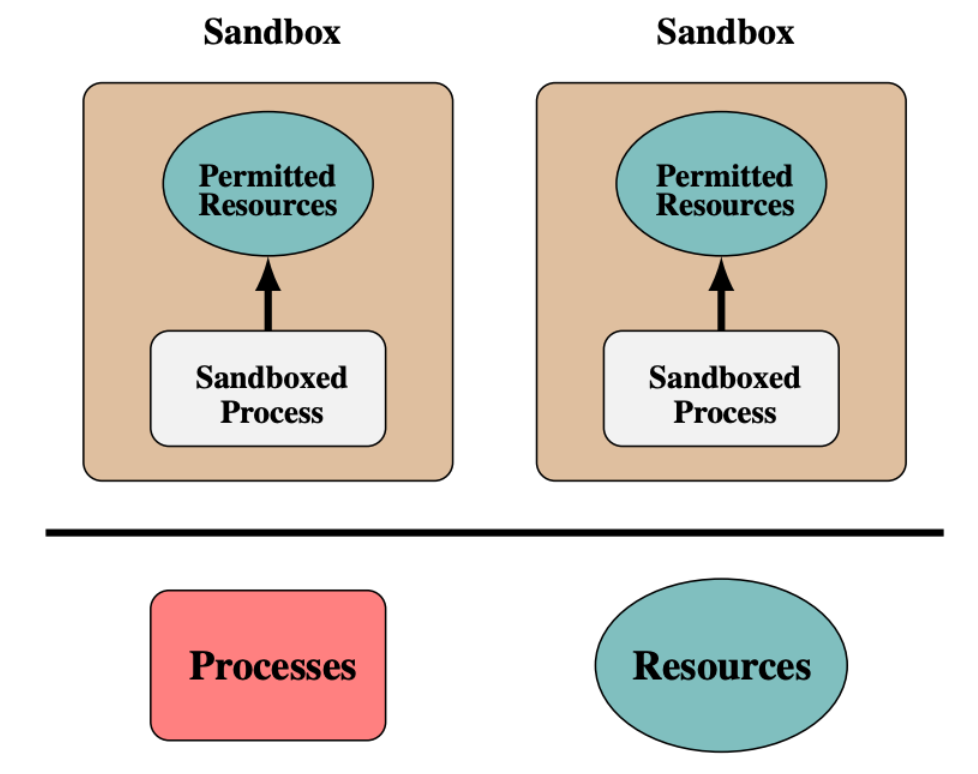
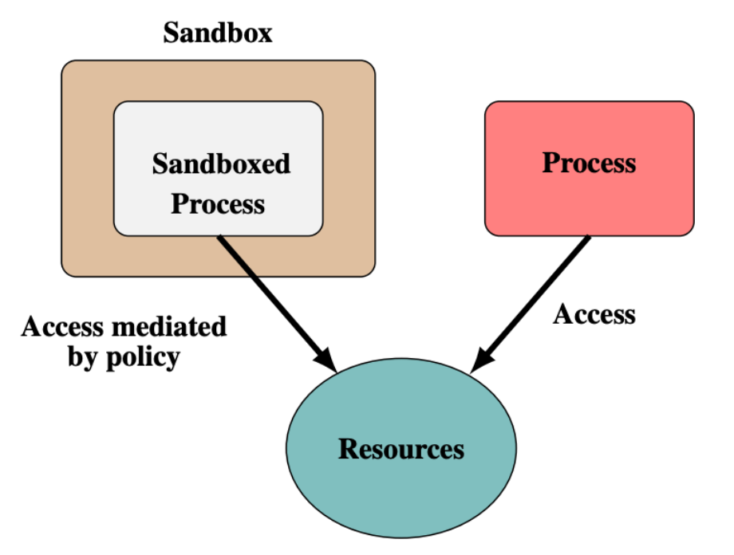
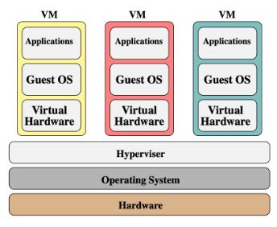
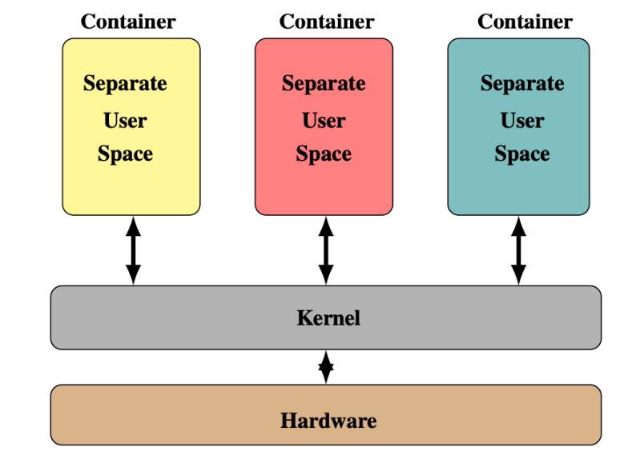
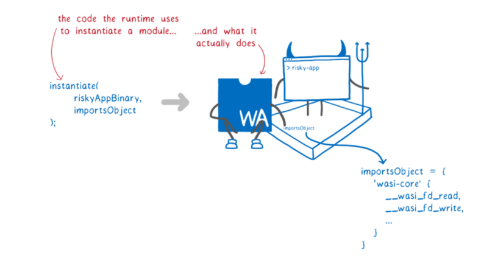
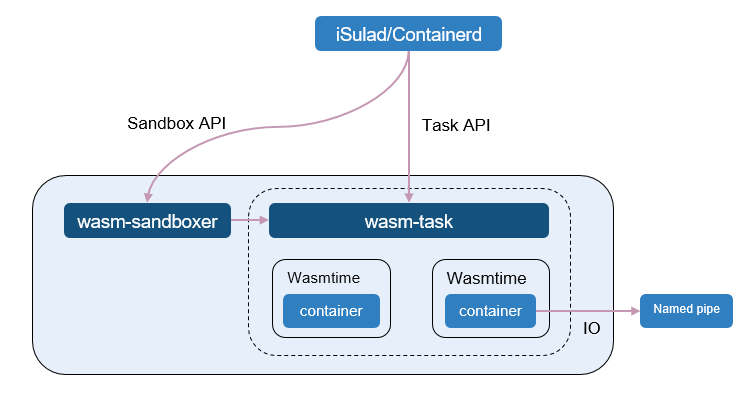
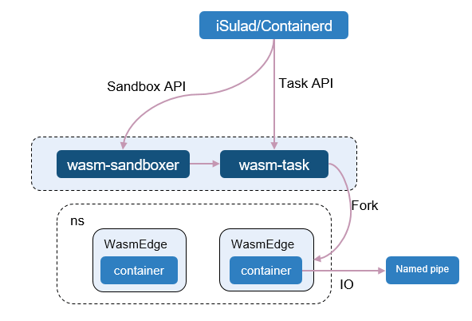
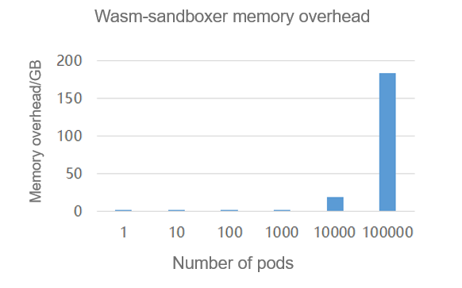
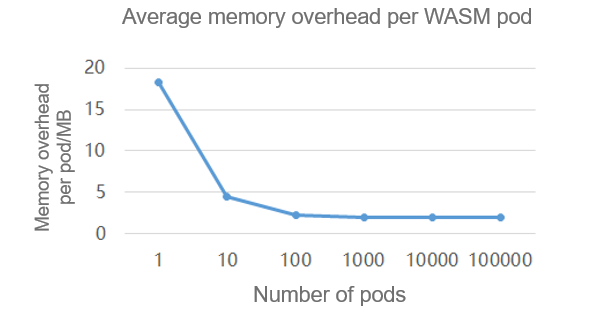

## Background of Sandbox Technologies

Virtual machines (VMs), containers, and WebAssembly (WASM) sandboxes all essentially leverage the sandbox technologies to isolate untrusted programs and execute them in sandbox environments to avoid the impacts on other applications and services. There are broadly two types of sandbox technologies<sup>[1]</sup>:

- **Isolation-based sandbox**: This sandbox type isolates an application's execution environment from the OS environment to create an independent execution environment.
  
  

  Figure 1 Isolation-based sandbox
- **Rule-based sandbox**: This sandbox type does not focus solely on isolating applications, but rather controls the permissions of each application through rules. Rule-based sandboxes can share logical resources of the OS.
  
  

  Figure 2 Rule-based sandbox

## Comparison and Analysis of Sandbox Security Isolation Capabilities

### VMs



Figure 3 VM security isolation architecture

The security isolation capability of VMs can be simply summarized as multidimensional isolation in both horizontal and vertical directions. In the horizontal dimension, the VM Hypervisor layer separates different guest OSs horizontally to ensure that vulnerabilities in one guest OS do not affect other guest OSs. In the vertical dimension, the Hypervisor layer separates different OSs (kernels of guest OSs and host OSs are not mutually shared) and physical hardware, so that vulnerabilities in guest OSs do not affect host OSs and physical hardware.

### Containers



Figure 4 Container security isolation architecture

The security isolation capability of containers also draws on the idea of VM-based isolation, which runs different applications in separate container environments horizontally. This ensures that any vulnerabilities in an application in a container do not have direct impacts on other applications.

However, in the vertical isolation dimension, containers share a common kernel, which results in incomplete isolation. Consequently, if one container exposes a kernel vulnerability leading to a kernel crash, applications in other containers across the entire system will also be impacted.

### WASM Sandboxes



Figure 5 WASM/WASI security isolation design

WASM utilizes software fault isolation (SFI) in its language design (the isolation-based sandbox technology), which confines all faults of WASM applications within separate linear address spaces. This ensures that the applications do not jump to address spaces outside of the fault domain, thus achieving the goal of secure isolation. In addition, the virtual instruction sets of WASM are pure computing instruction sets, which do not involve accesses to the kernel or hardware resources like VMs or containers. Therefore, program vulnerabilities can be protected from escalation and spread through the SFI mechanism.

The WebAssembly system interface (WASI)<sup>[2]</sup> is designed based on the rule-based sandbox technology or a capability-based security model. It controls the permissions of each WASM application in a rule-based manner. Each application needs to be explicitly configured with corresponding rules for the capabilities it requires.

**The WASM+WASI sandbox technology combines the benefits of both the isolation-based and rule-based sandbox technologies, resulting in a lightweight and efficient sandbox solution.**

## Integration of WASM Sandboxes to Cloud Native Ecosystem

WASM sandboxes can achieve millisecond-level cold startup while ensuring secure isolation. If they are integrated into the cloud native ecosystem, the first consideration during container running is how to leverage the advantages of WASM's ultra-fast startup.

Based on the sandbox API design, Kuasar redefines the concept of sandbox by dissociating it from the containerd-shim process model, and directly maps it to actual sandbox objects, such as MicroVM sandboxes of the lightweight VM type and WASM sandboxes of the language VM type.

Currently, Kuasar supports two mainstream WASM runtimes in the industry: **Wasmtime**<sup>[3]</sup> and **WasmEdge**<sup>[4]</sup>.

### Solution for Connecting Kuasar to Wasmtime



Figure 6 Architecture for connecting Kuasar to Wasmtime runtime

The architecture for connecting Kuasar to Wasmtime runtime utilizes a coroutine model. The sandbox management module wasm-sandboxer and the container management module wasm-task both run in the same process. The WASM sandbox instances created by wasm-task also run in the wasm-sandboxer process. **This design offers the benefit of fully leveraging the coroutine scheduling mechanism within a single process to reduce the scheduling overhead of WASM sandbox instances, avoids the consumption of system PID resources by each WASM instance in the traditional single-process mode, and improves the deployment density of WASM sandbox instances on a single node.**

In each WASM sandbox instance, the I/O streams of the WASM function are connected to the container engine through a named pipe, which allows the container engine to collect the outputs of the WASM function.

### Solution for Connecting Kuasar to WasmEdge



Figure 7 Architecture for connecting Kuasar to WasmEdge runtime

The architecture for connecting Kuasar to WasmEdge runtime differs slightly from that for connecting to Wasmtime runtime. When wasm-task receives a request to create a WASM sandbox, it creates a new process through a fork system call to instantiate a WASM sandbox. **The reason for this design is that the current WasmEdge runtime does not support redirection of standard inputs and outputs of different WASM sandbox instances in the same process.**

## WASM Sandbox Compilation and Running

> Notes:
> 
> 1. The following example uses Wasmtime as the WASM runtime. The compilation and running procedures of WasmEdge are similar.
> 2. Kuasar's support for WASM sandboxes is a preview feature and is not intended for commercial use.

### Environment Setup

1. Prepare an x86 environment running openEuler 23.09.  
2. Install the Rust compilation toolchain. For details, see the official Rust installation tutorial<sup>[5]</sup>.  
3. Install the iSulad container engine. For details, see the installation and configuration section on the iSulad container engine website<sup>[6]</sup>.  
4. Install the isula-build container image building tool. For details, see the installation section of isula-build container image building<sup>[7]</sup>.  

### Creation of a WASM Application Container Image

1. Compile a target application in WASM format.

```bash
# The wasi-demo-app application in the runwasi project is used as an example.
$ git clone https://github.com/containerd/runwasi.git

$ cd runwasi/crates/wasi-demo-app

# Install the rust wasm32-wasi compilation toolchain.
$ rustup target add wasm32-wasi

# Compile the wasi-demo-app program into the WASM target format.
$ cargo build --target=wasm32-wasi --release

# The WASM module generated after compilation is stored in the target/wasm32-wasi/release/ directory.
$ ls runwasi/target/wasm32-wasi/release/*.wasm                                  
target/wasm32-wasi/release/wasi-demo-app.wasm
```

2. Create an empty directory and copy the WASM application files generated in the previous step to the directory.

```bash
$ mkdir build && cd build
$ cp target/wasm32-wasi/release/wasi-demo-app.wasm .
```

3. Compile a Dockerfile required for building the container image.

```bash
$ cat Dockerfile
FROM scratch
ADD wasi-demo-app.wasm /
```

4. Use isula-build to build the WASM application container image and import it to the iSulad container engine.

```bash
$ isula-build ctr-img build -f Dockerfile -o isulad:wasi-demo-app:v1
STEP  1: FROM scratch
STEP  2: ADD wasi-demo-app.wasm /
Getting image source signatures
Copying blob sha256:2ed8f32f0a3bd46fddc96fbe1639eaebd8a3d0e49c9c284ddf24619300fcfab5
Copying config sha256:59b1ccb0ae18329439e0b3995de75df9a021b5096afaad7a72925fa2b85f4ae4
Writing manifest to image destination
Storing signatures
Committed stage 0 with ID: 59b1ccb0ae18329439e0b3995de75df9a021b5096afaad7a72925fa2b85f4ae4
Getting image source signatures
Copying blob sha256:2ed8f32f0a3bd46fddc96fbe1639eaebd8a3d0e49c9c284ddf24619300fcfab5
Copying config sha256:59b1ccb0ae18329439e0b3995de75df9a021b5096afaad7a72925fa2b85f4ae4
Writing manifest to image destination
Storing signatures
Build success with image id: 59b1ccb0ae18329439e0b3995de75df9a021b5096afaad7a72925fa2b85f4ae4

$ isula images
REPOSITORY                                TAG        IMAGE ID             CREATED              SIZE       
wasi-demo-app                             latest     59b1ccb0ae18         2023-11-21 20:30:53  108.229KB
```

### WASM Sandbox Runtime Compilation and Running

1. Compile the `wasm-sandboxer` component that is based on the `Wasmtime` runtime.

```bash
# Download the source code of the Kuasar project.
$ git clone https://github.com/kuasar-io/kuasar.git

# Switch to the source code directory of the WASM sandbox module.
$ cd kuasar/wasm

# Compile the wasm-sandboxer component.
$ cargo build --release --features=wasmtime

# Path of the generated wasm-sandboxer binary executable file
$ ls target/release/wasm-sandboxer
```

2. Start the wasm-sandboxer sandbox runtime process.

```bash
RUST_LOG=info wasm-sandboxer --listen /run/wasm-sandboxer.sock --dir /run/kuasar-wasm
```

3. Modify the iSulad container engine configuration to support WASM sandbox runtime.

```json
// Add the following configuration about the WASM sandbox to the /etc/isulad/daemon.json configuration file of the iSulad container engine:
{
  ......
  "cri-runtimes": {
    "wasm": "io.containerd.wasm.v1"
  },
  "cri-sandboxers": {
    "wasm": {
        "name": "wasm",
        "address": "/run/wasm-sandboxer.sock"
      }
  },
  ......
}
```

4. Restart iSulad for the configuration to take effect.

```bash
systemctl restart isulad
```

### WASM Sandbox Creation and WASM Function Execution

The following script defines the configurations of the WASM pod sandbox and the container for running the WASM function. You can run the **crictl** command to create the WASM sandbox and run the WASM function.

```bash
$ cat run_example_wasm_container_with_isulad.sh
set -e
# Prepare for the wasm Pod and Container config file.
touch pod.json container.json
current_timestamp=$(date +%s)
cat > pod.json <<EOF
{
    "metadata": {
        "name": "test-sandbox$current_timestamp",
        "namespace": "default"
    },
    "log_directory": "/tmp",
    "linux": {
        "security_context": {
            "namespace_options": {
                "network": 2,
                "pid": 1
            }
        }
    }
}
EOF
cat > container.json <<EOF
{
    "metadata": {
        "name": "wasm_$current_timestamp",
        "namespace": "default"
    },
    "image": {
      "image": "wasi-demo-app:latest"
    },
    "command": [
       "/wasi-demo-app.wasm","daemon"
    ],
    "log_path":"wasm.log",
    "linux": {
        "security_context": {
            "namespace_options": {
                "network": 2,
                "pid": 1
            }
        }
    }
}
EOF

# Run a WASM container.
crictl run --runtime="wasm" --no-pull container.json pod.json
rm -f container.json pod.json
```

After the preceding script is executed, you can run the `crictl` command to view the running status of the WASM sandbox and WASM function.

```bash
$ crictl ps -a
CONTAINER           IMAGE                  CREATED             STATE               NAME                ATTEMPT             POD ID              POD
0b1dee6dc1a6c       wasi-demo-app:latest   2 seconds ago       Running             wasm                0                   37fe4fc2fc358       unknown

$  crictl pods
POD ID              CREATED             STATE               NAME                     NAMESPACE           ATTEMPT             RUNTIME
37fe4fc2fc358       27 seconds ago      Ready               test-sandbox1700546390   default             0                   (default)
```

## Performance Test for High-Density Deployment

Test whether over 100,000 WASM sandbox instances can be densely deployed on a single node.

> Notes:
> 
> - Starting over 100,000 WASM sandbox instances may trigger an error in the wasm-sandboxer runtime process because the number of opened file handles exceeds the upper limit. Therefore, before starting the wasm-sandboxer process, increase the maximum number of file handles that the process can open. You are advised to set the number to 1073741816.
> - Ensure that the available memory on the test node is greater than 200 GB.

The test code is as follows:

```bash
for i in `seq 1 100000`;do bash run_example_wasm_container_with_isulad.sh;sleep 1;done
```

According to the test result, **100,000 WASM sandbox instances can be successfully started on a single node**. The wasm-sandboxer sandbox process consumes a total of 183.3 GB memory, and each WASM sandbox instance consumes 1.9 MB memory on average.



Figure 8 Memory overhead statistics of the wasm-sandboxer process



Figure 9 Average memory overhead of each WASM pod

## References

[1] [*Sandboxing in Linux: From Smartphone to Cloud--International Journal of Computer Applications*](https://www.ijcaonline.org/archives/volume148/number8/borate-2016-ijca-911256.pdf)  
[2] [*Standardizing WASI: A system interface to run WebAssembly outside the web*](https://hacks.mozilla.org/2019/03/standardizing-wasi-a-webassembly-system-interface/)  
[3] [Wasamtime](https://github.com/bytecodealliance/wasmtime)  
[4] [WasmEdge](https://github.com/WasmEdge/WasmEdge)  
[5] [Official Rust installation tutorial](https://www.rust-lang.org/tools/install)  
[6] [https://docs.openeuler.org/zh/docs/23.09/docs/Container/%E5%AE%89%E8%A3%85%E4%B8%8E%E9%85%8D%E7%BD%AE.html](https://docs.openeuler.org/en/)  
[7] [https://docs.openeuler.org/zh/docs/23.09/docs/Container/isula-build%E6%9E%84%E5%BB%BA%E5%B7%A5%E5%85%B7.html#%E5%AE%89%E8%A3%85](https://docs.openeuler.org/en/)

## Join Us

The iSulad and Kuasar components described in this blog are developed by the CloudNative SIG. Related source code has been open-sourced in the openEuler community. If you are interested in related technologies, you are welcome to join us by scanning the following QR code to join the SIG WeChat group that you are interested in.


