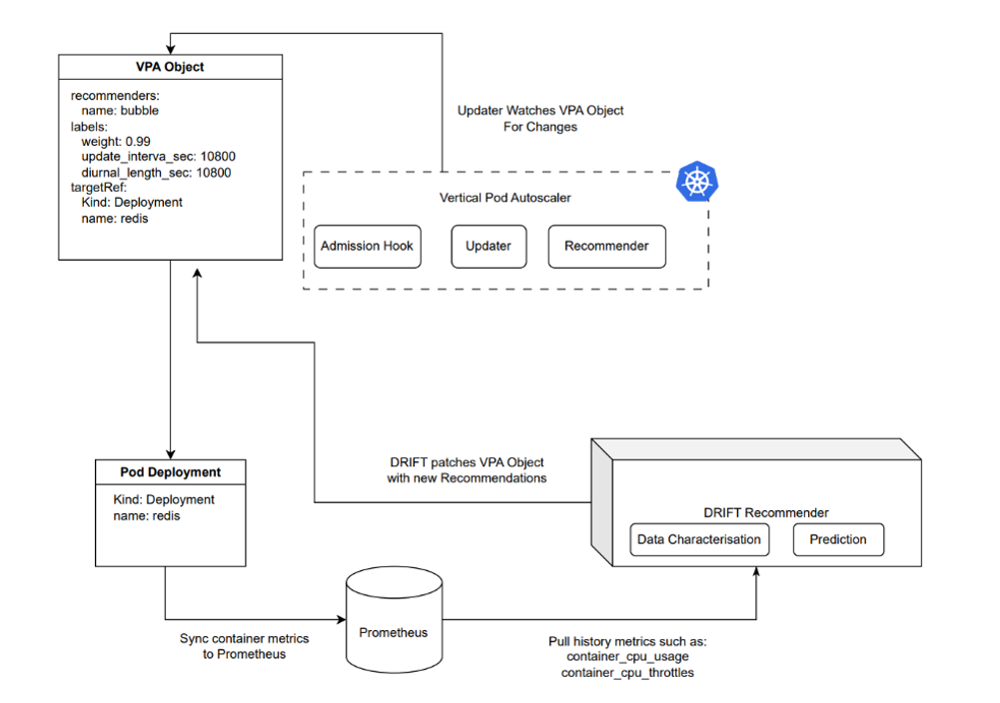
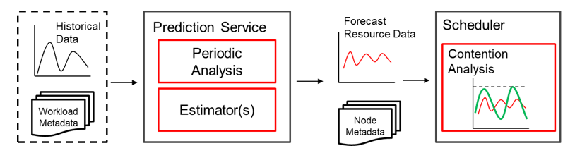
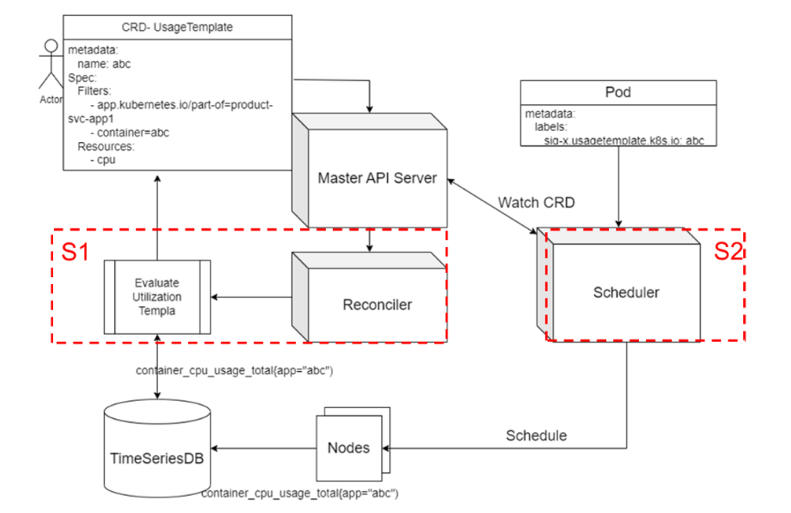
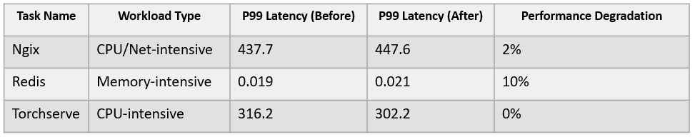

**Overview**
------------

In a data center, resource utilization indicators, especially the CPU utilization, are often used to measure the efficiency of a cluster. In practice, both resource allocation and workload scheduling can affect resource utilization.

On one hand, if resources are allocated to workloads inaccurately, the cluster may be underutilized due to idle resources. On the other hand, even if the utilization increases, if the scheduling decisions are improper, resource conflicts between workloads can also lead to performance degradation.

Performance Aware System (PAWS) is thereby developed to improve resource utilization and ensure the quality of service (QoS), while minimizing performance degradation caused by interference.

With the development of PAWS, our vision is to deliver a set of scheduling algorithms that can recommend resources based on historical workload characteristics while avoiding mutual interference.

**Features**
----------------

PAWS is designed to address the issue of resource interference and thus recommend accurate resource allocation. Therefore, it has the following features:

### **Feature 1: VPA Resource Recommendation**

#### **Principles**

Vertical Pod Autoscaler (VPA) is an automatic scaling technology that adjusts physical resources (such as CPUs and memory) allocated to microservices to meet the changing demands. Each service has its unique resource demands that are influenced by numerous factors, such as time and user needs. Fixed resource allocation to these services may result in very low resource utilization of the cluster.

The VPA recommendation algorithm of PAWS is therefore proposed, which combines classical numerical optimization solutions with machine learning techniques. VPA analyzes historical workload characteristics to recommend appropriate resources for workloads, freeing up improperly allocated resources and thereby enhancing the cluster utilization.

Overall architecture of PAWS-VPA

DRIFT Recommender obtains required data from Prometheus and leverages the VPA recommendation algorithm to generate corresponding data values. The algorithm consists of three parts: proactive prediction, workload awareness, and prediction feedback.

- [1] Proactive prediction: predicts resources required by workloads and provides recommendations before they change.

- [2] Workload awareness: detects load feature patterns based on the historical database changes and provides recommendations.

- [3] Feedback mechanism: quickly corrects inappropriate recommendations through the runtime feedback system.

The overall idea of the algorithm is that it is called at an interval of **(k)**, with the CPU utilization and resource execution statuses in the past *N* time windows as the inputs, to recommend an optimal value of CPU resources for each container at one or more time points in the future.

When making recommendations, the system assigns weights based on past overestimations, underestimations, and historical resource recommendations to provide optimal recommendations.

In the algorithm, our objective function (OBJ) is the weighted (w) average of resource overestimations and underestimations.  

- [1] Overestimation indicates that the recommended CPU usage is higher than the actual CPU usage. As a result, the overall CPU utilization is low.

- [2] Underestimation indicates that the recommended CPU usage is lower than the CPU usage. As a result, the throttle event occurs, leading to workload performance degradation.

In mathematics, **OBJ = w x UE + (1 – w) x OE**, where **w** is the importance or weight assigned to underestimation relative to overestimation.

#### **Modules**

The PAWS-VPA recommendation algorithm consists of three modules: workload characterization, numerical optimization, and machine learning forecast.

-   Workload characterization: analyzes the past CPU utilization characteristics to provide a proper OBJ weight **w**.

-   Numerical optimization: uses classical numerical optimization to calculate the optimal recommendations over the past *M* time periods. Specifically, we minimize the OBJ to obtain the optimal target recommendations for historical samples, and describe this minimization problem as a mixed integer linear program (MILP).

-   Machine learning forecast: After the MILP calculates the target values over the past *M* time periods, this module takes these *M* optimal historical recommendations as inputs to predict the optimal future recommendations for the next one or more update periods, based on the prediction level **F** defined in the machine learning algorithm.

### **Feature 2: Detection and Scheduling of Time Series Conflicts**

#### **Principles**

PAWS has a set of scheduling plugins that utilize resource utilization statistics extracted from historical workload data to perform time series analysis. The scheduler then staggers the peak and off-peak workloads to avoid resource conflicts, thereby achieving better resource allocation. It uses a specific mechanism to collect resources marked in the system. By collecting historical resource usage data of job containers and analyzing time series cycles (such as every hour), it generates estimated resource utilization of each cycle to prevent job resource conflicts, thus achieving optimal scheduling and improving cluster resource utilization.

#### **Algorithm Processes**

The algorithm comprises prediction and scheduling processes. The prediction process collects statistics on time series changes based on the historical data of each workload type for the scheduler to use. The scheduling process makes reasonable scheduling decisions based on the collected statistics and the characteristics of each new task.

-   Prediction process: Uses time series databases such as Prometheus to read historical resource usages of all known workloads, analyzes hourly changes, and saves the data as historical data for the scheduler to refer to.

-   Scheduling process: Determines an appropriate policy based on the label of each new task. For a known task, selects a historical template from the scheduler and sums it up with the historical data of each node. For an unknown task, directly sums up the task resource request and node data. In the scoring phase, if there is a possibility that the task running period may exceed the threshold, different scores are given and normalized. In addition, the system collects real-time resource utilization statistics of an unknown task to ensure that a more accurate score can be given when the task is resumed.

**Result Evaluation**
----------------

PAWS optimizes the allocation and scheduling of workload resources through machine learning and mathematical analysis. We simulated several typical applications, including Redis, Nginx, and Torchserve , in a laboratory, and validated our findings using a small cluster of 10 servers. The test result shows that the overall cluster utilization increases significantly before and after the deployment. The following figure shows the utilization change of a node, with the peak utilization increased from 30% to above 40%.

We also compared the service performance changes before and after the deployment, and observed that the P99 latency only deteriorated by less than 10%. This indicates that the algorithm is successful in preventing performance degradation while enhancing cluster utilization.

The code of PAWS has been open-sourced in the openEuler Cloud Native SIG at [https://gitee.com/openeuler/paws](https://gitee.com/openeuler/paws).

This solution also has some defects. For example, it only focuses on CPU computing-intensive scenarios. However, in actual scenarios, memory and I/Os may become bottlenecks that affect services. In addition, it is difficult to monitor the performance degradation caused by resource competition only from the perspective of utilization. Therefore, we hope that partners interested in this technology can join our SIG to continuously optimize PAWS.

**Join Us**
----------------

The resource utilization optimization technology described in this blog is developed by the Cloud Native SIG, and its source code has been gradually open in the openEuler community. If you are interested in related technologies, you are welcome to join us by scanning the following QR code to join the SIG WeChat group.

