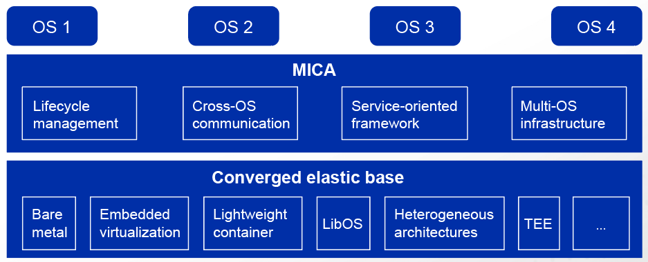

Mixed-criticality (MICA) is a multi-core SoC framework that supports mixed-criticality deployment of real-time and non-real-time OSs or secure and non-secure OSs based on hardware-assisted virtualization, trusted execution environment (TEE), and heterogeneous architectures. It utilizes the characteristics of each OS to meet the multi-objective constraints of embedded systems, such as security, real-time response, and extensive functions.

## Challenges

Improvements in hardware have allowed embedded systems to run on complex OSs like Linux. Embedded applications have higher requirements on interconnection, AI, and iterative upgrade than general-purpose workloads, but they typically have constraints in terms of resources, power consumption, real-time performance, reliability, and security. Because the Linux architecture cannot meet such constraints, simplified dedicated OSs such as RTOSs or even bare metal runtime systems are more suitable.

For embedded systems, hybrid deployment of multiple OSs faces the following challenges:

-	Deployment of multiple OSs requires collaboration on the same (homogeneous or heterogeneous) multi-core SoC to implement system functions.

-	System isolation to prevent impact of failures, such as a crash or fault, to OSs that have high security, reliability, and real-time requirements.

-	Improved resource scheduling and utilization to ensure full use of hardware resources.

## Project Introduction
The figure shows the overall architecture of MICA.

  

MICA needs to be in coordination with a converged elastic base, a set of technologies that enable multiple OSs or runtimes to run concurrently on a multi-core SoC. The base includes bare metal servers, embedded virtualization, lightweight containers, library operating system (LibOS), TEE, and heterogeneous architectures. This setup allows MICA to use the advantages of various technologies, such as high performance from the bare metal servers, better isolation and protection from embedded virtualization, and the usability and flexibility of lightweight containers.

MICA supports hybrid deployment of Linux and other OSs or runtimes, while the multi-core capabilities ensure the general-purpose Linux and dedicated RTOS complement each other. In this way, different systems can be developed and deployed independently or as a whole.

MICA consists of lifecycle management, cross-OS communication, service-oriented framework, and multi-OS infrastructure.

-	Lifecycle management provides operations to load, start, suspend, and stop the client OS.

-	Cross-OS communication uses a set of communication mechanisms between different OSs based on shared memory.

-	Service-oriented framework enables different OSs to provide their own services. For example, Linux provides common file system and network services, and the RTOS provides real-time control and computing.

-	Multi-OS infrastructure integrates OSs through a series of mechanisms, covering resource expression and allocation and unified build.

## Application Scenarios

The MICA project is positioned for mid-range and high-end embedded systems in manufacturing, energy, robotics fields, and other. It currently supports OpenAMP and Jailhouse, and is in development to work with ZVM and Rust-Shyper.

For more information about MICA and other openEuler features, please visit the 
[openEuler official website](https://www.openeuler.org/en/).
