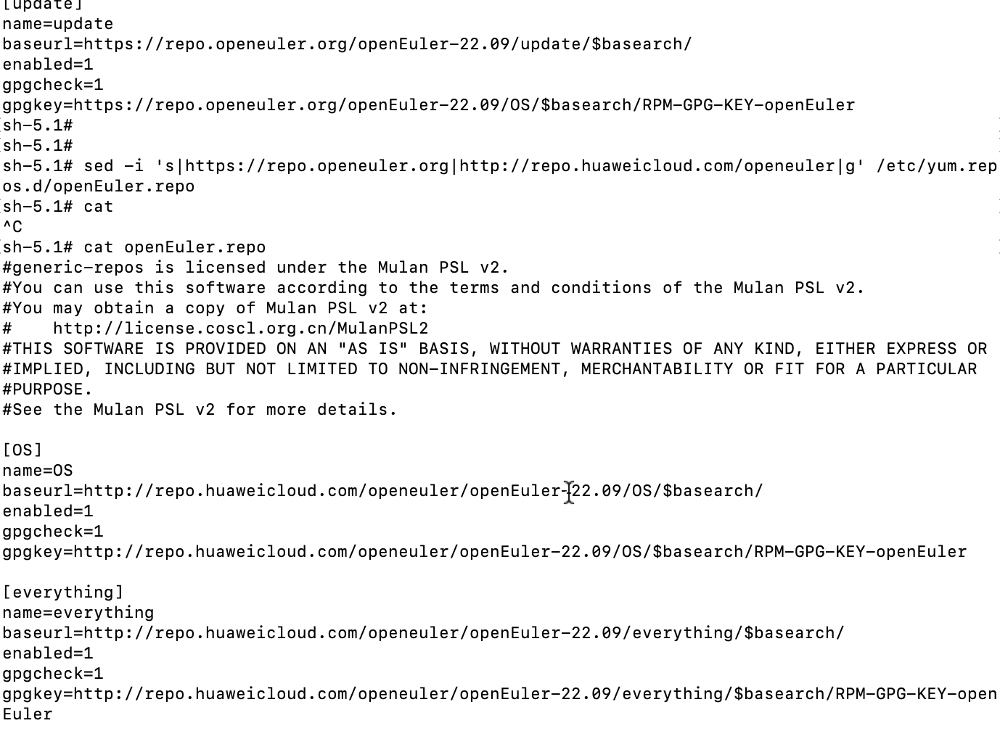
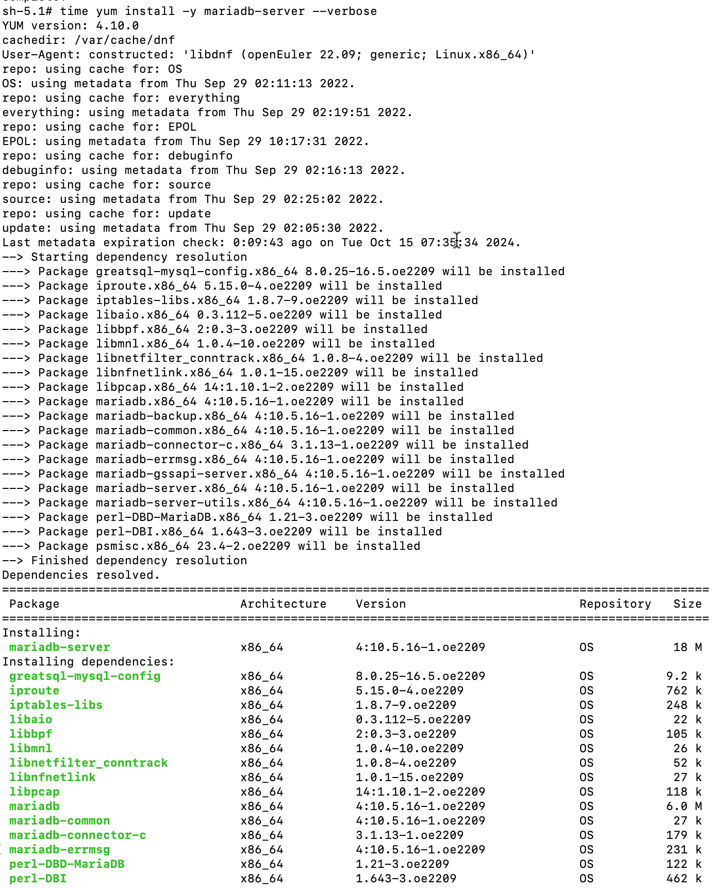
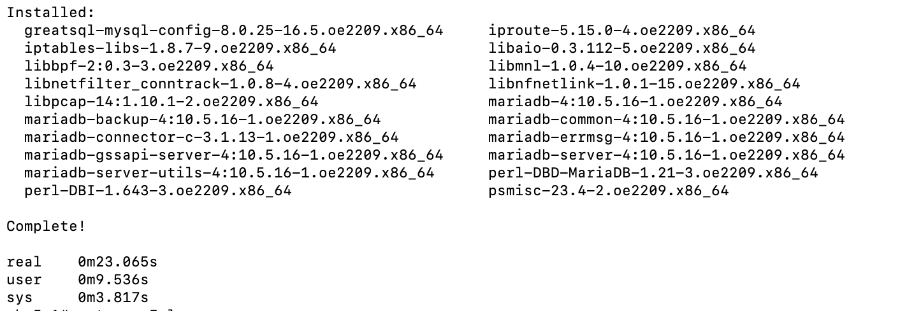
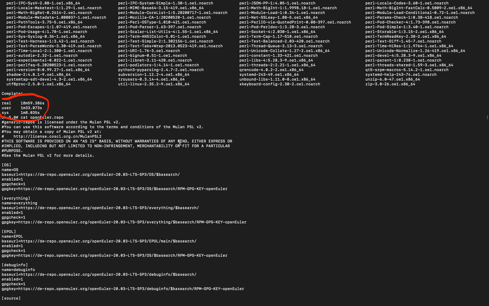
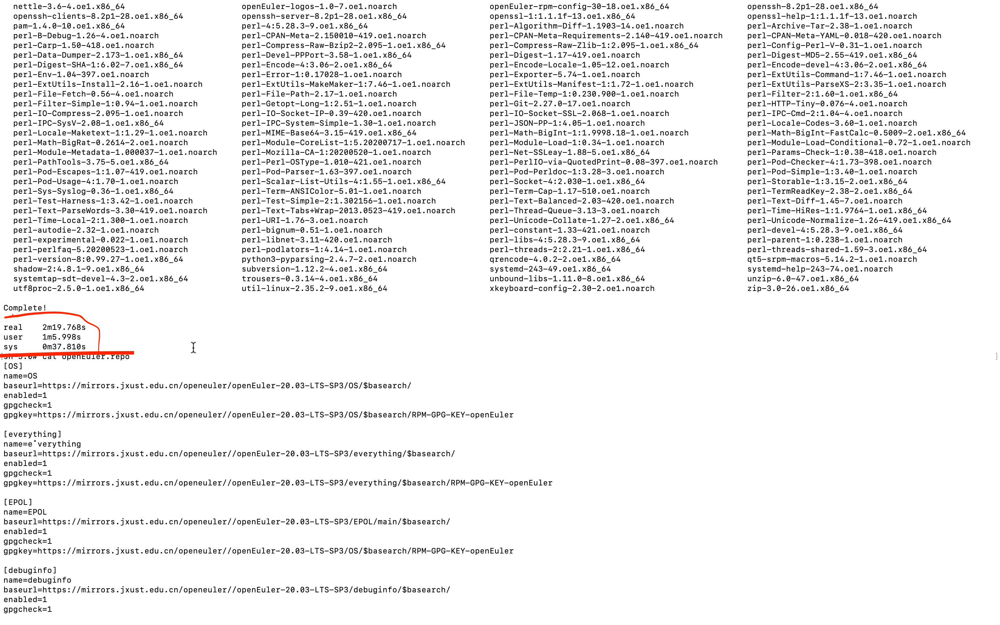
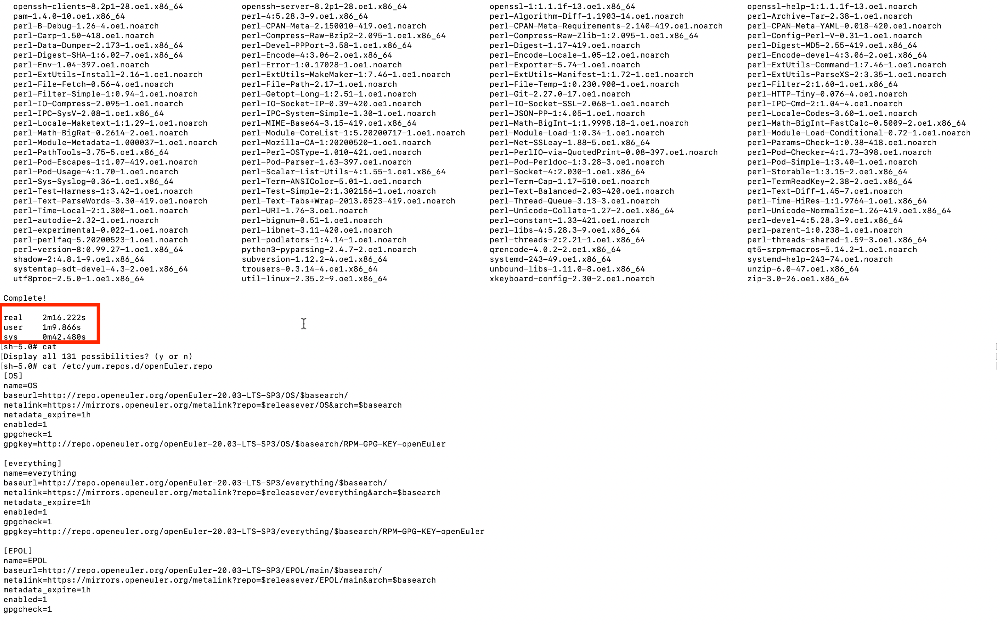

# Solution to the Slow Package Download Using Yum in the openEuler System: Switching Mirror Sites and Using Metalink for Acceleration

When using the openEuler system, you may experience slow download speeds when using Yum to fetch software packages, especially in cases of unstable network conditions or suboptimal mirror sites. This blog describes how to **switch mirror sites** and **use Metalink** to enhance the speed of Yum package downloads.

## 1. Mirror Site Switching

Choosing a mirror site closer to your location or one with faster speeds is the most direct and effective method to accelerate package downloads using Yum. openEuler offers multiple mirror sites, allowing you to select the optimal one based on your geographical location. The procedure is described as follows:

### Step 1 Check the current Yum repository configuration.

The configuration files of the Yum repositories are usually stored in the `/etc/yum.repos.d/` directory. You can run the following command to view these files:

```bash
cd /etc/yum.repos.d/
ls
```

The files whose names end with `.repo` define repositories used by Yum to pull packages. For example, there is only the `openEuler.repo` file in the directory. The file name varies depending on the version and may contain the system architecture name.


### Step 2 Change the mirror site.

Select a proper mirror site based on your network environment. The [Mirrors](https://www.openeuler.org/en/mirror/list/) page provides many mirror sites. And the commonly used mirror sites are as follows:

- **Huawei Mirrors**
  ```
  http://repo.huaweicloud.com/openeuler/
  ```
- **USTC Mirrors**:
  ```
  https://mirrors.ustc.edu.cn/openeuler/
  ```

#### Procedure:

Edit the corresponding `.repo` file and replace `baseurl` with a preceding mirror site URL.
```bash
vi /etc/yum.repos.d/openEuler.repo
```

The mirror site URL can be replaced in batches. For example:
```bash
sed -i 's|http://repo.openeuler.org|https://mirrors.jxust.edu.cn/openeuler/|g' /etc/yum.repos.d/openEuler.repo
```


```bash
[OS]
name=OS
baseurl=https://mirrors.jxust.edu.cn/openeuler/openEuler-22.09/OS/$basearch/
enabled=1
gpgcheck=1
gpgkey=https://mirrors.jxust.edu.cn/openeuler/openEuler-22.09/OS/$basearch/RPM-GPG-KEY-openEuler

[everything]
name=everything
baseurl=https://mirrors.jxust.edu.cn/openeuler/openEuler-22.09/everything/$basearch/
enabled=1
gpgcheck=1
gpgkey=https://mirrors.jxust.edu.cn/openeuler/openEuler-22.09/everything/$basearch/RPM-GPG-KEY-openEuler

[EPOL]
name=EPOL
baseurl=https://mirrors.jxust.edu.cn/openeuler/openEuler-22.09/EPOL/main/$basearch/
enabled=1
gpgcheck=1
gpgkey=https://mirrors.jxust.edu.cn/openeuler/openEuler-22.09/OS/$basearch/RPM-GPG-KEY-openEuler

[debuginfo]
name=debuginfo
baseurl=https://mirrors.jxust.edu.cn/openeuler/openEuler-22.09/debuginfo/$basearch/
enabled=1
gpgcheck=1
gpgkey=https://mirrors.jxust.edu.cn/openeuler/openEuler-22.09/debuginfo/$basearch/RPM-GPG-KEY-openEuler

[source]
name=source
baseurl=https://mirrors.jxust.edu.cn/openeuler/openEuler-22.09/source/
enabled=1
gpgcheck=1
gpgkey=https://mirrors.jxust.edu.cn/openeuler/openEuler-22.09/source/RPM-GPG-KEY-openEuler

[update]
name=update
baseurl=https://mirrors.jxust.edu.cn/openeuler/openEuler-22.09/update/$basearch/
enabled=1
gpgcheck=1
gpgkey=https://mirrors.jxust.edu.cn/openeuler/openEuler-22.09/OS/$basearch/RPM-GPG-KEY-openEuler
```
Then, save the modification and exit.

### Step 3 Clear the cache and update the Yum repositories.

Run the following commands to clear the old cache and update the newly configured Yum repositories:

```bash
sudo yum clean all
sudo yum makecache
```

As shown in the following figures, the package download speed is significantly improved when the system uses the new Yum repositories to pull software packages.



## 2. Using Metalink to Accelerate Yum Package Pulling

To further enhance download speed and stability, openEuler supports Metalink, which automatically selects the optimal mirror site based on your network conditions and supports resumable downloads, thereby improving download efficiency

### Introduction to Metalink

Metalink is a download acceleration technology. It provides multiple download modes (such as HTTP and FTP) through metadata files and lists multiple available mirror sites, to help you select the fastest one. In addition, Metalink supports multi-thread downloads and resumable downloads, improving the stability of large file downloads.

### Step 1 Enable Metalink.

By default, openEuler supports Metalink in the Yum configuration starting from openEuler 22.03 LTS SP2. In early versions, you need to manually configure it. Make sure that **Metalink URL** is configured in the `.repo` file, not just `baseurl`.

In `/etc/yum.repos.d/openEuler.repo`, find the configuration related to `metalink`. The format is as follows:

```bash
[OS]
name=OS
baseurl=http://repo.openeuler.org/openEuler-20.03-LTS-SP3/OS/$basearch/
metalink=https://mirrors.openeuler.org/metalink?repo=$releasever/OS&arch=$basearch
metadata_expire=1h
enabled=1
gpgcheck=1
gpgkey=http://repo.openeuler.org/openEuler-20.03-LTS-SP3/OS/$basearch/RPM-GPG-KEY-openEuler

[everything]
name=everything
baseurl=http://repo.openeuler.org/openEuler-20.03-LTS-SP3/everything/$basearch/
metalink=https://mirrors.openeuler.org/metalink?repo=$releasever/everything&arch=$basearch
metadata_expire=1h
enabled=1
gpgcheck=1
gpgkey=http://repo.openeuler.org/openEuler-20.03-LTS-SP3/everything/$basearch/RPM-GPG-KEY-openEuler

[EPOL]
name=EPOL
baseurl=http://repo.openeuler.org/openEuler-20.03-LTS-SP3/EPOL/main/$basearch/
metalink=https://mirrors.openeuler.org/metalink?repo=$releasever/EPOL/main&arch=$basearch
metadata_expire=1h
enabled=1
gpgcheck=1
gpgkey=http://repo.openeuler.org/openEuler-20.03-LTS-SP3/OS/$basearch/RPM-GPG-KEY-openEuler

[EPOL-UPDATE]
name=EPOL-UPDATE
baseurl=http://repo.openeuler.org/openEuler-20.03-LTS-SP3/EPOL/update/main/$basearch/
metalink=https://mirrors.openeuler.org/metalink?repo=$releasever/EPOL/update/main&arch=$basearch
metadata_expire=1h
enabled=1
gpgcheck=1
gpgkey=http://repo.openeuler.org/openEuler-20.03-LTS-SP3/OS/$basearch/RPM-GPG-KEY-openEuler

[debuginfo]
name=debuginfo
baseurl=http://repo.openeuler.org/openEuler-20.03-LTS-SP3/debuginfo/$basearch/
metalink=https://mirrors.openeuler.org/metalink?repo=$releasever/debuginfo&arch=$basearch
metadata_expire=1h
enabled=1
gpgcheck=1
gpgkey=http://repo.openeuler.org/openEuler-20.03-LTS-SP3/debuginfo/$basearch/RPM-GPG-KEY-openEuler

[source]
name=source
baseurl=http://repo.openeuler.org/openEuler-20.03-LTS-SP3/source/
metalink=https://mirrors.openeuler.org/metalink?repo=$releasever&arch=source
metadata_expire=1h
enabled=1
gpgcheck=1
gpgkey=http://repo.openeuler.org/openEuler-20.03-LTS-SP3/source/RPM-GPG-KEY-openEuler

[update]
name=update
baseurl=http://repo.openeuler.org/openEuler-20.03-LTS-SP3/update/$basearch/
metalink=https://mirrors.openeuler.org/metalink?repo=$releasever/update&arch=$basearch
metadata_expire=1h
enabled=1
gpgcheck=1
gpgkey=http://repo.openeuler.org/openEuler-20.03-LTS-SP3/OS/$basearch/RPM-GPG-KEY-openEuler
```

This enables Yum to use Metalink to automatically select the fastest mirror site for package downloads. For more details, see [configurations for different versions](https://www.openeuler.org/en/blog/zengchen1024/use-dnf-with-metalink.html).

### Step 2 Optimize Metalink settings.

You can also adjust the Yum configuration file `/etc/yum.conf` to further speed up downloads of Metalink. To increase the number of concurrent connections, you can modify `max_parallel_downloads`.

```bash
sudo vi /etc/yum.conf
```

Add or modify the following content:

```bash
max_parallel_downloads=10
```

This allows Yum to download packages from multiple mirror sites in parallel at the same time, improving the overall speed.

## 3. Metalink Test Example

The following illustrates the effect of mirror site switching and Metalink.

Step 1 **Check the original download speed**. Run the following command to install a test package and record the download speed:
   ```bash
   time dnf install -y golang 
   ```

As shown in the figure, the process takes more than 18 minutes.

Step 2 **Use another mirror site**, run the installation command again, and record the speed change.

   ```bash
   # Use vi to change the mirror site.
   yum clean all
   yum makecache
   time dnf install -y golang
   ```
As shown in the following figure, the process takes about 37 seconds.

Step 3 **Enable Metalink, optimize download settings**, and test the speed again.
   ```bash
   # Run vi /etc/yum.repos.d/ openEuler.repo to modify the Metalink configuration. For details about configurations of different versions, see [https://www.openeuler.org/en/blog/zengchen1024/use-dnf-with-metalink.html].
   # Run vi /etc/yum.conf and specify max_parallel_downloads to 10, to enable concurrent download from multiple mirror sites, thereby improving the overall download speed.
   yum clean all
   yum makecache
   time dnf install -y golang
   ```
As shown in the following figure, the process takes about 25 seconds.

## 4. Conclusion
By switching to a faster mirror site and enabling Metalink, you can significantly enhance the download speed of Yum in the openEuler system. Specifically, choose a mirror site based on your network status and geographical location, and enable Metalink to automatically choose the optimal one and accelerate downloads. This can mitigate the impact of network instability.

## Reference Links

- [openEuler Mirrors](https://www.openeuler.org/en/mirror/list/)
- [Using Metalink to Speed Up DNF Software Package Installation](https://www.openeuler.org/en/blog/zengchen1024/use-dnf-with-metalink.html)
- [Metalink Accelerates Software Download from openEuler Repository by More Than 20 Times](https://www.openeuler.org/en/blog/20230728-metalink/20230728-metalink.html)
