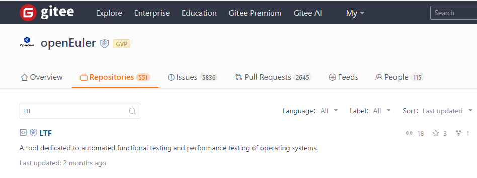

**Introduction to LTF**
=======================================
**Linux Test Framework (LTF) is an automatic test framework developed by the Kylinsec automation team for testing Linux distributions. It has been open-sourced in the openEuler community.** LTF is used in various test projects and routine version tests. **Being lightweight and loosely coupled**, this framework can meet test requirements in multiple scenarios with its extensive experience in Linux automatic testing.

**Wide Coverage**
=======================================
**● Various automatic test cases**

Currently, LTF integrates a total of 267 test cases for 12 test modules related to commands, security, performance, and kernel. The existing automatic test cases cover most test items of test schemes in China and common Linux modules. In addition, LTF provides various APIs for developers to develop automatic test cases.

**● Continuously expanded coverage**

Since V1.0, LTF has been iterated to keep pace with the latest test trends of Linux distributions. It covers key test modules to ensure the stability of Linux distributions in continuous development.

**Loosely Coupled Test Framework**
=======================================
**● Flexible tests**

Each test module of LTF can run independently of each other, reducing inter-module dependencies. This not only enhances the test flexibility and maintainability, but also reduces the complexity and error rate of test code.

**● Efficient source code management**

LTF has a clear source code directory structure, facilitating navigation and access for developers and testers. Through proper directory division and naming, LTF source code is efficiently organized and managed, so that developers can quickly locate and understand each part of the code.

**● Test-focused**

LTF test cases are stored in the **testcases** directory, so that the test cases are clearly isolated from other code, effectively reducing the coupling degree. In this way, testers can focus more on tests without delving into the code implementation details. In addition, this design makes it easier to transplant and extend test cases. Test cases can be easily integrated into a third-party test platform or continuous integration/continuous deployment (CI/CD) platform, improving test flexibility and efficiency.

**Lightweight Features**
=======================================

**● Cross-platform lightweight tests**

LTF is developed using Shell and can be used in Bash or Dash environments. It has no requirement on the Python version and can run on Linux distributions in various architectures without any environment configuration, providing out-of-the-box, efficient test methods for test projects and routine version tests.

**● Cross-interface lightweight tests**

LTF allows users to perform tests and view results on the GUI and TTY in the Linux environment.

**● Lightweight tests without interference**

1. Before the test, users do not need to install or uninstall any additional software package.

2. During the test, no system log is deleted, cleared, or modified, and no software package is installed or uninstalled.

3. If the test is stopped abnormally, all test items are cleared to avoid subsequent test problems.

4. After the test is complete, all test items are cleared.

5. After the test is complete, users can view the test result on the host without using other graphics software.

**Follow-up Plans**
=======================================
LTF has been open-sourced in the openEuler community. With respect to its development, we have made the following plans:

**● Optimizing test cases**

1. Regularly collect and sort out requirements.

2. Develop new test cases.

3. Update and maintain test cases.

**● Improving automatic test capabilities**

1. Introduce automatic test technologies, such as CI/CD.

2. Enhance integration with other test platforms.

**● Improving the stability**

1. Optimize and refactor code.

2. Verify the stability of LTF.

We will gradually promote the plans to improve the test capability, automation degree, and stability of LTF, and contribute more to the openEuler community as well as the open source ecosystem.

If you are interested in this tool, have a try at: [https://gitee.com/openeuler/LTF](https://gitee.com/openeuler/LTF)

