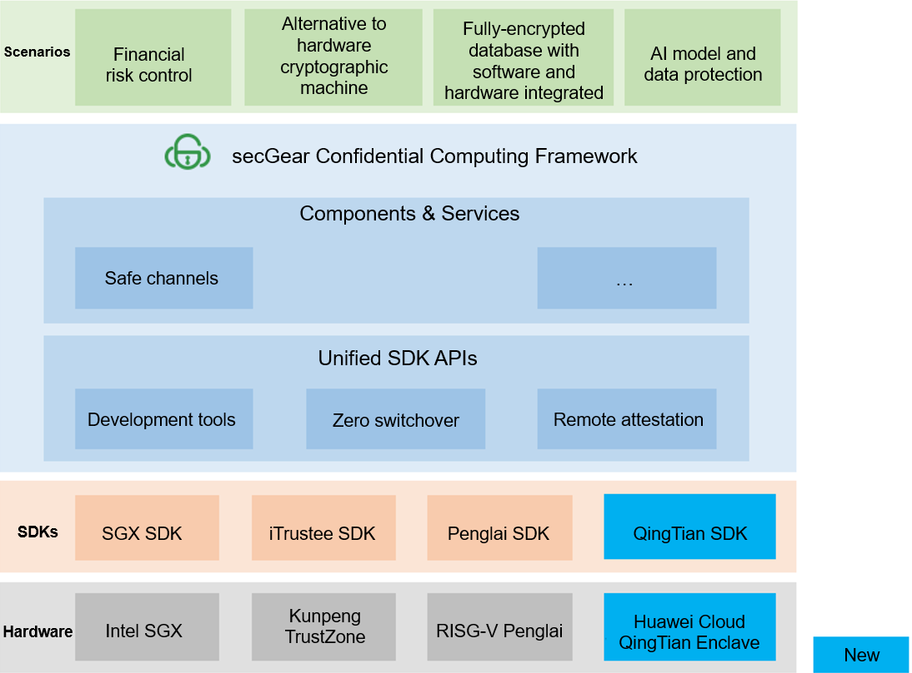
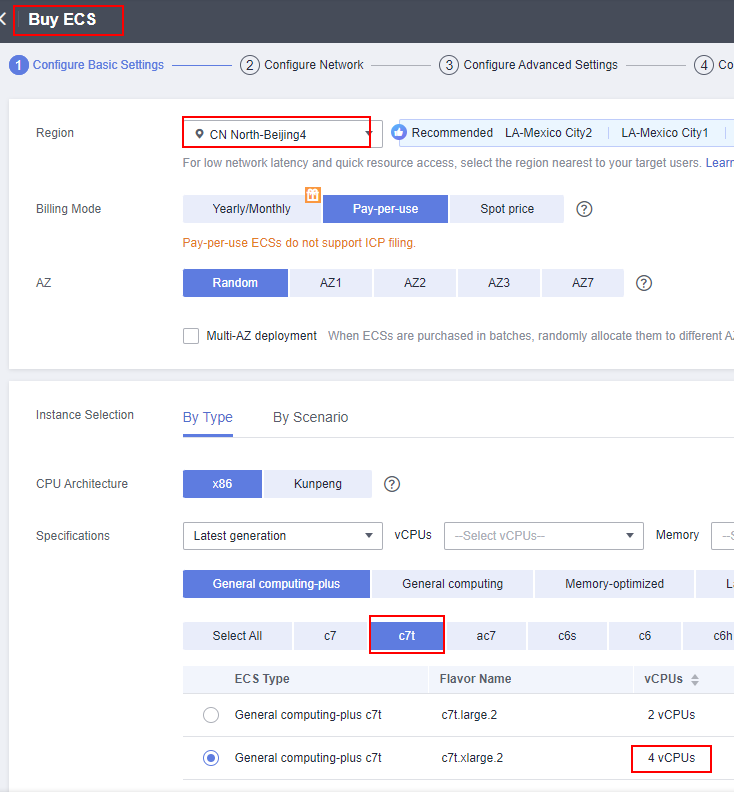
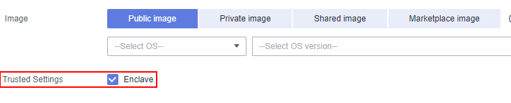
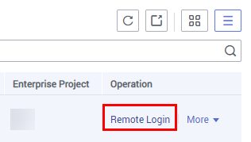

# Background

secGear<sup>[1]</sup>, a confidential computing development framework launched by openEuler, provides unified development APIs that shield TEE SDK differences and allow for source code sharing across different architectures. It currently supports Intel SGX, Kunpeng Trustzone, and RISC-V Penglai, with the recent addition of the support for Huawei Cloud QingTian Enclave. Users can develop and deploy confidential computing applications on Huawei Cloud through secGear, which allows them to focus on their services, reduce development costs, and promote the growth of the confidential computing application ecosystem.



Figure 1 secGear architecture

QingTian Enclave is a confidential computing technology launched by Huawei Cloud. It is an advanced security feature based on some VM instances in the QingTian architecture on Huawei Cloud and provides a secure and isolated execution environment for customers.

# Try It Now

## Environment Setup

Precautions:

- Flavor of Elastic Cloud Servers (ECSs) that support the QingTian Enclave feature: **c7t**  
- Sites that support the QingTian Enclave feature: CN East-Shanghai1 and CN North-Beijing4  
- Default configurations of QingTian Enclave: 1 GB hugepages, 1 GB memory, and two vCPUs  

### Buying an ECS

Log in to Huawei Cloud and buy an ECS<sup>[2]</sup>.

#### Basic Configurations

Note: The number of vCPUs must be greater than 2 because QingTian Enclave occupies two vCPUs by default. Otherwise, the option that enables the Enclave feature will not be displayed.



Figure 2 Basic configuration 1



Figure 3 Basic configuration 2

#### Other Configurations

There are no special requirements for network or advanced configurations, and they can be configured as needed. Ensure that all configurations are confirmed before purchasing the ECS.

### Log in to the ECS.

In the ECS list, select the bought ECS instance, click **Remote Login**, and select a proper terminal for login.  
Note: If you select the pay-per-use billing mode when buying an ECS, stop the ECS when it is not in use to reduce costs.

  

Figure 4 Remote login

### Install the QingTian Enclave software stack.

```shell
yum install qt-enclave-bootstrap virtio-qtbox qingtian-tool libqtsm docker
pip3 install docker knack

// Configure isolation parameters in the configuration file (/etc/qingtian/enclave/qt-enclave-env.conf) as required. This tutorial uses 1 GB memory and two vCPUs by default. Then, start the isolation service.
systemctl start qt-enclave-env
```

## Demo Running

### Obtain the openEuler container image.

The QingTian Enclave image file provides system information required to start QingTian Enclave and run the QingTian Enclave application, including information about the Linux operating system, other third-party libraries, and the QingTian Enclave application. It is a container image that contains user applications and is generated through conversion by the QingTian command tool. This demo uses the openeuler-22.03-LTS container image as the base image to package the QingTian Enclave application and its dependency libraries.

```shell
wget https://repo.huaweicloud.com/openeuler/openEuler-22.03-LTS/docker_img/update/2023-09-09/x86_64/openEuler-docker.x86_64.tar.xz

docker load --input openEuler-docker.x86_64.tar.xz

[root@openEuler]# docker image ls
REPOSITORY                TAG                 IMAGE ID            CREATED             SIZE
openeuler-22.03-lts       latest              3138523abc5f        2 months ago        190MB
```

### Install secGear.

```shell
# The devel package is in debuginfo. By default, debuginfo in the repo source is disabled. Change the value of enabled to 1.
vim /etc/yum.repos.d/hce.repo
[debuginfo]
name=HCE $releasever debuginfo
baseurl=http://repo.huaweicloud.com/hce/$releasever/debuginfo/$basearch/
enabled=1

yum install secGear-devel
```

### Download the demo.

```shell
# Install dependencies.
yum install git gcc-c++

git clone https://gitee.com/openeuler/secGear.git -b qt_dev
```

### Compile and run the demo.

```shell
# Compile the demo.
cd examples/helloworld/
mkdir build && cd build && cmake -DCC_QT=on .. && make

# Run the demo.
./host/secgear_helloworld
```

# Procedure for Developing an Application

The directory structure of the demo is as follows, including the Rich Execution Environment (REE) program, Trusted Execution Environment (TEE) program, REE-TEE interaction header file, and others (compilation project and configuration file).

```shell
[root@openEuler helloworld]# tree
.
├── CMakeLists.txt
├── enclave
│   ├── CMakeLists.txt
│   ├── config_cloud.ini
│   ├── Dockerfile			// Container image Dockfile corresponding to QingTian Enclave
│   ├── enclave.c			// Application entry in QingTian Enclave
│   ├── Enclave.config.xml
│   ├── Enclave.lds
│   ├── hello.c               // Program in the TEE (sensitive data processing function)
│   └── manifest.txt
├── helloworld.edl			// REE-TEE interaction header file
└── host
    ├── CMakeLists.txt
    └── main.c				// Program in the REE
```

To develop an application based on the demo project, perform the following steps:

- Identify sensitive data and the processing program, extract functions to an independent file **private_data_proc.c**, and place the file in the **enclave** directory to adapt to the compilation project.  
- Add the external API of **private_data_proc.c** to the **helloworld.edl** file.  
- Call the external API of **private_data_proc.c** in **main.c** in the REE.  

The development process of a secGear application involves extracting the sensitive data processing program into an independent library and running it in the TEE. The REE then calls the library in the TEE through an API. secGear shields the calling details of REE-TEE across different platforms, allowing users to focus on their services and improving the development efficiency.

# Join Us

The Confidential Computing SIG<sup>[3]</sup> is committed to providing users with simple and easy-to-use software stacks and solutions, reducing the threshold for the use of confidential computing and promoting the development of the confidential computing ecosystem.

Currently, the implementation of secGear has been open-sourced in the openEuler community. You can access it through the address of the source code repository<sup>[4]</sup> at Gitee. We welcome interested users to join us.  


# References

[1] Introduction to secGear: [https://www.openeuler.org/en/other/projects/secgear/](https://www.openeuler.org/en/other/projects/secgear/)  
[2] ECS purchase address: [https://console.huaweicloud.com/ecm/?agencyId=059c1e36a08010141fb6c0084089a303&region=cn-north-4&locale=en-us#/ecs/createVm](https://console.huaweicloud.com/ecm/?agencyId=059c1e36a08010141fb6c0084089a303&region=cn-north-4&locale=en-us#/ecs/createVm)  
[3] Confidential Computing SIG: [https://www.openeuler.org/en/sig/sig-detail/?name=sig-confidential-computing](https://www.openeuler.org/en/sig/sig-detail/?name=sig-confidential-computing)  
[4] secGear Gitee source code repository: [https://gitee.com/openeuler/secGear](https://www.openeuler.org/en/sig/sig-detail/?name=sig-confidential-computing)
