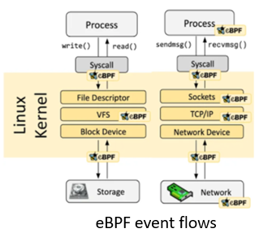
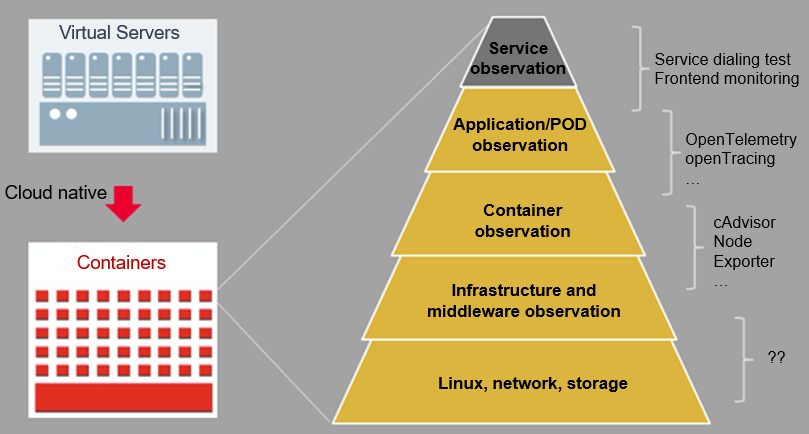
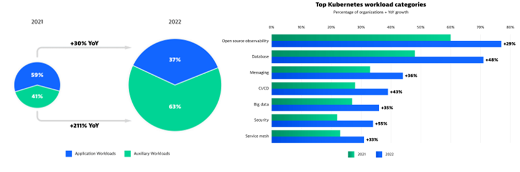
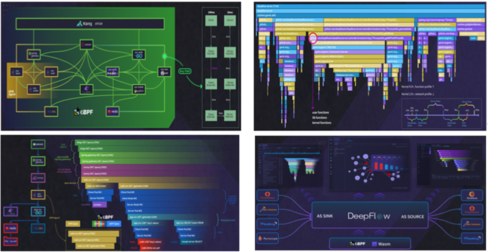
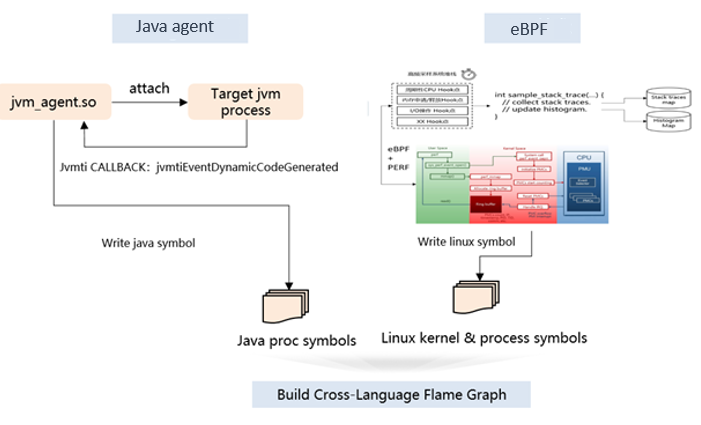
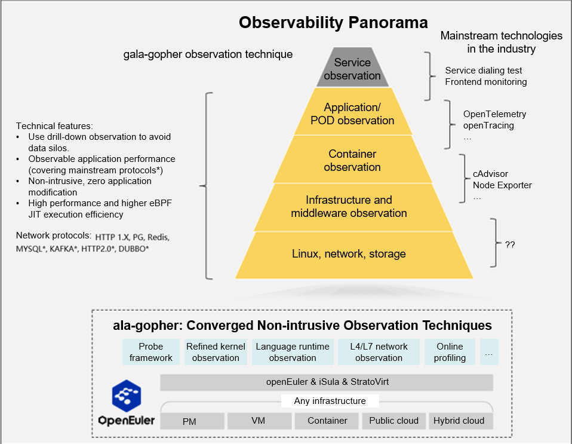
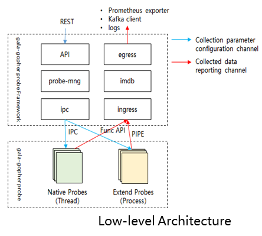

Application observability can assist in analyzing the actual data generated by enterprise operations, and observability will become the strongest support for data-driven decision-making in enterprises. The infrastructure in the cloud native era is more complex, and it exposes certain observability problems, including inadequate infrastructure observability and a lack of infrastructure observability data from the application perspective. These provide opportunities and challenges for the next generation of cloud-native observability.

**The gala-gopher[1] project within the openEuler community has completed a series of full-stack observability practices based on the eBPF technology.**

**eBPF and Its Significance to Observability**
--------------------------

eBPF is a technology that allows sandboxed programs to run in the kernel. It provides a mechanism for safely injecting code during occurrence of kernel and user program events, enabling non-kernel developers to control the kernel. As the kernel evolves, eBPF gradually expands from its initial packet filtering capabilities to include networking, kernel, security, and tracing.

**Principle**: eBPF is event-driven and executes eBPF programs in data flows through hooking. The Linux kernel predefines a series of commonly-used hook points (there are also uprobe and USDT dynamic and static hook points in user mode). eBPF utilizes the Just-in-Time (JIT) technology to achieve runtime efficiency of eBPF code comparable to that of native kernel code and kernel modules. It also incorporates a Verification mechanism to ensure the safe execution of eBPF code, preventing kernel crashes and infinite loops. Additionally, the eBPF Helper mechanism enables eBPF code to access runtime data and statuses of both the kernel and applications.

**Observability**: Through hooking of the kernel and user-mode programs, observation programs in eBPF sandboxes are driven by data flows and system events. This provides flexible and on-demand observation of services and system statuses, while also offering low workload, high security, and non-intrusive technical features to observability.

**Changes and Challenges Brought by O&M in Cloud Native Scenarios**
----------------------------------

Changes and challenges brought by O&M in cloud native scenarios:

-   **Change 1**: The traditional approach of using "one-fits-all" layered O&M (infrastructure and application layers) in a single virtualization architecture has now evolved into a converged O&M approach in cloud native scenarios. This shift necessitates the need for **full-stack observability and O&M**.

-   **Change 2**:
    The cloud native multi-technology systems (such as Linux and CNCF), rapid evolution, and other characteristics require observability solutions to decouple from their applications/infrastructure technology stacks and provide **non-intrusive observability**.

-   **Change 3**: The cloud native high-density and distributed deployment mode requires cluster O&M for layer-by-layer/level-by-level root cause demarcation and locating from the **service cluster perspective**.

The preceding technical features of cloud native enable the construction of observability to **naturally sink into the infrastructure software**. The eBPF technology is particularly prominent in the observability of infrastructure software (especially the kernel). This is because its technical features perfectly match the cloud native observability requirements.

-   **Non-intrusive**: Through the eBPF byte injection technology, programmable and non-intrusive observation logic injection can be quickly performed, to easily cope with the rapidly evolving features in cloud native scenarios.

-   **Portability and cross-platform**: By using standard eBPF ISA, CO-RE, and other technologies, it is possible to enable different Linux versions, ISA architectures, and platforms to be compatible with the same eBPF program. This makes it easy to handle hybrid deployment of different platforms and systems in cloud native scenarios.

-   **Full stack**: Technologies such as eBPF + USDT, eBPF + Tracepoint, and eBPF + kprobe can cover most foundational software such as the kernel, runtime, and basic databases. This enables easy support for cloud native features, such as multi-language, multi-network protocol, and heavy software stack.

**Industry Insights**
------------

Observability is becoming increasingly important in Kubernetes scenarios. According to the Cloud Native Report[2] in 2023, auxiliary application workloads in cloud native clusters increased to 63%, and nearly 80% of enterprises deployed observability solutions (a year-on-year increase of 29%).

Here are several mature cloud native O&M systems in the industry:

### **Deepflow**

Carry out network-centric O&M in cloud native scenarios, develop observability technologies based on eBPF, and build four capability features[3]:

-   **Universal map**: Construct a cluster topology in real time in non-intrusive mode to enable full-link latency observation.

-   **Continuous profiling**: Provide the online continuous code profiling capability.

-   **Distributed tracing**: Enable non-intrusive full-link distributed tracing, covering infrastructure such as the ServiceMesh, database, DNS, and NIC.

-   **Seamless integration**: Data storage can seamlessly integrate with ecosystem software such as Prometheus and Skywalking; data collection can seamlessly connect to ecosystem collection probes (such as OLTP); observation data carries cloud platform context information such as Kubernetes and VPC.

### **Pixie**

Pixie is an advanced observability tool[4] designed specifically for Kubernetes applications. Powered by the eBPF technology, it provides users with a real-time overview of their Kubernetes clusters' running statuses, including ServiceMap, cluster resources, and application traffic. Additionally, Pixie offers detailed views of pod statuses, flame graphs, and individual application requests for enhanced visibility. Pixie provides the following features:

-   **Network monitoring**: Monitor the network traffic, DNS, and TCP quality (such as packet loss, retransmission, and congestion) in a Kubernetes cluster.

-   **Infrastructure monitoring**: Monitor resources (CPU, memory, network, and storage) in different dimensions, such as pods, nodes, and namespaces.

-   **Service performance**: Support Kubernetes service topology construction and service performance (including HTTP1.*X*, PGSQL, gRPC, and Redis) monitoring. The performance metrics include the latency, throughput, and error rate.

-  **Application profiling**: Enable continuous application profiling, and support performance flame graph analysis of multi-language stacks.

-  **Middleware monitoring (such as DB and Kafka)**: Provide the capability of observing key data flows of middleware, including the DB access process and Kafka topic production/consumption process.

**eBPF Limitations and Solutions**
--------------------------

In some advanced language scenarios (especially Java) with independent runtime, eBPF's observability has some limitations, mainly manifested in:

-   The observability of encrypted flows (encrypted and decrypted by the JSSE class libraries) cannot be achieved through eBPF + uprobe, which results in the inability to observe networks in encrypted scenarios.

-  The language stack information is incomplete, such as the inability to effectively obtain software stack information in the JVM heap, resulting in incomplete stack information during profiling, and this is not conducive to problem locating.

-   Solution: Based on the particularity of Java scenarios, the Java agent and eBPF technologies are used to implement non-intrusive observability. For example, the roadmap for Java application profiling is as follows.
 

**Introduction to openEuler Practices**
---------------------------

The gala-gopher[1] project within the openEuler community is centered around the eBPF technology and takes into account the integration of various observation techniques. It adopts a probe-based architecture and quickly builds observability by integrating probes. Its observation panorama is shown below.

### **Key Features**

-   **Probe framework**: Provide an eBPF probe framework for probe lifetime management, probe task management, and data reporting.

-   **Performance observation**: Assist in locating difficult application/system faults such as memory leaks, deadlocks, and CPU scheduling problems through flame graphs and timeline charts.

-   **Application observation**: Provide process-level full-stack performance observability, covering applications, containers, basic databases/middleware, and kernels.

-   **Network traffic observation**: Provide end-to-end tracing in cloud native scenarios, with the ability to construct network topologies (covering various cloud native network scenarios), and provide the capability to collect various metrics for L4 and L7 traffic.

### **Architecture and Key Technical Features**

-   **Scalability**: The probe-based architecture allows for the collection scope and capability to be tailored as needed, and can seamlessly integrate with external probes.

-   **Non-intrusive & multi-language**: Applications and container images do not need to be modified or restarted. Multi-language applications can be observed, covering mainstream languages such as C/C++, Go, Java, and Python.

-   **Ecosystem**: Support OpenTelemetry ecosystem interfaces and interconnection with various open-source O&M software (such as Prometheus and ES).

-   **Rich context**: Provide automatic labeling capabilities, including all data application labels (such as process and container information), node labels (such as IP addresses and machine IDs), and Kubernetes labels (such as POD and namespace information).

For details, see the community document[5].

**Related Links**
------------

[1] gala-gopher
source code repository at Gitee: [https://gitee.com/openeuler/gala-gopher](https://gitee.com/openeuler/gala-gopher)  
[2] Cloud Native Report in 2023: [https://www.dynatrace.com/news/blog/kubernetes-in-the-wild-2023/](https://www.dynatrace.com/news/blog/kubernetes-in-the-wild-2023/)  
[3] Deepflow Introduction: [https://deepflow.io/blog/zh/036-ebpf-the-key-technology-to-observability-zh/](https://deepflow.io/blog/zh/036-ebpf-the-key-technology-to-observability-zh/)  
[4] Pixie Introduction: [https://docs.px.dev/about-pixie/what-is-pixie/](https://docs.px.dev/about-pixie/what-is-pixie/)  
[5] Detailed capability introduction of gala-gopher: [https://gitee.com/openeuler/gala-docs/blob/master/demo/A-Ops%E5%8F%AF%E8%A7%82%E6%B5%8B%E8%83%BD%E5%8A%9B%EF%BC%88gala-gopher%EF%BC%89%E4%BB%8B%E7%BB%8D%EF%BC%8823.12%EF%BC%89.pdf](https://gitee.com/openeuler/gala-docs/blob/master/demo/A-Ops%E5%8F%AF%E8%A7%82%E6%B5%8B%E8%83%BD%E5%8A%9B%EF%BC%88gala-gopher%EF%BC%89%E4%BB%8B%E7%BB%8D%EF%BC%8823.12%EF%BC%89.pdf)

**Join Us**
------------

Welcome interested friends to participate in the openEuler eBPF SIG to discuss the eBPF technology.  
 
