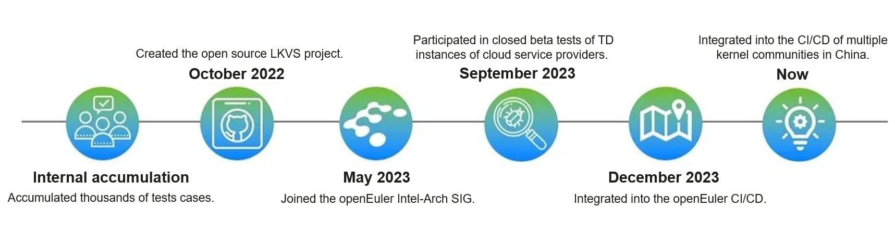
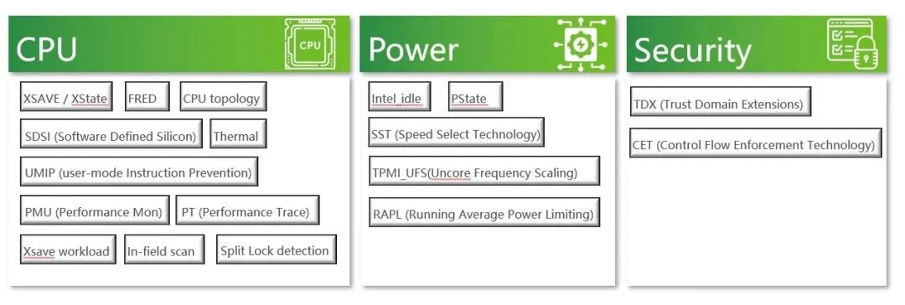
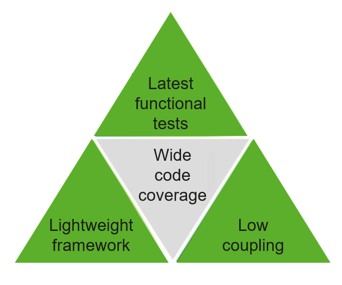
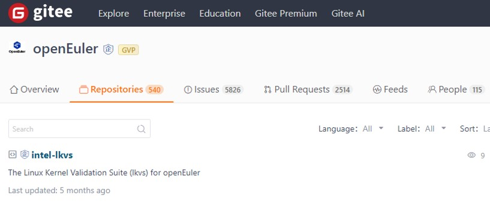

**Introduction to LKVS**
=======================================
The Linux Kernel Validation Suite (LKVS) is a comprehensive Linux kernel test suite developed by the Intel Core Linux Kernel Val Team. **This project has been open-sourced in the openEuler community.** **It highlights the professional knowledge accumulated by Intel kernel development and validation teams over the years. Being lightweight and loosely coupled, this suite can be used in multiple Linux system development and validation scenarios.**

**Wide Coverage**
=======================================
**● Wide test scope**

LKVS integrates more than 600 test cases, covering 20+ key features of the Linux kernel. The test scope involves CPU features, power management, and security features. Specifically, the following Intel features are covered:

CET (Control flow Enhancement Technology), cstate, Intel_TH (Trace Hub), Intel_PT, UMIP (User-Mode Instruction Prevention), xsave, IFS (In Field Scan), FRED (in progress), guest-test, IFS, ISST, PMU, RAPL, SDSI, splitlock, tdx-compliance, thermal, CPU topology, UFS, AMX

**● Depth testing**

The tests cover new platforms and functions developed by Intel. Key kernel paths and hardware integration details are focused to detect exceptions and improve stability.

**● Continuous testing**

LKVS has been iterated since it was released. Through a wide range of professional tests, LKVS ensures the robustness of the Linux environment on the Intel platform and detects new or residual risks and exceptions.

**Flexible and Decoupled Test Framework**
=======================================
**● Decoupled component**

LKVS contains test cases that are independent from internal functional tests and rollback test frameworks. The coupling degree of the test cases is minimized, simplifying the porting and expansion of test cases. LKVS can be easily integrated into various infrastructures, such as the EulerPipeline (CI/CD) system in the openEuler community.

**● Multi-language test scripts**

The test suite supports test cases written in C, Bash, Python, etc. The functional tests are independent of each other, that is, the functional tests are not coupled, which makes them more user-friendly and inspires developers to contribute more test cases.

This scalable, customizable, and loosely coupled architecture promotes the long-term evolution of LKVS.

**Diverse Application Scenarios**
=======================================
LKVS can be used in the following key scenarios:

**● CI/CD integration testing**

Reduces integration risks and improves quality control through automatic testing.

**● Baseline function verification**

Covers baseline functions and evaluates function maturity.

**● Hardware compatibility**

Verifies the latest hardware features to avoid compatibility issues.

**● Security audit**

Proactively detects and mitigates security risks.

**● Regression testing**

Locates problems that may be introduced by patches and version upgrades.

**Follow-up Plans**
=======================================
This project has been open-sourced in the openEuler community and integrated into the EulerPipeline system. Follow-up plans are as follows:

● Supports new functions of platforms to be released.

● Supports new kernel features.

● Improves this framework to enhance the scalability and portability of test cases.

● Optimizes VM test scenarios.

Developed based on expertise in the Linux kernel, LKVS can be used in multiple Linux system development and validation scenarios. It benefits contributors in the Linux ecosystem with its professional capabilities, loosely coupled framework, and wide coverage. Welcome to try this project at: [https://gitee.com/openeuler/intel-lkvs](https://gitee.com/openeuler/intel-lkvs)

