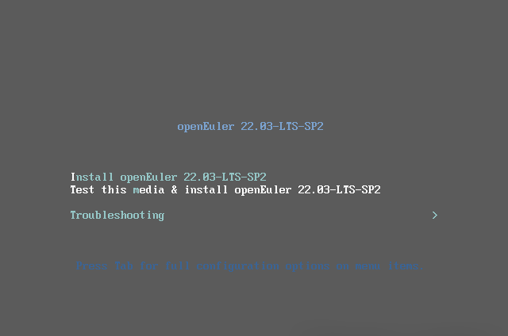

As a virtualization platform widely used by enterprises and individuals, VMware is widely recognized in the IT field. This article describes how to use VMware and how to use VMware to install openEuler OS.

openEuler is a free open source Linux distribution. In the openEuler community, global developers join hands to build an open, diversified, and architecture-inclusive software innovation ecosystem.

**Similarities and Differences Between openEuler and CentOS**
=========================

1.1 **Similarities**

Both are developed based on the Linux kernel.

1.2 **Differences**
    
    (1) openEuler supports many architectures (ARM64, RISC-V, x86, and Kirschberry). But CentOS supports only the x86\_64 and Arm architectures.
    
    (2) openEuler emphasizes a versatile ecosystem, security, and applications such as artificial intelligence. In contrast, CentOS focuses prioritizes system stability and compatibility, offering robust RHEL compatibility and support.
    
    (3) openEuler is a lightweight, efficient enterprise-level OS.


​    
**openEuler Basic Experiment**
=========================
**Using VMware to install the openEuler VM**

**2.1 Environment**

-   Virtualization tool: VMware (16.1.2 build-17966106)

-   openEuler image: openEuler 22.03 LTS SP2

Download the openEuler ISO image from the official website. Select required version, architecture, and scenario: https://www.openeuler.org/en/download/archive/

Go to the official website. Here, we choose openEuler
22.03 LTS SP2 as an example.
We select x86\_64 as the architecture and servers as the scenario.


**2.2 VMware VM Configuration**

After the image is downloaded, go to VMware to install the openEuler OS.

(1) Type of configuration

-   Typical: The system automatically configures the parameters. The parameters can be modified through the VM settings.

-   Custom: You will manually configure the VM.

(2) Hardware compatibility: We select **Workstation 16.x**.  The advantage is that there are few restrictions, but the disadvantage is that the compatible products are few.

-   The lower the version, the more compatible versions, but the more restrictions.

-   The later the version, the fewer the compatible versions and the fewer the restrictions.

Workstation 6.0 is compatible with many products but has many restrictions.

(3) The installer disc is not available.

(4) After **Installer disc image file (iso)** is selected, VMware automatically detects the frequently used image. You need to manually select the path of the downloaded ISO image. Then the system displays a message indicating that the OS cannot be detected. Therefore, choose **I will install the operating system later**. openEuler is developed based on the Linux kernel. Therefore, you can select **Linux** as the OS and **CentOS** as the version. Add a name for the VM and choose the installation location. Here we configure 4 processors an 8 GB memory.

(5) Network configuration

-   **Use bridged networking**: The VM uses the IP address of the physical machine. The VM and the external network can mutually access each other.

-   **Use network address translation (NAT)**: Create a NIC on the host and share the network segment of the NIC with the host. The VM can access the external network, but the external network cannot access the VM.

-   **Use host-only networking**: The PM and VM can communicate with each other, but the VM cannot access the external network. The VM can only communicate with other machines on the same LAN in the same network. (OpenStack private cloud requires this mode for internal communication between VMs.)

-   **Do not use a network connection**: The host machine cannot communicate with the VM, and the VM cannot access the external network.

Here, we retain the default setting.

(6) Disks

-   **Create a new virtual disk**: The system creates a new disk.
-   **Use an existing virtual disk**: A previously created disk is used.

-   **Specify Disk Capacity**: Choose **Allocate all disk space now**. The VM immediately occupies 1000 GB of the PM (PM: 2 TB, VM: 1000 GB).
     The difference between **Store virtual disk as a single file** and **Split virtual disk into multiple files** is the efficiency of starting a VM, but the disk performance is affected.

In this way, a VM template is successfully created. Then specify the path of the ISO image for the VM.


Connect at startup.

**2.3 Installing openEuler**



Language

Here we select English.


Partitioning

For convenience, use automatic partitioning.


For manual partitioning (recommended):

-   **/boot**: 300-500 MisB (for storing the Linux kernel)

-   **swap**: one or two times of the running memory;

-   **/**: The remaining space can be allocated to the root partition. If there are other requirements, the remaining space can be allocated to the openEuler partition.

**Setting the network settings on the VM**


-   DHCP: automatically obtained (more convenient)

-   Manual: Enter an IP address manually. You can manually configure an IP address as required. For example, in a lab environment, set the IP address to xxx.xxx.xxx.xx1, xxx.xxx.xxx.xx2, or xxx.xxx.xxx.xx3.

**Installation mode:**


In this example, select the minimum installation mode. (You can run commands to install the dde desktop later.) 

**Enable root login.**

-   By default, the root user is not allowed to log in. You need to create a user. In this example, the root user is enabled.

-   You only need to set the partition, network, installation mode, and enable root.

Then, complete the installation.


**Restarting the system**


Log in to openEuler.


The openEuler installation is complete.

**Installing the GUI for openEuler on the CLI**

**3.1 Checking Network Connectivity**

```shell
ping baidu.com
```


**3.2 Updating Software Packages in Yum**

```shell
sudo yum -y update
```


**3.3 Installing Font**

To prevent garbled characters, run the following command:

```shell
sudo yum -y groupinstall fonts
```


**3.4 Installing DDE**

```shell
sudo yum -y install dde
```


**Summary**

Through this experiment, we have learned about the basic usage of VMware and how to use the VMware tool to install the openEuler VM.
