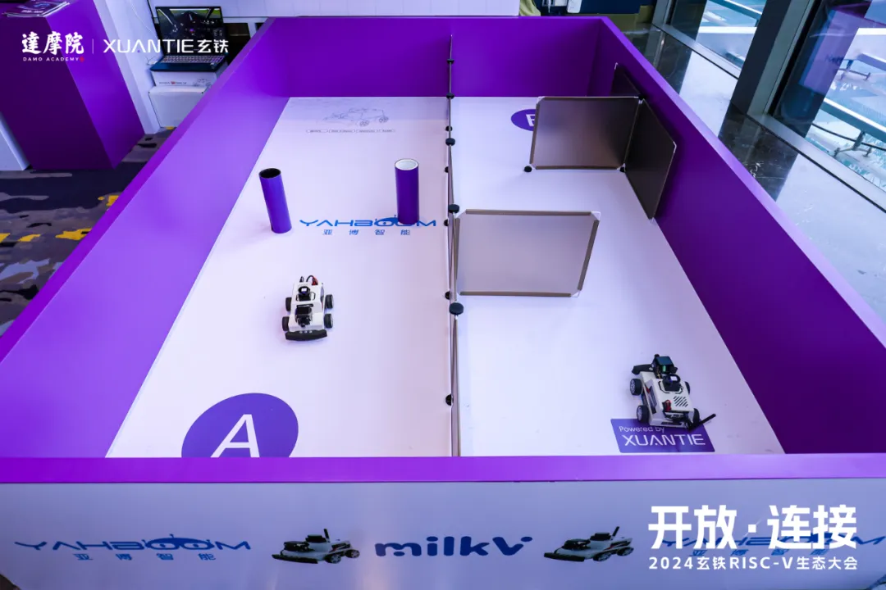
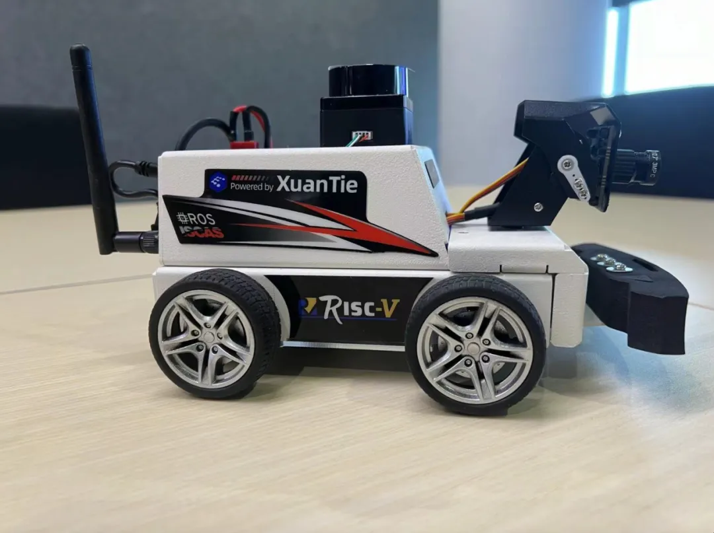
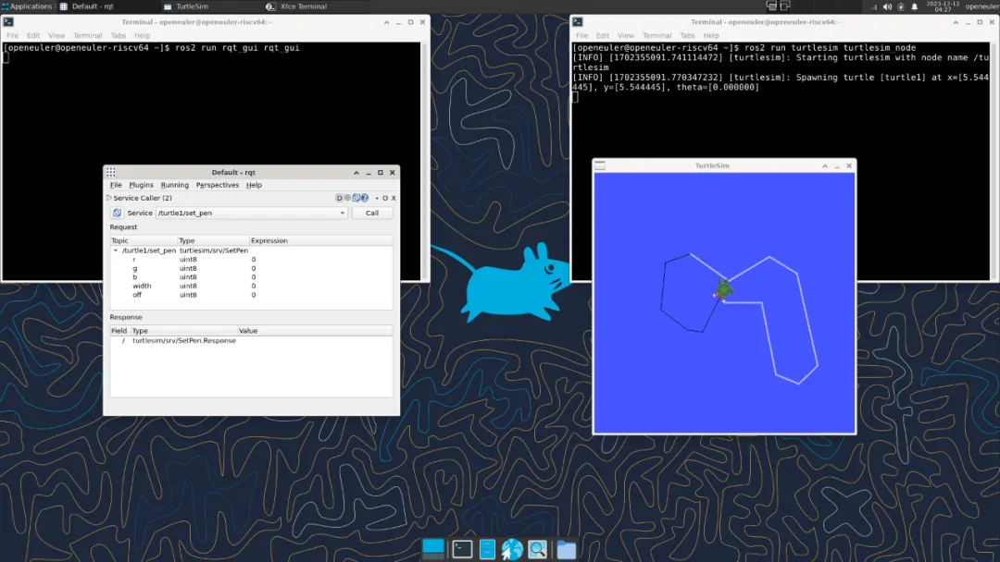
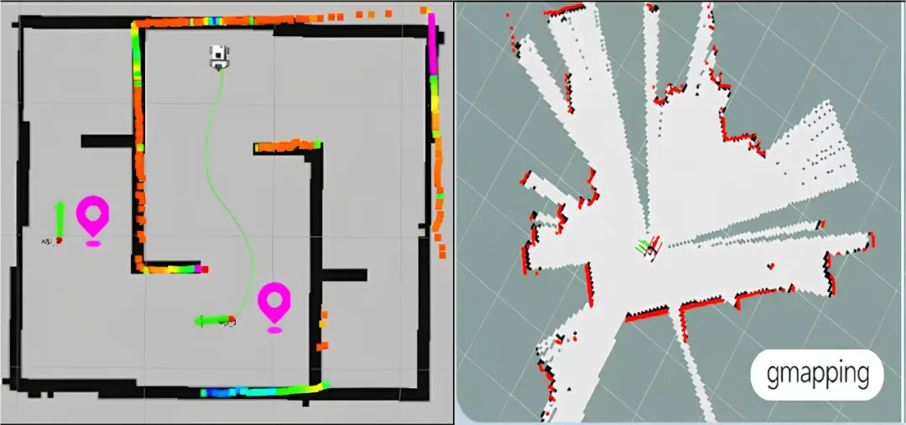

**Introduction to the Robot Car**
=======================================
On March 14, the 2024 XuanTie RISC-V Partner Conference was held in Shenzhen by the Damo Academy. A robot operating system (ROS) robot car solution, jointly developed by Institute of Software Chinese Academy of Sciences, Yahboom Robotics, and XuanTie, made it debut at the conference. This product, RISC-V MicroROS, is expected to be on sale by Yahboom Robotics in April. RISC-V MicroROS is an ROS 2 robot car developed based on Milk-V Meles. It is equipped with the XuanTie C910 processor, openEuler RISC-V operating system, and peripheral solutions of Yahboom Robotics, achieving multiple functions such as robot motion control, AI visual interaction, SLAM navigation, and multi-machine synchronization control. The RISC-V SIG led by the Institute of Software Chinese Academy of Sciences contributes to building the system environment for the RISC-V MicroROS robot car. This SIG provides openEuler RISC-V images and hardware drivers that adapt to the TH1520 SoC, enhancing ROS 2 software and hardware adaptation to the RISC-V hardware environment. The successful implementation of this robot car demonstrates the achievements of the RISC-V SIG in building the community software ecosystem.

**openEuler's ROS + RISC-V Solution**
=======================================
The ROS 2 Humble project is introduced to the openEuler community by the ROS SIG led by Institute of Software Chinese Academy of Sciences, and is transplanted and optimized by the RISC-V SIG. This project enables ROS 2 functions for the openEuler RISC-V system. In addition, the RISC-V SIG and the ROS SIG jointly formulate test policies under the RISC-V architecture and perform function tests to ensure stable running of related software and hardware. From the software perspective, developers in the RISC-V SIG provide a demo document for dual-machine communication using ROS 2 based on openEuler RISC-V, presenting reference for applying ROS 2 in the RISC-V architecture.

● Test document: [https://gitee.com/zhtianyu/ros-humble-work/tree/master/ros-humble-test/ROS-humble-oerv23.09-lpi4a](https://gitee.com/zhtianyu/ros-humble-work/tree/master/ros-humble-test/ROS-humble-oerv23.09-lpi4a)

● Demo document: [https://gitee.com/zhtianyu/ros-humble-work/tree/master/ros-humble-demo](https://gitee.com/zhtianyu/ros-humble-work/tree/master/ros-humble-demo)

**Hardware Optimizations**
=======================================
In addition to upper-layer software, the RISC-V SIG also optimizes hardware based on peripheral drivers of TH1520, including multiple hardware drivers such as GPU, NPU, and multimedia codecs to accelerate image capture and parsing, image creation and rendering in SLAM, and synchronous network response for multiple machines. The RISC-V SIG repairs the openEuler kernel of TH1520 and enables peripheral functions such as Bluetooth and Wi-Fi, ensuring a stable and efficient operating environment with extensive functions for ROS 2. Another integration achievement is the TH1520-based Meles image, which is a dedicated openEuler system image base for the development and application of ROS robots.

**Follow-up Plans**
=======================================
To promote the openEuler RISC-V ecosystem and consolidate openEuler RISC-V as the system base for full-stack applications, the RISC-V SIG plans to make more efforts in the following aspects:

1. Adapt openEuler RISC-V based on openEuler 24.03 to provide reliable pipeline testing and manual verification for various software stacks.

2. Explore the optimal openEuler ecosystem in RISC-V and expand application scenarios of openEuler RISC-V.

3. Optimize the software and hardware in openEuler RISC-V to build a reliable, full-stack RISC-V system base.

**Join Us**
=======================================
RISC-V has become an unstoppable trend. Both Ruyi Book laptops and RISC-V-based MicroROS robots show that RISC-V has made great strides in the HPC field. If you are interested in RISC-V, welcome to join the RISC-V SIG!

● RISC-V SIG home page: [https://www.openeuler.org/en/sig/sig-detail/?name=sig-RISC-V](https://www.openeuler.org/en/sig/sig-detail/?name=sig-RISC-V)

● ROS SIG home page: [https://www.openeuler.org/en/sig/sig-detail/?name=sig-ROS](https://www.openeuler.org/en/sig/sig-detail/?name=sig-ROS)