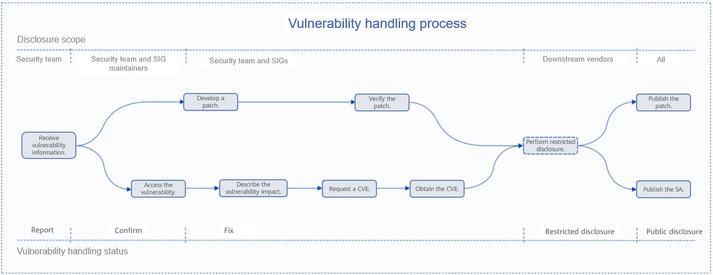

Recently, Andres Freund, a security researcher at Microsoft, uncovered a backdoor vulnerability in the XZ Utils open source project when investigating program performance degradation. The security committee of the OpenAtom openEuler community immediately analyzed and checked the vulnerability. It is verified that the openEuler OS is not affected by the xz backdoor. In this article, we'll delve into the details of CVE-2024-3094 and explore the robust vulnerability management process of openEuler.

## Vulnerability Description

xz is a compression repository used to compress and decompress files. Andres Freund, a Microsoft security researcher, discovered this vulnerability when investigating program performance deterioration. The  vulnerability contains malicious backdoors in XZ Utils 5.6.0 and 5.6.1. If the xz software containing the CVE-2024-3094 vulnerability is installed on a computer, attackers can remotely send and execute arbitrary code through SSH and control the computer.

## Solution

Uninstall or deprecate the defective XZ Utils 5.6.0/5.6.1 version. Use the stable XZ Utils 5.2.5 released by the openEuler community.

## Response by openEuler

- On March 28, 2024, openEuler preliminarily detected security risks in XZ Utils 5.6.0/5.6.1. Immediately initiated a full software version check on openEuler 2203-LTS and 2003-LTS release branches, and 2403-LTS in the test. Then, it was confirmed that the defective XZ Utils 5.6.0/5.6.1 version was not introduced to the openEuler repository.

- On March 29, 2024, [openwall](https://www.openwall.com/lists/oss-security/2024/03/29/4) disclosed the attack code and means of xz CVE-2024-3094. The openEuler security team followed up in real time, organized related technical personnel to analyze whether the source code of openEuler xz contained malicious code, and confirmed that the CVE-2024-3094 vulnerability does not exist in openEuler xz.

## Vulnerability Management Process of openEuler

The openEuler community attaches great importance to the security of community versions. The Security Committee has developed community vulnerability handling policies and processes, including vulnerability awareness, vulnerability confirmation and assessment, vulnerability fixing, and vulnerability disclosure.

Each security vulnerability is tracked and handled by a designated person. The coordinator is a member of the openEuler Security Committee, who will be responsible for tracking and promoting the fixing and disclosure of vulnerabilities. The following figure shows the end-to-end vulnerability handling process.

Security vulnerability maintenance is an important part of OS version security. openEuler Security Committee has developed a strict vulnerability handling process to ensure the security and ease of use of openEuler OS.