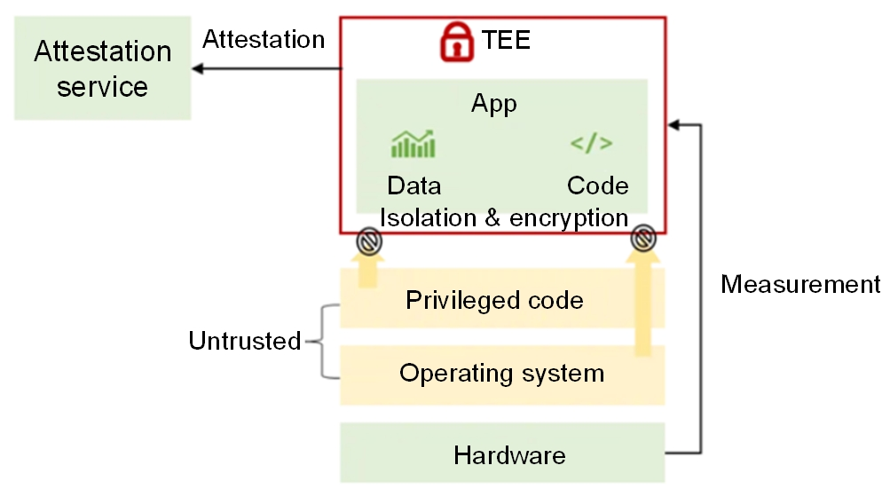

In today's digital era, data security and privacy protection have become critical, thanks to innovations in cloud computing, big data, and AI. Traditional data security measures focus on protecting static data. However, the necessity for secure data usage during computations has led to the advent of confidential computing, which leverages trusted hardware to secure data in use.

Work principles of confidential computing

### Challenges Faced

- **Development complexity:** Different Trusted Execution Environment (TEE) technologies such as Intel SGX/TDX, Arm TrustZone/CCA, and AMD SEV present unique challenges that complicate development efforts.

- **Security assessment issues:** The diversity of remote attestation methods makes comprehensive security assessment challenging, leading to potential vulnerabilities.

- **Interoperability issues:** Remote attestation methods that are incompatible across various TEEs hamper effective cross-platform collaboration.

### Solutions Delivered by the Unified Remote Attestation Framework

- **Simplified development:** The unified remote attestation API simplifies development by providing a common API for different TEE platforms.
Enhanced security: A standardized approach to remote attestation ensures more rigorous security standards and evaluation systems.

- **Improved interoperability:** The unified framework facilitates collaboration across different TEE technologies, promoting a broader application of confidential computing.

### Introducing openEuler secGear

openEuler secGear offers a comprehensive solution to these challenges with a unified remote attestation process compatible with multiple TEE platforms. Key components of the framework include:

- **Report Verification Plugin Framework:** verifies attestation reports from different TEE platforms.

- **Certificate Baseline Management:** manages Trusted Computing Base (TCB) and Trusted Application (TA) baseline values for various TEEs.

- **Policy Engine:** utilizes the Open Policy Agent (OPA) for default and customizable policies.

- **Identity Token: **issues identity tokens in JWT format after attestation report verification.

- **Resource Hosting:** supports access control and resource injection based on attestation reports.

- **Attestation Proxy:** simplifies integration with remote attestation services.

### Application Scenarios

The secGear framework is applicable in various scenarios requiring remote attestation:

- **TEE interconnectivity:** Devices with TEEs verify each other's security to ensure data security during transmission.

- **Confidential container solutions:**The framework ensures that containers in a trusted environment prevent sensitive data leakage or tampering.

- **Third-party certification of public cloud instances:** Public cloud users can verify the trustworthiness of their instances via third-party certifications.

- **Regulation of data trustworthy circulation platforms:** The framework provides necessary verification tools for regulatory authorities to ensure the trustworthiness of data during transmission and processing.

### Outlook

- **Enriched ecosystem:** expands support for common TEE platforms to build a diverse TEE ecosystem.

- **Heterogeneous environments:** supports remote attestation for various confidential computing environments such as GPU-TEE and NPU-TEE.

- **National cryptographic algorithms:** promotes synergy with the domestic information technology innovation industry by supporting national cryptographic algorithms.

- **Performance improvement:** reduces performance overhead through optimized algorithms and hardware support, enhancing the efficiency of remote attestation services in different application scenarios.

### Conclusion

openEuler's secGear unified remote attestation framework aims to streamline the development and deployment of confidential computing applications, enhance security, and promote interoperability across TEE platforms. This unified approach significantly reduces development complexity and fosters a more secure and collaborative confidential computing ecosystem.

For more information about how openEuler helps tackle modern workloads, visit [openEuler official website](https://www.openeuler.org/en/).