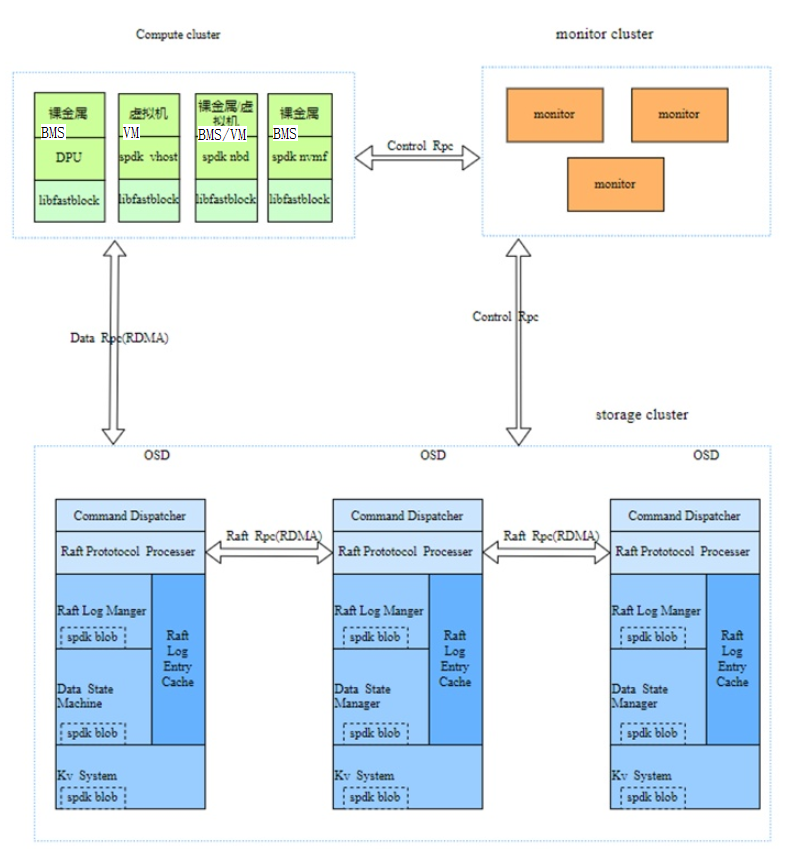
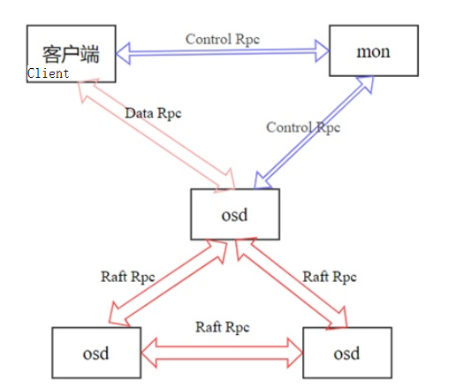
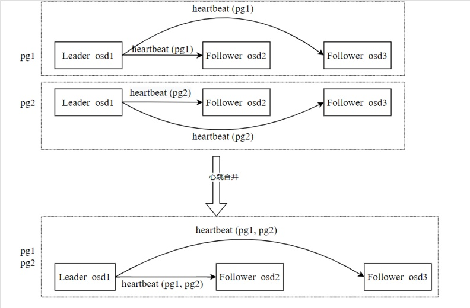
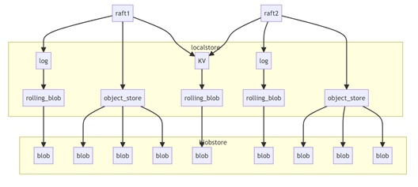

## Fastblock Introduction

Fastblock is a high-performance distributed block storage system that has the following core features:

- High availability and consistency: The Raft protocol is used to ensure the consistency and high availability of the system.

- Low-latency I/O: Uses the SPDK user-mode NVMe driver and lock-free queue technologies to reduce the I/O path latency.

- Efficient network communication: The RDMA NIC is used to achieve zero copy, kernel bypass, and network communication without CPU intervention.

Fastblock combines these advanced technologies to create a high-performance, low-latency distributed storage solution. This project has been open sourced in the OpenAtom openEuler (openEuler for short) community.

link: <https://gitee.com/openeuler/fastblock>

## Fastblock architecture

The architecture of the fastblock is similar to that of the Ceph. The fastblock includes the concepts such as monitor, OSD, and PG, as shown in the following figure.

It consists of the following six parts:

**1.Monitor**

Manages nodes, volumes, stores volume metadata, maintains cluster topology, and manages pg distribution. Monitor uses etcd for multi-copy storage, which is the key to system consistency. It guarantees that the client and the OSD see the same view. Client I/O operations can be performed only at the PG layer. The OSD and client periodically obtain OSDMap and PGMap information from the Monitor to ensure that they can view the same PG status changes after startup. Write operations for a specific PG, which avoids incorrect write locations.

**2.RPC**

The RPC subsystem is a key component that connects modules and supports two communication modes:

Socket-based: Classic Linux Socket, used for communication between the Monitor and OSD.

RDMA-based: Asynchronous RDMA semantics are used for communication between OSDs and between OSDs and clients.

The preceding figure shows the relationships between modules in the fastblock. Three types of RPCs are used: Control RPC, Data RPC, and Raft RPC. The functions of the RPCs are as follows:

- Control Rpc: It is used to transmit small-amount and low-frequency operations such as OSDMap, PGMap, and image information between the client and Monitor and between the OSD and Monitor. Because the data volume is small and the frequency is low, the Socket-based implementation can be used.

- Data Rpc: used to transfer object data operations and results between the client and OSD. The data volume is large and the frequency is high. Therefore, the RDMA-based communication mode is used to ensure efficient data transmission.

- Raft Rpc: used to transmit Raft protocol content between OSD nodes, including object data. These data are large in volume and high in frequency, and are also efficiently transmitted in an RDMA-based manner.

**Both Data RPC and Raft RPC use the Protobuf RPC framework. The code implementation of the network interaction part is based on RDMA, and the data serialization transmitted by RPC uses the Protobuf format.**

**3.OSD Raft**

Fastblock uses the Raft protocol to achieve highly available consistency. The Raft protocol elects a leader to manage the generation, storage, and synchronization of log entries. The process includes: The leader receives the data from the client, generates a log entry, writes the log to disk and synchronizes it to other replicas, and indicates when the other node can safely apply the log to the state machine.

Huawei has implemented multi-raft, which involves the following tasks:

- Manages raft groups, including creating, modifying, and deleting raft groups.

- Raft election and election timeout processing

- Processes raft logs, including caching logs, flushing logs to disks, and copying logs to the follower node.

- Data state machine processing, that is, data flushing to disks

- Manages snapshots and recovers data using raft.

- raft heartbeat merge

In the multi-raft design, multiple rafts coexist. The leader of each raft group needs to periodically send heartbeat packets to its follower. If the number of Raft packets is excessive, the number of heartbeat packets is excessive, occupying a large number of bandwidth and CPU resources. To solve this problem, we combine heartbeat packets for Raft groups with the same leader and follower. Heartbeat combination example: Assume that there are two PGs (PG1 and PG2), both of which contain OSD1, OSD2, and OSD3, and OSD1 is the leader. OSD1 needs to send two heartbeat packets (PG1 heartbeat and PG2) to OSD2 and OSD3.

In the heartbeat combination mechanism, OSD1 only needs to send a combined heartbeat packet to OSD2 and OSD3 respectively, including the heartbeat packets of PG1 and PG2, thereby reducing the number of unnecessary heartbeat packets and optimizing the usage of bandwidth and CPU resources.

**4.OSD KV**

Stores raft protocol metadata and storage system data. Because the amount of data is small, you can store all of it in memory and periodically flush the data to disk.

**5.OSD localstore**

The local storage uses the SPDK's Blobstore to access NVMe disks. It consists of the following three enclosures:

- disk_log: stores raft log data. One pg corresponds to one spdk blob.

- object_store: stores object data. One object corresponds to one SPDK blob.

kv_store: Each CPU core has an spdk blob, which stores all kv data that needs to be saved to disks on the current CPU core.

**6. Client**

The client supports the following modes:

- Spdk vhost is used to provide services for VMs.

- Use NBD to provide data to the BMS.

- Use spdk nvmf-tgt to export disks through the OS Kernel.

These modes switch between Image access and Object access by calling the libfastblock library. Then, the data is encapsulated into a Data RPC message and sent to the leader OSD of the PG. The leader OSD processes the message and returns a response to the client. Finally, the result is returned to the user. Fastblock implements the vhost app and nvmf_tgt app, which are used to connect VMs and OS kernels to export disks, respectively. The rpc.py script of the SPDK is used to send messages to the vhost app and nvmf_tgt app. Perform operations such as creating bdev.

## Application Scenario

Used as the VM disk: Use the fastblock vhost application to start an SPDK vhost process. This process is used to create the BDEV device and vhost controller on the fastblock image and generate a socket file. When starting a VM using QEMU, you can use the BDEV device as the VM disk. If the BMS is used, use the fastblock-nvmf-tgt application of FastBlock to start an SPDK nvmf-tgt process. Create a BDEV device on the FastBlock image and export the BDEV device as a disk through the OS Kernel.

## Features of the fastblock technology

The fastblock design improves storage system performance and consistency through a series of optimization techniques, including the following:

- Each OSD can be bound with multiple CPU cores. When creating a pg, the OSD list is allocated with the CPU cores. The same pg falls on the same shard_id of all OSDs. (shard_id indicates the sequence of the CPU cores bound to the OSD node. For example, if the CPU cores bound to an OSD node are 8, 9, 10, and 11, the shard_id values of these cores are 0, 1, 2, and 3 respectively.) This design prevents CPU core switching between OSDs during communication. (A network connection is established between two CPU cores with the same shard_id of the OSD node.) to reduce the cross-core overhead.

- The SPDK programming framework is used. The user-mode NVMe driver replaces the NVMe driver of the kernel, reducing the frequent switchover between the user mode and the kernel mode. At the same time, polling is used instead of interrupt, which improves the response speed. The lock-free queuing technology is used. Significantly reduces I/O path overhead.

- Use SPDK Blobstore instead of traditional file systems to store Raft logs, object data, and KV data. The entire I/O process is processed in user mode from initiation to disk flushing, bypassing the kernel. The SPDK provides asynchronous, lock-free, zero copy, and polling mechanisms to greatly reduce I/O overheads.

- An independent blobstore can be created on each bound CPU core of the fastblock OSD. Blob management, read, and write operations can be performed on the CPU cores of the fastblock OSD. No cross-core operation is required, further reducing the cross-core overhead.

- The RDMA is used for network communication between OSDs and between OSDs and clients. The zero-copy, kernel bypass, and CPU-free feature of the RDMA technology significantly improve data transmission efficiency, and reduce network communication latency and CPU usage.

- The Multi-Raft protocol is used to ensure data consistency between multiple nodes and enhance the fault tolerance and reliability of the system.

## Development Progress

Functions that have been completed:

- The multi-raft implementation, including raft group management, raft election, raft log processing, state machine processing, follower data recovery, raft member change, and raft heartbeat combination, has been implemented.

- The pg distribution algorithm is implemented to ensure that the OSD process has a balanced PG on each core, improving the cluster efficiency and CPU usage.

- The prometheus exporter can export the cluster running status, including the IOPS and bandwidth.

- Implemented the performance test tools block_bench and bdevperf.

- Provides the vstart.sh script of the Swift Deploy tool.

- The configuration file is simplified. The Monitor and OSD can share the same configuration file, facilitating deployment.

- Attach disks to VMs through vhost and export disks to the system through nvmf to access fastblock.

- The OSD, vhost, and nvmf_tgt can be bound to multiple cores.

- Both Monitor and OSD adapt to RPC to prevent cross-core communication.

- PoC capabilities are available and interconnection tests are being performed in AI scenarios.

- The three servers configured with three 4K data copies can achieve more than 1 million random write IOPS, and the 128K I/O read/write bandwidth can reach 100 Gbit/s.

## Follow-up planning

- Provides functions such as volume snapshot and snapshot group.

- Implement volume QoS.

- The DPU can uninstall the Vhost.

- Supports volume encryption and decryption.

- Volume sharing is supported.