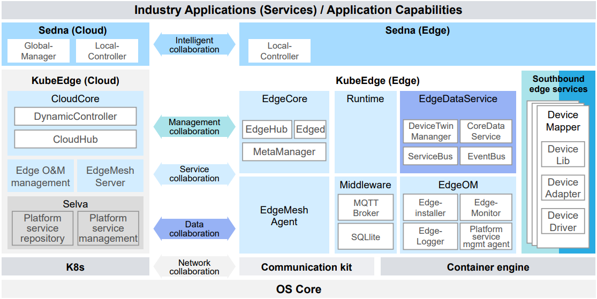

As we know, technical breakthroughs, such as artificial intelligence (AI) and industrial internet of things (IIoT), have caused huge data growth at the network edge. Though centralized cloud computing has been well recognized among enterprises, it alone is no longer able to cater to these unforeseen circumstances. It is hindered by infrequent data interaction caused by inadequate bandwidth, noticeable network latencies, and high management costs.  

Edge computing has risen as an alternative or supplementary solution to resolve such a challenge. It is a distributed computing paradigm that brings computation and data storage closer to the sources of data. This is expected to improve response times and save bandwidth.  

**Edge computing and central cloud computing are highly complementary and significant benefits can be achieved when utilizing both.** However, most of the existing computing frameworks either focus on edge or central cloud computing only.  

openEuler is a digital infrastructure OS that fits into any server, cloud computing, edge computing, and embedded deployments. The OS empowers collaboration over the new generation of digital infrastructure.  

**openEuler 22.09 adopts the KubeEdge+ framework to facilitate edge-cloud synergy.** It offers base capabilities such as edge-cloud application communication, management and deployment, and edge-cloud southbound peripheral management, as illustrated in the following figure:  

>

openEuler 22.09 is designed with the following features to better utilize centralized cloud computing and cloud computing both:  

-	Edge-cloud synergy: The EdgeMesh Agent and EdgeMesh Server are deployed on the edge and the cloud, respectively, to implement edge-cloud service discovery and service routing. 

-	Optimized southbound edge services: Device Mapper is used for southbound access to provide the peripheral profile and parsing mechanisms, helping manage and control southbound peripherals and service streams. It is compatible with the EdgeX Foundry open source ecosystem.  

- Edge data services: implements on-demand persistence of messages, data, and media streams, and provides data analysis and export operations.  

-	Sedna framework: The open source framework Sedna enables collaborative inference, federated learning, and incremental learning on openEuler to unify edge and cloud environments. It also supports intelligent model and dataset management, simplifying development, training, and deployment of new AI features that flow between edge and cloud devices.  

openEuler 22.09 is perfectly suitable for edge-cloud synergy scenarios, such as smart manufacturing, urban transportation, tollway inspection, smart gas stations, medical image recognition, and smart campuses.  

For more information about how openEuler helps in modern applications, visit:  

-	[openEuler official website](https://www.openeuler.org/en/)

-	[openEuler@GitHub](https://github.com/openeuler-mirror)  

