Author: Wang Hanxing, a SUSE software engineer who is responsible for Rancher R&D

The RFO SIG, or Rancher for openEuler (RFO) special interest group (SIG), is trying to integrate openEuler with Rancher, an open source multi-cluster orchestration platform, to follow the cloud native trend. This integration starts with the evolution of openEuler as out-of-the-box software. In this blog, we explain how to 1) combine openEuler with AWS cloud services by building openEuler AWS Amazon Machine Images (AMIs) to support standard SSH key injection, partition scaling, and user data execution in cloud environments, and 2) run the cloud-init mechanism to automatically start the Rancher RKE2 cluster. 

## Resizing Drive Partitions

The QCOW2 image provided by openEuler is a VM image that has a total drive size of 40 GB.
Start the VM in QEMU and check the partitions. 

>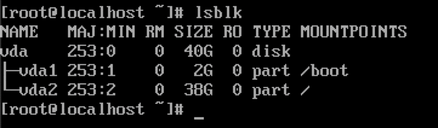

We can see that the drive contains two partitions: a 2 GB boot partition, and a 38 GB root partition.

Mount the partitions of the QCOW2 image to the Linux system through the network block device (NBD) protocol. Then run resize2fs to compress the ext4 file system, and run fdisk to adjust the partition size.  

>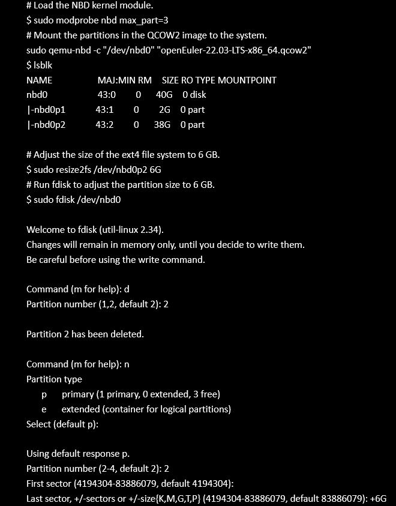  
>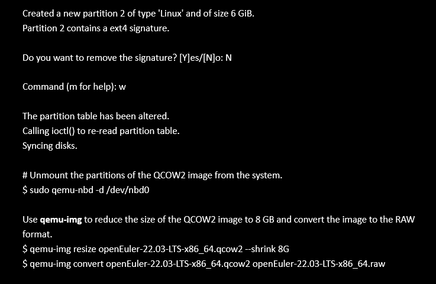

Run qemu-img to reduce the QCOW2 image to 8 GB and convert it to RAW format.  

>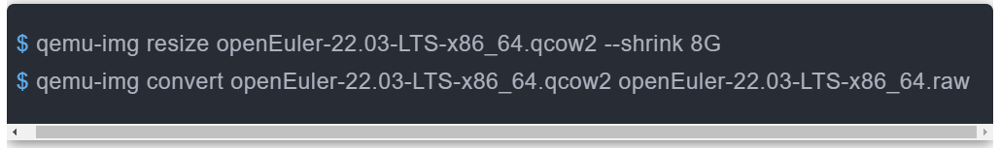

## Creating a Snapshot and Base AMI

Use the tool provided by the AWS CLI to upload the RAW image to an AWS S3 bucket.

>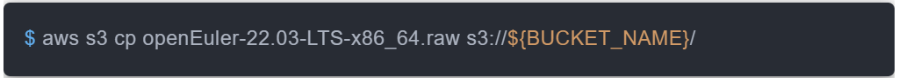

Create policies vmimport and role.

>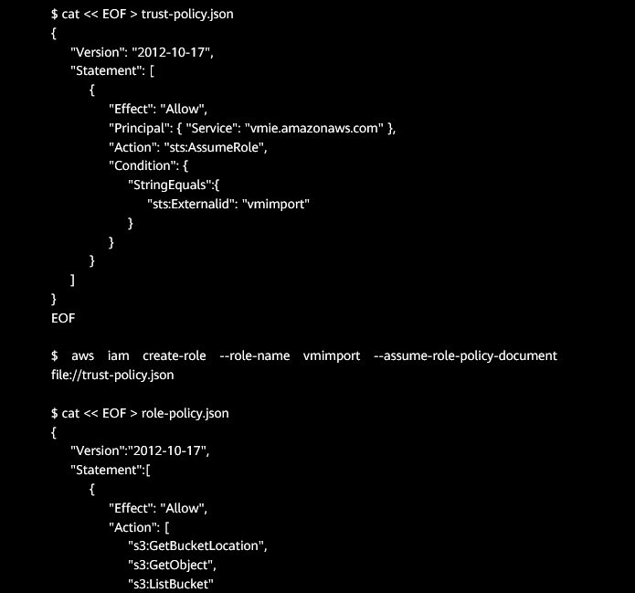  
>  

Create an import-snapshot task to create a snapshot using the RAW image stored in the S3 bucket. 

>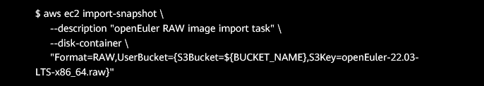 

Wait several minutes and obtain the snapshot ID from the import task ID. 

>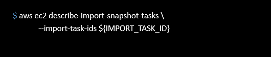 

Use the snapshot to create a base AMI that doesn't use the cloud-init mechanism. 

>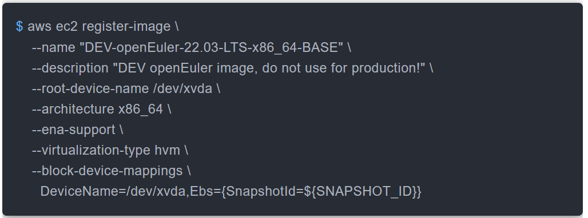 

From these operations, we know the base AMI ID.

## Using Packer to Create an AMI That Uses the Cloud-init Mechanism

Create a Packer configuration file and replace <BASE_AMI_ID> in the configuration file with the obtained base AMI ID.  

>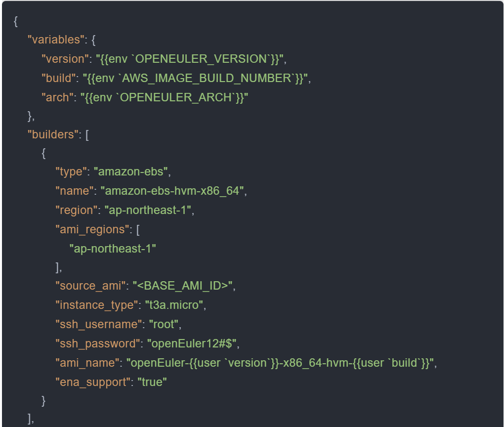  
>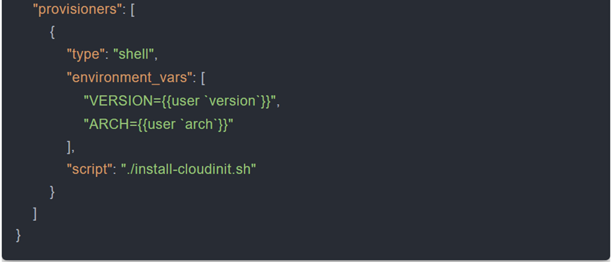 

Create a script file install-cloudinit.sh to execute the cloud-init installation and other configuration commands. 

>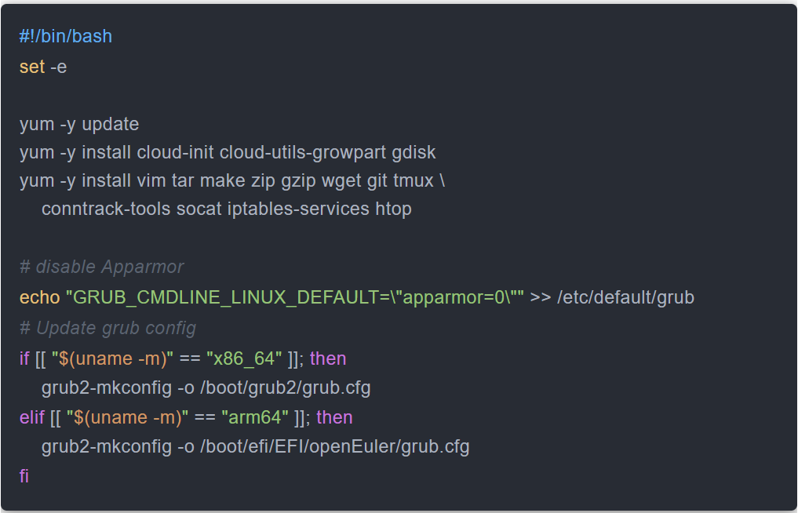 

Use Packer to build an AMI:

>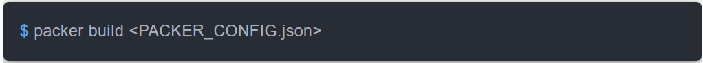 

## Building an AMI on Arm

Theoretically, the process of building an AMI on Arm architecture is almost the same as that on x86_64 architecture. However, in actual operations, once the server was started using the base AMI, the NIC couldn't be found and the server failed to be connected through SSH. After connecting the server using the serial port for debugging, we found that the AWS ENA NIC driver was not installed in the kernel of the Arm-based openEuler system. As a result, the network was disconnected.  

>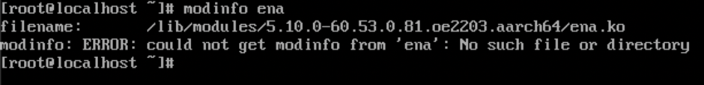 

In the future, openEuler will add ENA driver support to the kernel of the Arm architecture. Until then, this temporary solution requires you to compile and import an ENA driver kernel module.  

> Caution: This solution is not recommended in production environments. 

Run an openEuler AArch64 VM on the local host to compile the kernel module. Then, install tools for compilation (GCC, make, Git, Vim) and kernel header files, clone the source code of the ENA driver to the local host, and compile the driver.

>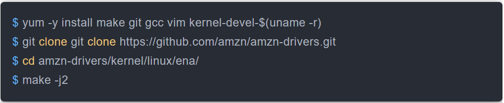 

The following error message may be displayed during compilation: 

>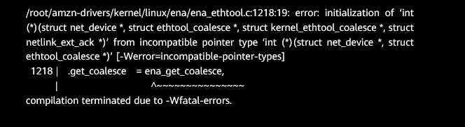 

If this case occurs, directly edit ena_ethtool.c and add (void*) for the function pointers in lines 1218 to 1221 to forcibly convert the pointer types.

>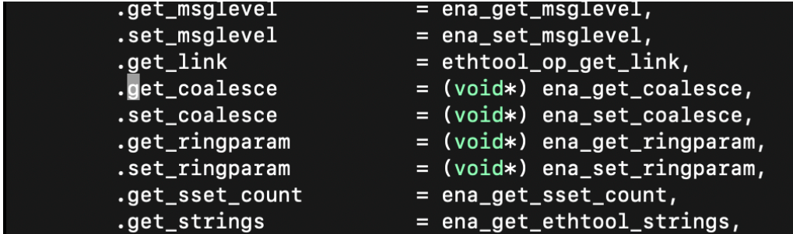 

After compilation, the ena.ko kernel module file is generated. Run the modinfo ena.ko command to view the module information.

>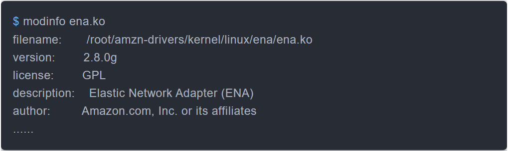

To adjust the drive partition, first mount the partition, then copy the kernel module file to the directory of the mounted partition and edit the modprobe configuration file. Set the kernel module to be loaded each time the system starts.

>

Restart the system. Then run the lsmod command to view the loaded kernel module or run the dmesg command to view the kernel log. The operation of loading the ENA driver is recorded.

>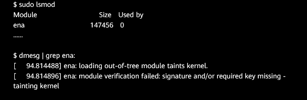

## Using a Built AMI

On the console of the AWS EC2 instance, use the built AMI to create an EC2 VM, and set the network security group, SSH key, drive size, and user data.  

Here, we set the EBS drive size to 30 GB, and fill the RKE2 installation script in the user data.

>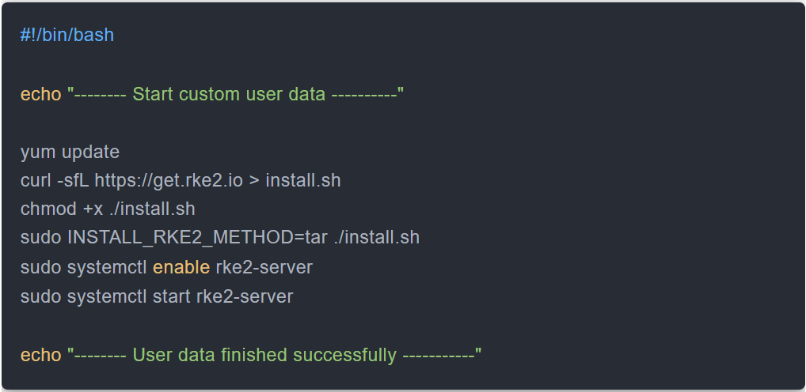

After the instance is started, the cloud-init mechanism automatically creates an account named openeuler and allows only SSH key login (SSH-based login as the root account is disabled). The root partition of the drive is automatically scaled to the specified EBS drive size, and the script filled in the user data is automatically executed.

>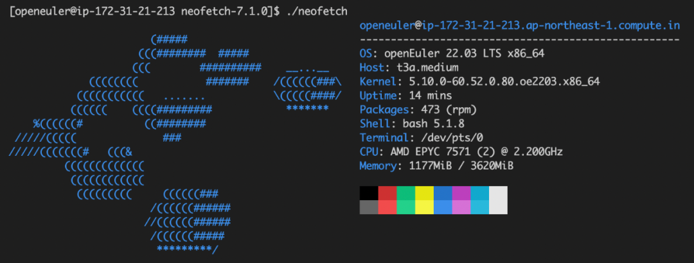

Logs generated by cloud-init contain the user data execution result. 

>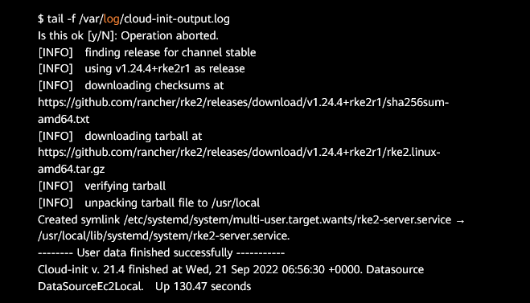

Confirm that the partition's total capacity has been automatically scaled to the specified EBS size.

>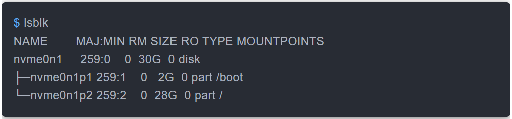

Verify that RKE2 has been successfully installed and all Pods are running properly.

>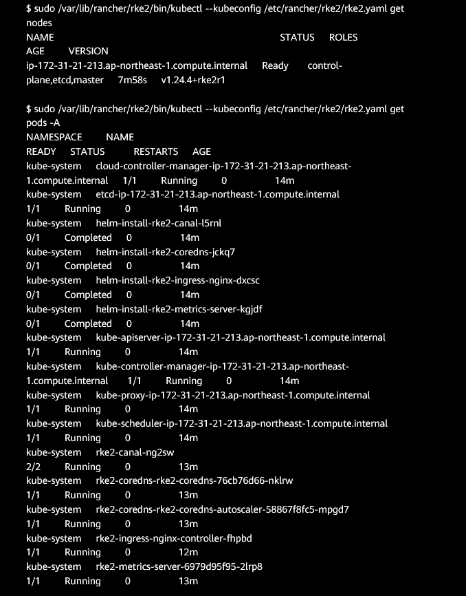  
>

## About SUSE Rancher

Rancher is a container management platform that deploys containers in Kubernetes environments. Designed to connect applications from edge to cloud, Rancher is empowering DevOps teams everywhere.   

For details, please visit [https://www.suse.com/products/suse-rancher/](https://www.suse.com/products/suse-rancher/).
