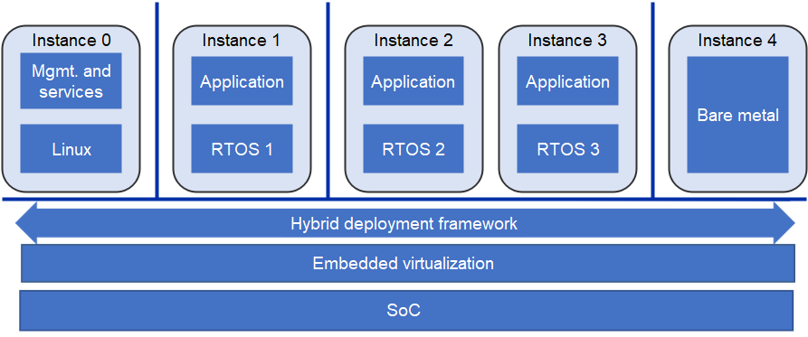
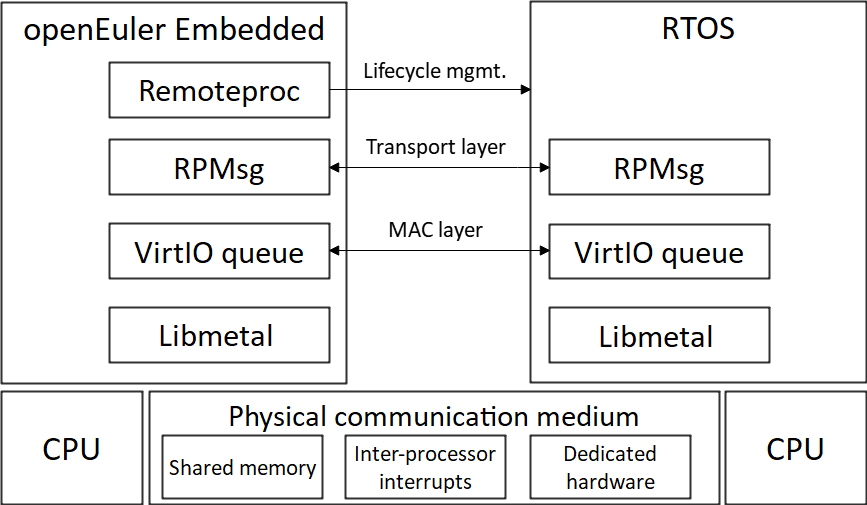
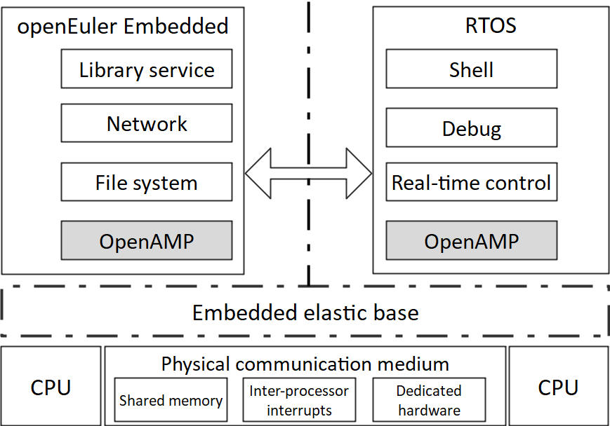

Benefiting from the rapid development of hardware technologies, embedded systems are becoming increasingly powerful:  

-	Processing power of a single core is ever growing;  

-	Systems have evolved from single-core to multi-core, heterogeneous multi-core, and even many-core;  

-	Virtualization technologies and trusted execution environment (TEE) can be implemented on embedded platforms;  

-	Advanced packaging technologies bring higher circuit density, improving the processing capability of chips.  

All these technical breakthroughs enable a system-on-chip (SoC) to run multiple operating systems (OSs).  

Meanwhile, driven by application demands in scenarios like Internet of Things (IoT), smart devices, functional security, and information security, embedded systems are growing more and more complex, and embedded OSs face the challenge of carrying various functions.  

A solution to this dilemma is to have different OSs do what they are good at in one embedded system. For instance, an embedded system can display a GUI provided by Windows, leverage the network communication and management capabilities of Linux, and take advantage of the real-time performance and high reliability available on a real-time OS (RTOS). Such an embedded system is expected to be easy to develop, deploy, and scale as a container or VM.  

These changes in hardware and software reveal an evolution trend of embedded systems, that is, mixed criticality systems (MCSs).  

openEuler Embedded, an openEuler distribution for embedded scenarios, enables an MCS of the following architecture:

>

openEuler Embedded sees an MCS as a combination of multi-OS hybrid deployment, OS isolation and protection, and mixed criticality scheduling. To achieve these, openEuler Embedded employs a hybrid deployment framework that features efficient deployment and communication, and that enables embedded virtualization technologies for resource isolation, protection, sharing, and scheduling.  

The following figure shows architecture of the openEuler Embedded multi-OS hybrid deployment framework, which integrates OpenAMP components and practical innovations. 

>

With the help of SIG Zephyr, openEuler Embedded 22.03 supports hybrid deployment of openEuler Embedded and the Zephyr RTOS on the QEMU platform. openEuler Embedded 22.09 further enables shell access to the client OS and supports multi-user and multi-thread scenarios on Raspberry Pi 4B.  

The hybrid deployment framework of openEuler Embedded is evolving to deploy more RTOSs as services with an embedded elastic base powered by virtualization technologies.  

>

For more about how openEuler Embedded supports other embedded OSs with management, network, and file system services, visit:  

-	[openEuler official website](https://www.openeuler.org/en/)

-	[openEuler@GitHub](https://github.com/openeuler-mirror)  

