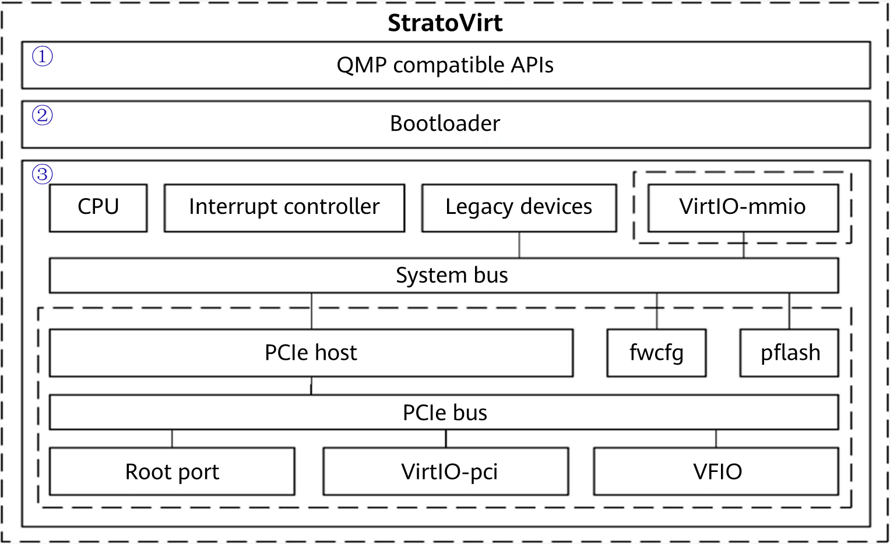

StratoVirt is an innovative virtualization platform designed for openEuler. It offers a unified architecture that fits into the three scenarios: VMs, containers, and serverless computing.

"Strato" is abbreviated from "stratosphere", which is the layer of the Earth's atmosphere immediately above the troposphere. As the name implies, it refers to a light protective layer that protects services in openEuler-based virtualization environments.

We've already had QEMU, a generic and open source machine and userspace emulator and virtualizer. **Why do we still develop StratoVirt for openEuler? That is mainly because QEMU has the following deficiencies:**  

	QEMU is heavily coded.

Currently QEMU has more than 1.6 million lines of code, of which a large part is written to support legacy features and devices. Its functions and compatible devices are severely coupled, making QEMU destined to become increasingly clumsy.

	QEMU is susceptible to CVE vulnerabilities.

QEMU is targeted by frequent CVE vulnerabilities, nearly half of which are caused by memory issues. StratoVirt leverages the Rust programming language to mitigate CVE vulnerabilities. The Rust-based virtualization solution is more secure.

	QEMU is incapable of resolving the conflict: Containers are generally lightweight but not secure enough, whereas VMs are generally secure but not lightweight enough.

StratoVirt supports both lightweight and standard VMs. It offers a well-balanced solution for both types of VMs.

**To summarize, StratoVirt has the following advantages over QEMU:**

	Robust security

StratoVirt offers Rust-language-level security. Its modular design minimizes the attack surface and isolates each tenant.

	Lightweight and low-overhead

When using a simplified device model, StratoVirt can start within 50 ms, and control the memory overhead within 4 MB.

	Converged software and hardware

StratoVirt supports x86 and Kunpeng-V virtualization.

	Lightning-fast scaling

Device scaling can complete within milliseconds, providing flexible resource scaling for lightweight workloads.

	Multi-scenario support

StratoVirt is well suited to multiple application scenarios, including serverless, secure containers, and standard VMs, with just a single architecture.

>
 
**As illustrated in the preceding figure, the StratoVirt core architecture consists of three layers from top to bottom:**

1. QMP compatible APIs

StratoVirt is compatible with the QEMU Monitor Protocol (QMP), has complete OCI compatibility capabilities, and supports interconnection with libvirt.

2.	Bootloader

StratoVirt discards the traditional BIOS+GRUB boot mode to achieve fast boot in lightweight scenarios, and provides UEFI boot support for standard VMs.

3.	Emulated mainboard

For lightweight VMs, StratoVirt fully utilizes software and hardware collaboration to simplify device models. For standard VMs, StratoVirt implements UEFI boot with constructed ACPI tables. It can have VirtIO-pci and VFIO devices attached to greatly improve the VM I/O performance.

For more information about how openEuler helps tackle modern workloads, visit:
 
-	[openEuler official website](https://www.openeuler.org/en/)

-	[openEuler@GitHub](https://github.com/openeuler-mirror)  

