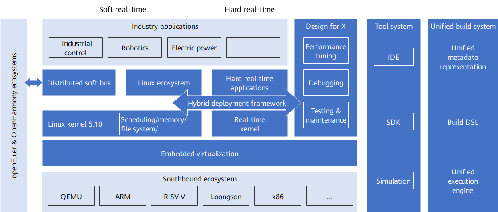

openEuler Embedded is a Linux distribution for embedded scenarios derived from the mainline version of openEuler. This blog post will describe the paths through which openEuler Embedded becomes a high-quality, Linux-centric, and multi-scenario embedded software platform.  

>
 
Architecture of openEuler Embedded

•	**Linux-centric** 

Same as the mainline version of openEuler, openEuler Embedded uses the 5.10 release of the Linux kernel with six years of long-term support. Software packages of openEuler Embedded also share the same code as those of the mainline version of openEuler. Nearly 300 core software packages have been ported to openEuler Embedded. An overall goal of openEuler Embedded is to support all applicable software packages in the openEuler community.

To meet the requirements of embedded scenarios, openEuler Embedded offers innovative features in terms of kernel features, system configurations, software package combinations, image tailoring, security hardening, and lightweight. For example, openEuler Embedded provides soft real-time capabilities based on the Preempt-RT patch and minimum OS images tailored down to 5 MB, with a fast startup time less than 5s.

•	**Hybrid Deployment Framework**

Although Linux has been widely used in embedded systems, it fails to meet requirements in scenarios that require high real-time performance, reliability, and security. Such scenarios are often predominated by dedicated systems represented by real-time operating systems (RTOSs). To combine the management capabilities and rich ecosystems of Linux and high real-time features of RTOSs, a conventional practice is to have a powerful processor to run Linux and a microcontroller/DSP/real-time processor to run an RTOS, and let the two communicate with each other through I/O, network, or external bus. However, the rapid development of hardware technologies brings a new choice: with the increased integration complexity, a system-on-chip (SoC) can have multiple cores or even heterogeneous multiple cores, allowing it to run different OSs simultaneously.

To fully utilize the multi-OS capability of SoCs, openEuler Embedded designs a hybrid deployment framework to deploy Linux with other OSs. In this way, the complementary features of a general-purpose Linux and a dedicated RTOS can facilitate flexible development and deployment.

•	**Embedded Virtualization**

With the hybrid deployment framework, Linux and RTOSs can be deployed in one embedded system, but the two OSs are not strictly isolated and have low resource utilization. Embedded virtualization is openEuler's approach to solving these problems. Due to constraints of embedded systems, embedded virtualization is significantly different from general-purpose virtualization observed in servers and cloud computing. openEuler Embedded is actively exploring embedded virtualization technologies and will launch community solutions in the future.

•	**Intelligent Soft Bus**

The openEuler and OpenHarmony communities are actively cooperating to introduce distributed soft bus into openEuler Embedded, so that devices running openEuler or OpenHarmony can communicate with each other, thereby streamlining openEuler and OpenHarmony ecosystems.

•	**Tool System**

To tackle the challenge of restricted system resources during embedded application development, openEuler Embedded provides a software development kit (SDK) and an embedded system simulation solution. Together with the GUI-based integrated development environment (IDE) planned in the future, these tools will form a complete development tool system.

•	**Design for X**

In addition to the tool system, the Design for X methodology of openEuler Embedded assists developers to debug, tune, test, and maintain embedded Linux systems in spite of limited system capabilities.

•	**Unified Build System**

Software packages of the mainline version of openEuler, built by open build service (OBS), cannot directly run on openEuler Embedded. And it is clearly infeasible to rebuild all openEuler packages with Yocto, the build system currently used by openEuler Embedded. To realize the vision of supporting all software packages of the mainline version of openEuler, openEuler Embedded is working with community SIGs to construct a unified build system for multiple scenarios.

•	**Southbound Ecosystem**

openEuler Embedded has initially supported the ARM architecture widely used in embedded systems, including AArch32 and AArch64 on QEMU and Raspberry Pi 4B platforms. In the future, openEuler Embedded will support more ARM-based platforms and other architectures such as RISC-V, x86, and Loongson.

•	**Northbound Ecosystem**

openEuler Embedded is cooperating with community special interest groups (SIGs) and partners to develop applications for industrial control, robotics, and energy fields.

Visit openEuler community and repositories to see how openEuler Embedded implement its brilliant features:

	[openEuler official website](https://www.openeuler.org/en/)

	[openEuler@GitHub](https://github.com/openeuler-mirror)

