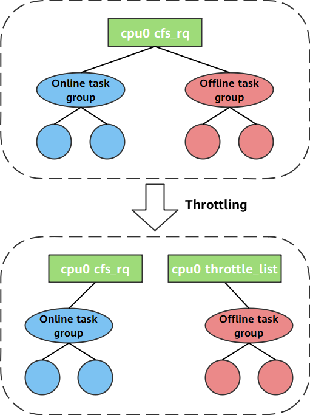

Data center servers and production clusters are usually tasked with running various routine online services. Because the loads of such services are unpredictable, the average resource usage of a cluster must be kept low, so that the servers in the cluster have sufficient resources to perform computing and respond to burst requests in the case of sudden traffic spikes, thereby avoiding service breakdown caused by stacked requests and maintaining consistent user experience. This, however, wastes a large number of idle resources and increases maintenance costs. An intuitive way to improve resource utilization under such conditions is to deploy another type of task when the online service load is low. Such tasks, as they do not require extremely quick response but consume a lot of computing resources, are called best-effort batch tasks, or simply called offline tasks.

For hybrid deployment of online and offline services, openEuler provides the CPU preemption feature to improve resource utilization and reduce cloud operation costs. When a server is deployed with both services, without CPU preemption, the offline service attempts to consume as many resources as possible, increasing the response time of the online service. The CPU preemption feature of openEuler enables online services running on a core to preempt and suppress offline services, thus ensuring the QoS of online services.

When performing CPU scheduling in hybrid deployment scenarios, openEuler throttles offline tasks to ensure CPU resources for online tasks. If hyper-threading is enabled, offline tasks are evicted from the logical cores of the physical core on which the online task runs. 

openEuler's solution maximizes resource utilization while ensuring the QoS of online services by improving CPU utilization and ensuring the response time of online services. The solution has the following features:

1. Guaranteed low preemption latency for online tasks  
To ensure that online tasks can quickly preempt offline tasks, the scheduling policy of offline tasks is set to **SCHED_IDLE** by default. The scheduling policy of online tasks is not modified, which is **SCHED_OTHER** by default. This allows an online task to quickly preempt an offline task without being restricted by the **sched_min_granularity_ns** and **sched_wakeup_granularity_ns** mechanisms.

2.	Absolute suppression of offline tasks  
When online tasks are running, offline tasks must be suppressed, that is, stopped to prevent them from consuming CPU resources. This is achieved by the throttle mechanism. When both online and offline tasks exist on a CPU core, the throttle mechanism adds the CFS run queue (struct **cfs_rq**) corresponding to the offline task group to a per-CPU global linked list **throttle_list**, so that all CPU resources are allocated to online tasks.

>
 
Visit openEuler community and repositories and explore more resource management solutions from openEuler:
 
-	[openEuler official website](https://www.openeuler.org/en/)

-	[openEuler@GitHub](https://github.com/openeuler-mirror)  

