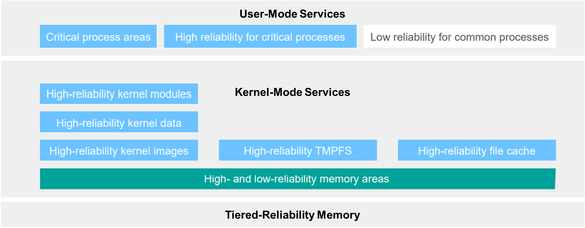

With the advent of various new memory types, a server may be equipped with multiple types of memory resources, for example, host memory buffer (HMB), non-volatile dual in-line memory modules (NVDIMMs), and Address Range Mirror (ARM), that vary in reliability specifications.

Memory hardware faults may cause servers to break down. Once an uncorrectable multi-bit memory error occurs, the OS kernel and critical service processes will be impacted, and the OS will be reset, causing a long downtime. A practical solution to these problems is memory tiering, which in this blog post, refers to using memory of different reliability levels for data with different priorities and reliability requirements.

Within the Linux kernel there is initial support for memory tiering. Different memory types work together to satisfy memory allocation. There may have dynamic page movement, for example, demoting pages to a less reliable level of memory when a more reliable level of memory is insufficient.

openEuler 22.09 runs on Linux kernel 5.10 and inherits this memory tiering feature. In openEuler, memory tiering can be enabled in hardware, kernel, or user space:

>
 
openEuler manages memory areas of different reliability levels hierarchically. The kernel, critical processes, memory file systems, and file cache can use highly reliable memory areas to prevent kernel resets caused by multi-bit memory errors, therefore improving system availability.
The memory tiering feature in openEuler ensures high-reliability memory resources for the following data and services:

	High-reliability memory for kernel data

Critical kernel data is directed to the highly reliable memory area, to prevent any possible memory errors caused by kernel data read and write.

	High-reliability memory for processes

By setting the attribute of a process, you can prioritize and move the process to a memory space from the highly reliable memory area.

	High-reliability memory for the TMPFS

Read operations on the temporary file system, or TMPFS, are implemented in kernel mode. Using highly reliable memory reduces the probability of system resets.

	High-reliability memory for the file cache

The Linux kernel file cache can make file operations appear much faster than the underlying disks can actually perform. Using highly reliable memory for the file cache adds data reliability in addition to the efficient data access.

With memory tiering, you can make better use of different types of memory resources to achieve a balance between performance and cost while protecting your mission-critical data in openEuler.
For more information about how openEuler helps tackle modern workloads, visit:

	[openEuler official website](https://www.openeuler.org/en/)

	[openEuler@GitHub](https://github.com/openeuler-mirror)

