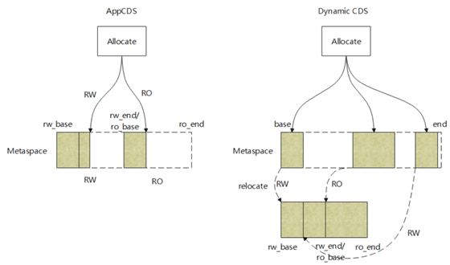
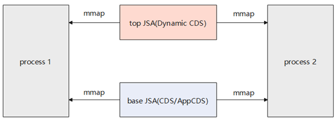

### Background

BiSheng JDK is the default Java operating environment of the openEuler OS, and is a level-1 sub-project in the openEuler community. In BiSheng JDK 5, the Class-Data Sharing (CDS) technology was first introduced to preprocess a set of data classes into a shared archive file, which can then be memory-mapped to reduce the startup time and memory footprint across Java Virtual Machines (JVMs).  

In the OpenJDK community, CDS has evolved in the following two directions:  

1. Expanded scope of archive classes: CDS > AppCDS > Dynamic CDS

2. Expanded archive data types: metadata (CDS, AppCDS, and Dynamic AppCDS) > basic objects > strings > modules > pre-generated java.lang.invoke classes

The first direction saw the Dynamic CDS feature introduced in BiSheng JDK 8. Compared with AppCDS, Dynamic CDS has a wider scope of shared classes, supports Custom ClassLoader, and presets a base JSA file that contains basic classes to improve feature usability.

### Feature Description

At the end of application execution, Dynamic CDS is used for dynamic archiving of classes, dumping classes from the memory directly into a JSA file without creating a class list for every application.

It lets Java applications run with the base JSA. When application execution ends, classes are dynamically archived to generate the top JSA, which contains all classes (loaded by Custom ClassLoader) that can be shared except those in the base JSA. This practice creates a wider scope of shared classes, while accelerating startup of applications, and even improves space utilization by relocating additional shared classes to a more compact memory space.

Note:  
Base JSA: shared class file generated by CDS/AppCDS.   
Top JSA: shared class file generated by Dynamic CDS.

>
 
Class data is classified into read/write data and read-only data, which are stored in the RW and RO areas respectively (see picture). 

Dynamic CDS uses the default JSA (preset JSA file in the JDK) as the base JSA to simplify the use of the CDS feature. After the top JSA is generated, both the base JSA and top JSA are mapped to the memory to accelerate application startup and save memory.

>

Dynamic CDS ensures correcting class loading by the Custom ClassLoader. It differs from AppClassLoader and ExtClassLoader, in which ClassLoader directly searches for shared classes. Here, Custom ClassLoader queries shared classes only after the basic validation in DefineClass is complete.

### Restrictions

Dynamic CDS has the following restrictions:

-	The parameters for generating and using JSA files must be consistent.  
-	The compressed Oops cannot be disabled.  
-	Shared classes not supported include classes whose Java version is 1.5 or earlier and JVM anonymous classes.  
-	JFR is not supported because anonymous classes are dynamically created during JFR startup, which conflicts with Dynamic CDS.  

Visit openEuler community and repositories for more information about BiSheng JDK and Dynamic CDS:

-	[openEuler official website](https://www.openeuler.org/en/)

-	[openEuler@GitHub](https://github.com/openeuler-mirror)

