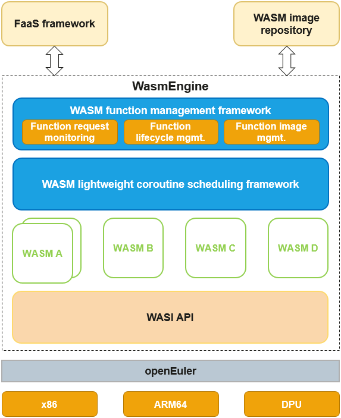

Framework as a Service (FaaS) is a new computing paradigm of cloud computing. With FaaS, developers can quickly build applications and services of any type. FaaS features agile development, auto scaling, and minimized O&M. Although the conventional container-based FaaS solution can decouple customized computing capabilities from content delivery network (CDN) services and implement fast iteration and update, in scenarios with high concurrency and heavy traffic, the cold start speed and memory overhead of containers do not meet the requirements of quick execution and processing of tens of thousands of instances on a single node.

openEuler provides WasmEngine based on the WebAssembly (WASM) sandbox isolation model to isolate functions in the WASM sandbox. This makes high-concurrency function execution and millisecond-level function cold start possible.

The popular FaaS framework in the industry uses HTTP RESTful APIs to connect to the backend function execution engine. WasmEngine also uses a similar solution. It provides a group of RESTful faas-provider APIs to add, delete, modify, query, and call functions.

WasmEngine allows stateless FaaS function tasks that run for a short period of time to be started on demand. For example, in the CDN edge computing scenario, customized request preprocessing functions can be deployed to implement on-demand pull and quick response.

>
 
The overall functions of WasmEngine are provided by the following two key components:

1.	WASM function management framework  
-	Listens to and processes concurrent function requests.  
-	Manages functions through their lifecycle.  
-	Compatible with Open Container Initiative (OCI) container images and manages local function image resources.  

2.	WASM lightweight coroutine scheduling framework  
Abstracts the execution context of WASM instances, supports lightweight and high-performance user-mode coroutine scheduling models, and supports multiple WASM instance execution models such as JIT and AOT.

The code structure of WasmEngine is as follows:

-	benches: stores benchmark code, including .wat files of three test functions: gcd, echo_string, and authentication.  
-	experiments/application: stores common function code that can be compiled into the WASM format.  
-	src/main.rs: main entry of WasmEngine, which defines the RESTful APIs.  
-	src/wrapper: encapsulates the underlying WebAssembly Runtime.  
-	src/function_store: stores the code for managing WASM function images and WASM module instances.  

Before using WasmEngine, pay attention to the following points:  
-	The WASM format must meet the WebAssembly Spec 1.0.  
-	A WASM function image can contain only one WASM module file.  
-	The limit for resources of each function call cannot be set.  
-	Functions cannot call each other.  

Visit openEuler community and repositories for more information about WasmEngine:

-	[openEuler official website](https://www.openeuler.org/en/)

-	[openEuler@GitHub](https://github.com/openeuler-mirror)

