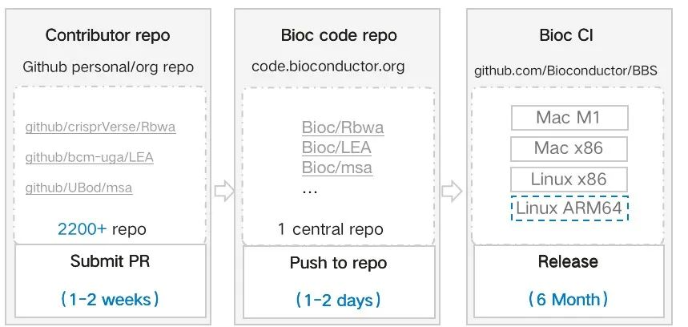
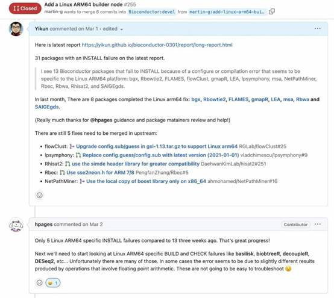
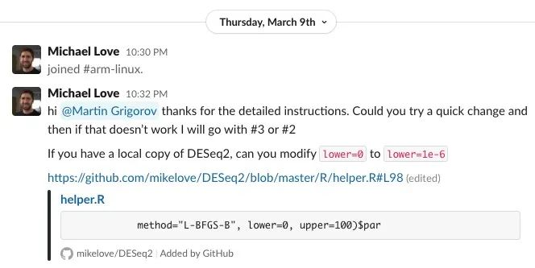
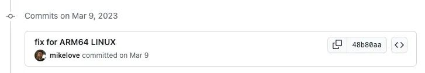
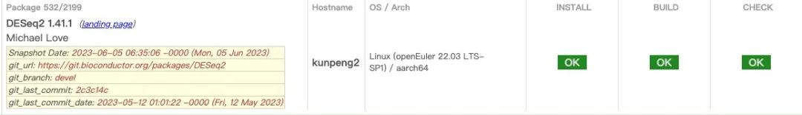
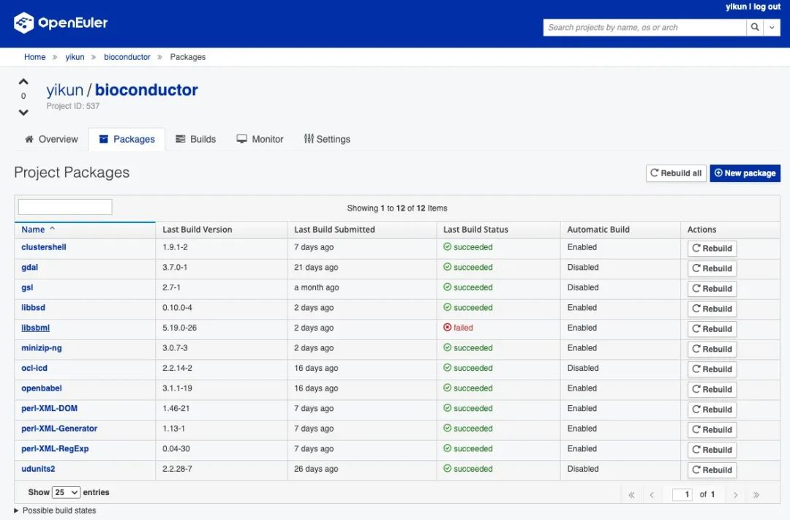

In the world of Bioinformatics, the [BioConductor](http://mp.weixin.qq.com/s?__biz=MzI2NDE4OTE2Mg==&mid=2247504799&idx=1&sn=1a978f72b5eed3bf73d42013399363e5&chksm=eab2f61addc57f0c0689c1359c294044e157f9f30d371268133ba9cbb01a0ecfa1b197f17e3c&scene=21#wechat_redirect) project stands tall as a free open source software umbrella. This developer story chronicles the efforts of Martin Grigorov and Jiang Yikun as they embarked on the mission to enable BioConductor's seamless compatibility with openEuler's Arm64 architecture. Their journey of collaboration and community support shed light on the charm of open-source development and its potential to shape the future of HPC and bioinformatics.

------

**Martin Grigorov**

GitHub ID: @martin-g

Martin Grigorov is a maintainer of openEuler from the OpenHPC team and a member of several Apache Software Foundation projects. Martin has been working in the IT industry since 2003 and has developed plenty of software for different industries. As an open source believer, he has contributed to many projects and communities. He likes to spend his free time with his family, to travel and to care about his garden. 

 

**Jiang Yikun** 

GitHub ID: @Yikun

Jiang Yikun is a Senior Software Engineer from the Huawei Computing Open Source Team. As an Apache Spark Committer and openEuler Infra SIG Maintainer, he actively contributes to various open-source projects in the fields of HPC, big data, and cloud computing. He also holds the position of Volcano Reviewer and OpenStack Storage Project Committer. Currently, his focus revolves around the development and design of projects in the aforementioned domains.

 

------

### Q1: What is BioConductor, and how does it revolutionize genomic data analysis for biologists worldwide?

**Martin Grigorov:**

> BioConductor is a free open source software project that houses a diverse collection of statistical tools used for analyzing and comprehending genomic data in molecular biology. These tools, developed in the R programming language, are instrumental for biologists to analyze datasets with ease. The project consists of a core team that provides infrastructure and maintainers of each tool, totaling a few thousand contributors worldwide.

 

**Jiang Yikun:**

> The BioConductor community boasts over 2,000 R language packages submitted by thousands of developers from around the globe. The development process involves authors submitting code to personal repositories (left), which then gets integrated into the BioConductor central repository (middle). The code undergoes validation on the CI platform with multiple architectures (right). These R language packages may also have interdependencies, meaning that issues in lower-level packages can affect the building of higher-level packages.

>

### Q2: How did you tackle the biggest challenges during the integration of BioConductor with openEuler's Arm64 architecture?

 

**Martin Grigorov:**

> Initially, there was some doubt within the core team about the need to support Arm64 on Linux. However, with some convincing from the community, including users from openEuler, we established the demand for running BioConductor tools on Arm64 in the cloud. Consequently, the core team added an experimental build and test runner on openEuler 22.03 LTS Arm64.
>
>  
>
> The next challenge was enabling tool maintainers to debug Arm64 related issues, as most of them lacked access to Linux Arm64 machines. To address this, I authored an [article explaining how to use Docker Arm64 containers for debugging](https://blog.bioconductor.org/posts/2023-06-09-debug-linux-arm64-on-docker/), while another community member prepared a [follow-up article on adding automated testing via GitHub Actions](https://blog.bioconductor.org/posts/2023-07-14-linux-arm64-github-actions/).

 

**Jiang Yikun:**

> Another challenge we faced was the decentralized nature of the BioConductor community, with thousands of developers scattered across the world, each maintaining their packages. This required us to establish efficient communication channels via GitHub, GitLab, email, etc., to contact developers for necessary modifications and adaptations.

>

### Q3: What impressively collaborative efforts led to the seamless adaptation of core packages for Linux Arm64 support within the BioConductor community?

 

**Jiang Yikun:**

> One remarkable aspect of this project was the proactive involvement of core package maintainers, who independently joined our efforts to support and adapt their packages for Linux Arm64. For instance, a maintainer of DESeq2, a widely-used bioinformatics package, joined the BioConductor Slack #arm-linux channel to analyze and resolve issues together.

>

>

>

### Q4: What motivated you to embark on the mission of supporting BioConductor on openEuler, and how did yourcollaboration inspire other developers?

 

**Jiang Yikun:**

> The driving force behind this project was to cater to the community's needs. The bioinformatics user base in both openEuler and Kunpeng communities fueled our ambition to lead the efforts to support BioConductor on Linux Arm64. Moreover, BioConductor welcomed diverse support, and its users expressed a desire for Linux Arm64 compatibility. This collaboration benefited every communities involved.

>

### Q5: How did openEuler's Bio SIG and its contributors strategically align with BioConductor's needs, shaping the future of HPC and bioinformatics on the Arm64 platform?

 

**Martin Grigorov:**

> To kickstart the integration, we randomly selected several BioConductor projects and tested them on openEuler 22.03 Arm64. Most of them passed successfully, and we reached out to the maintainers of the failing projects, offering assistance through Pull Requests to resolve issues.

 

**Jiang Yikun:**

> Alongside Martin, I took on various tasks during this journey. We began by testing dozens of random BioConductor projects on openEuler 22.03 Arm64 to access how many might fail and the nature of the encountered issues. 
>
> Additionally, we noticed that some openEuler repositories did not support all required software packages. Given the need for fast iteration and validation, I utilized the EUR (Euler User Repository) provided by the infrastructure team (<https://eur.openeuler.openatom.cn/coprs/yikun/bioconductor/>). This choice proved to be effective in rapidly generating software packages, especially during the initial phase of frequent changes, significantly boosting our development efficiency.

>

> It's essential to acknowledge the contributions of many other behind-the-scenes contributors, such as Yang Xingyu from Huawei's computing team. While Martin and I focused on upstream fixes and community communication, Xingyu invested his efforts in error analysis, software package support, and development. We are genuinely grateful for everyone's support.

 

 

### Q6: What do you think about the overall layout and development direction of the openEuler community in the fields of HPC and bioinformatics?

 

**Jiang Yikun:**

> openEuler indeed has a Bio SIG that has been working closely with us. Recently, we engaged in discussions with the openEuler Bio SIG (<https://etherpad.openeuler.org/p/sig-bio-meetings>) and identified certain gaps that needed attention. For example, we noticed that R language packages required continuous maintenance, and some critical packages lacked proper RPM dependencies. However, the good news is that developers from both the openEuler and Kunpeng communities, along with openEuler Technical Committee member Hu Xinwei, have been supporting our efforts.
>
> With individual progress being swift, collaborative efforts can lead to far-reaching outcomes. We hope to continue working with the openEuler Bio SIG, making significant strides in improving BioConductor support on openEuler as we journey further together.

------

## Conclusion

This inspiring developer story showcases the power of open-source collaboration and community support in empowering the bioinformatics domain on openEuler's Arm64 architecture. The dedication of Martin Grigorov, Jiang Yikun, and numerous contributors from both BioConductor and openEuler communities exemplifies the spirit of open-source development. Their joint efforts not only successfully integrated BioConductor on openEuler but also paved the way for further advancements in HPC and bioinformatics. As the journey continues, the openEuler Bio SIG and its contributors look forward to enhancing BioConductor support on openEuler, fostering a brighter future for bioinformatics on Arm64.