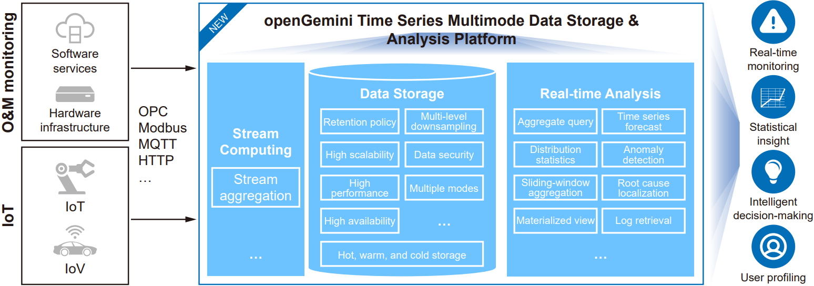

Data is the new oil. With the increasing importance of data analysis, time series databases stand out from more common relational databases. Instead of using rows and columns to find the association between data points, time series databases are designed to handle the unique workloads of time series data, which is recorded over consistent intervals of time and is typically used to analyze trends, patterns, and changes. Examples of time series data include weather data, website traffic, and quarterly sales.

openGemini is an open-source time series database available on openEuler. As a massively parallel processing (MPP) database, openGemini is capable of managing hundreds of millions of timelines accurate to nanoseconds and supports complex data queries and analysis during O&M and monitoring, helping store huge volumes of data and handle high read/write throughput in fields such as observability, AIOps, and IoT.

openGemini leverages multiple innovative technologies, such as vectorization, stream computing, multi-level downsampling, LSM-tree optimization, AI4DB, and data compression, to build an integrated platform for IoT, O&M monitoring, and data storage and analysis. It resolves database performance and storage cost issues common with ultra-large timelines and massive time series data.

  

openGemini features the following key highlights, among its variety of advantages:

-	Multiple programming languages  
openGemini can be developed in C/C++, C#, Java, Python, Go, Rust, JavaScript, and other.
-	Distributed architecture  
The MPP architecture can scale horizontally by adding additional compute nodes rather than having to scale vertically by adding more servers.
-	Vectorization  
For large data volumes, the MPP architecture improves query performance with batch data processing in each iteration.
-	Data compression  
In column-based storage, different compression algorithms are needed to fit the data type, while petabytes of metric data can be stored for a long time. In contrast, the openGemini database reduces the storage cost to one-twentieth that of a traditional relational database and one-tenth that of NoSQL.
-	Multi-level downsampling  
When downsampling historical data of a time range, only the features of the downsampled data are retained and the data itself is deleted in place. Multi-level downsampling saves storage space by 50% and compute resources by 90%.
-	Stream computing  
For large data volumes, a legacy downsampling method incurs an excess of drive I/Os and serious I/O amplification. The high-performance stream computing approach employed by openGemini realizes data downsampling when data is written and with low network overheads.
-	Anomaly detection and forecast  
The openGemini database adopts an AI-based time series analysis and forecast framework, which supports batch-stream convergence and severity classification. This analysis framework contains 13 anomaly detectors and can analyze tens of thousands of real-time timelines per second.

Overall, openGemini is a powerful and flexible time series database that is well suited for a wide range of use cases, from IoT sensor data to financial market data and beyond.

For more information about how openEuler helps tackle modern workloads, please visit the  [openEuler official website](https://www.openeuler.org/en/).
