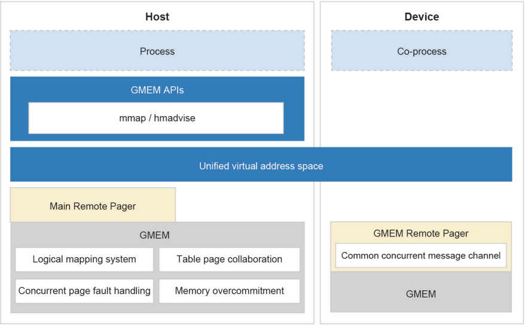

## Background of Sandbox Technologies

In recent years, we've seen remarkable breakthroughs in graphics processing units (GPUs), tensor processing units (TPUs), field-programmable gate arrays (FPGAs), and other dedicated heterogeneous accelerators. Similar to CPUs, these accelerators are designed to increase computing speeds by storing data in local memory, but such a design complicates memory systems.

Most of today's memory systems have the following defects for accelerators:

-	Memory management is separated between CPUs and accelerators. Explicit data migration makes it difficult to balance the usability and performance of accelerators' memory.

-	Accelerators' high bandwidth memory (HBM) is usually insufficient for foundation models, and what's worse, manual swaps are allowed only in certain situations and may cause unacceptable performance loss.

-	A large number of invalid data migrations have to be done in search & recommendation and other big data scenarios, and no efficient memory pool solution is presented.

Heterogeneous Memory Management (HMM), a native feature of Linux, is hampered by its poor programming, performance, and portability while relying heavily on manual tuning. As a result, it is not favored by most developers, which stimulates demand for efficient heterogeneous accelerator solutions.

Generalized Memory Management (GMEM) arises as a reliable choice, which provides a centralized management mechanism for heterogeneous memory connections.

GMEM combines the two independent address spaces of the OS and accelerators into a unified virtual memory address space. After an accelerator calls GMEM APIs to connect its memory to the unified virtual address space, the accelerator automatically obtains the programming optimization capability of the heterogeneous memory, and does not need to execute the memory management framework multiple times. This greatly relieves development and maintenance workloads.

Developers can apply for a unified set of APIs to achieve heterogeneous memory programming without memory migrations. If an accelerator's HBM is insufficient, GMEM can use the CPU memory as the accelerator cache to transparently over-allocate the HBM without manual swap.

The logical mapping system of GMEM masks the difference between the ways how CPUs and accelerators access memory addresses. The Remote Pager memory messaging framework provides the device access abstraction layer. In the unified virtual address space, GMEM automatically migrates the data to the OS or accelerator before data is accessed or paged.

GMEM uses a collection of new logical page tables to manage the unified virtual memory address space, ensuring data consistency between the page tables of different CPUs and micro architectures. Based on the memory access consistency mechanism of the logical page tables, the target memory space can be migrated between the host and accelerator using a kernel page fault handling procedure.

GMEM is well suited for unified heterogeneous memory programming. For example, an NPU memory management system can be connected to GMEM with just 100 lines of modified code in the NPU driver, a huge reduction on the original 4,000 lines in the memory management framework.

For more information about how openEuler helps tackle modern workloads, please visit the [openEuler official website](https://www.openeuler.org/en/).

