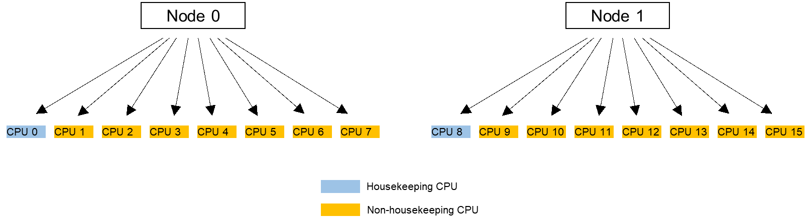

OS researchers and developers have been exploring ways to reduce OS jitter, or sometimes called noise, which is known to be a major contributor to performance degradation, especially in the high-performance computing (HPC) field.

OS jitter results from the execution of services by the OS kernel, such as scheduling of background daemons and handling of asynchronous events like interrupts. OS jitter significantly affects applications where many processes or threads frequently synchronize with each other.

CPU isolation is an effective means of reducing OS jitter. It is critical for any application which relies on specific and often extreme latency or performance requirements.

On normal configurations, every CPU gets its housekeeping duty share. To reduce OS jitter, background processes, except bound kernel threads which are tied to a specific CPU, can be assigned to one or more dedicated CPUs, which are referred to as housekeeping CPUs. The other CPUs are then called non-housekeeping CPUs or isolated CPUs.

Example: Specifying one CPU for each NUMA node to process housekeeping work, namely, periodic and routine work that run in the Linux kernel background

There are two ways of implementing CPU isolation: isolcpus and cgroups. Isolcpus is a kernel parameter that allows a set of CPUs to be ignored by the process scheduler. Cgroups, or control groups, is a kernel feature that allows administrators to allocate resources such as CPUs, memory, and I/O bandwidth to groups of processes.

The CPU isolation feature available in openEuler 22.03 LTS SP3 enhances application performance by confining OS jitter within housekeeping CPUs to prevent it from affecting application tasks that run on non-housekeeping CPUs.

It is worth noting although CPU isolation can bring significant wins for some specific applications, it is not a cure-all in many situations. And you must consider whether it is acceptable to sacrifice at least one CPU off to handle boring internal kernel work.

For more information about how openEuler helps tackle modern workloads, please visit the [openEuler official website](https://www.openeuler.org/en/).
