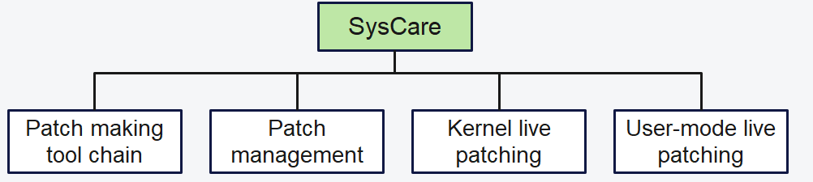
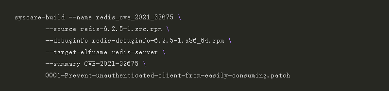
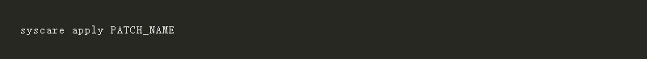
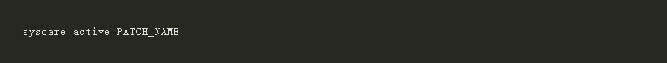
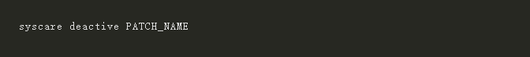
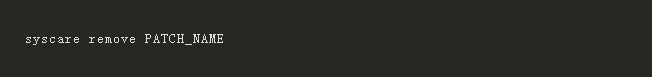
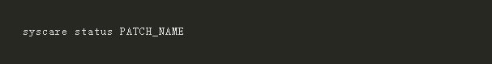
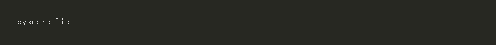

In the Linux world, there is a long-standing problem: how to quickly and reliably fix vulnerabilities and rectify faults without interrupting services? Live patches have emerged as a common solution to tackle this problem. However, it is intricate to create and manage them, as they must precisely align with the existing codebase. Furthermore, there lacks a straightforward and standardized patching mechanism for user-mode components that must accommodate diverse file formats, programming languages, compilation techniques, and runtime modes.

Nevertheless, for the Linux kernel, live patching is a clever way to apply critical security patches and allow for quick fixes to the kernel space, all without the need for rebooting or interrupting ongoing operations. Taking inspiration from this remarkable feature of the Linux kernel, openEuler has introduced SysCare, a tool specially designed to create and manage hot patches. 

## What Is SysCare

SysCare is a system-level hotfix software that provides security patches and hot fixes for operating systems. It can clear system errors without restarting hosts. SysCare combines kernel-mode and user-mode live patching to take over system repair, allowing users to focus on core services.

## SysCare for Live Patching

SysCare can mask differences in detail when creating patches, providing a unified management tool to improve O&M efficiency. It is able to live patch multi-process and multi-thread services in user mode when a process or thread is started or restarted. Moreover, it is able to fix the ptrace defect (after all kernel calls are ended), thereby increasing the fix success rate. All these factors make SysCare an excellent choice for automatically fixing bugs and vulnerabilities in both kernel and user-mode services. 

● One-click creation  
SysCare is, in essence, a unified environment for both kernel and user-mode live patches that masks differences between patches to ensure that they can be created with just one click.

● Patch lifecycle operations  
SysCare provides a unified patch management tool for users to install, activate, uninstall, and query patches.

● Support for user-mode live patches  
SysCare is adept at handling hot fixes in Executable and Linkable Format (ELF), as well as DWARF debug information. However, it does not extend its support to hot fixes in interpreted languages and debug information at the G3 level.

## How to Use SysCare

To run SysCare, you first need to install openEuler 22.03 LTS SP1. After that, you can run **syscare build** to create patches and **syscare patch** to manage patches, including installing, activating, deactivating, and uninstalling patches.

## Creating Patches

● Run syscare build to create patches.

## Managing Patches

● Install a patch:

Notice that the format of a patch name is **TARGET_PACKAGE_NAME/PATCH_NAME**. If **PATCH_NAME** is unique, **TARGET_PACKAGE_NAME/** can be omitted.

● Activate a patch:

● Deactivate a patch:

● Uninstall/Remove a patch:

● Query a patch:

● Query all SysCare patches:

SysCare made its official debut in openEuler 22.0 LTS SP1. As the project evolves, future versions will bring exciting enhancements, including hot patch generation and release via PRs, support for complex compilation process, and cluster patch management. If you are interested in this project, please visit the project homepage on [Gitee](https://gitee.com/openeuler/syscare) for more detailed information.